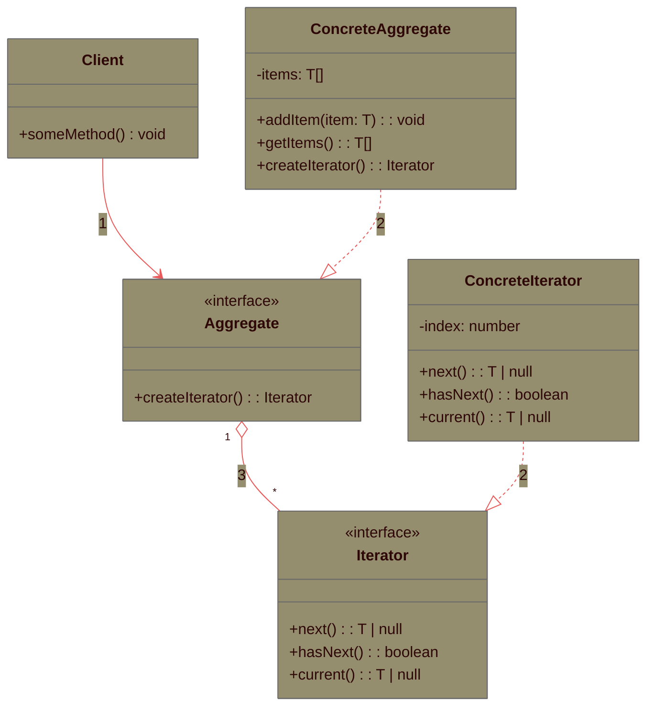
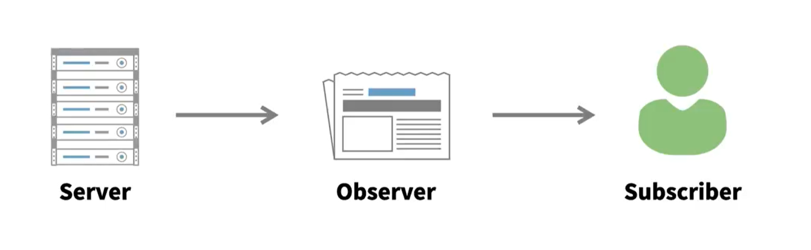
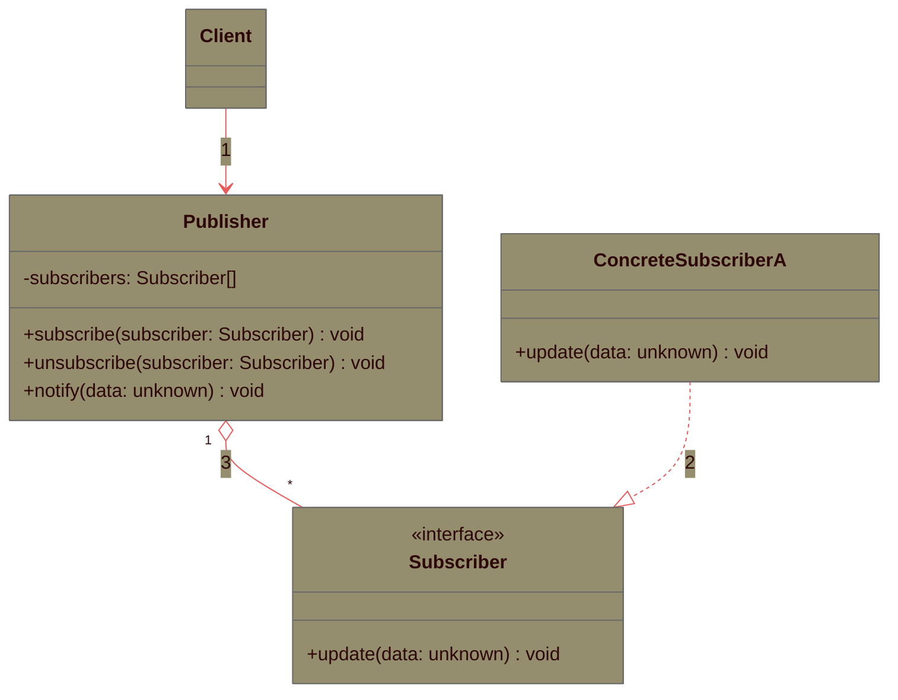
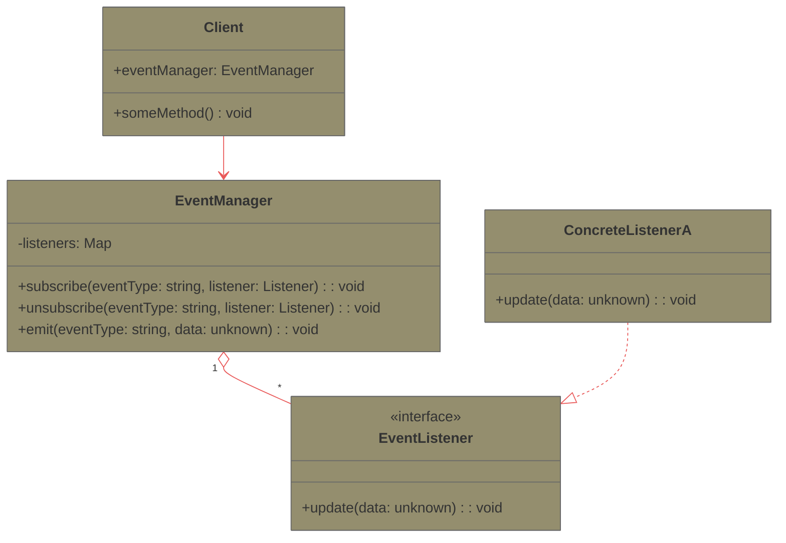
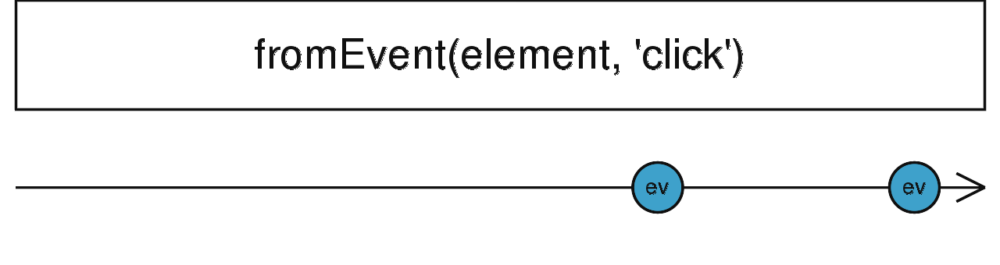
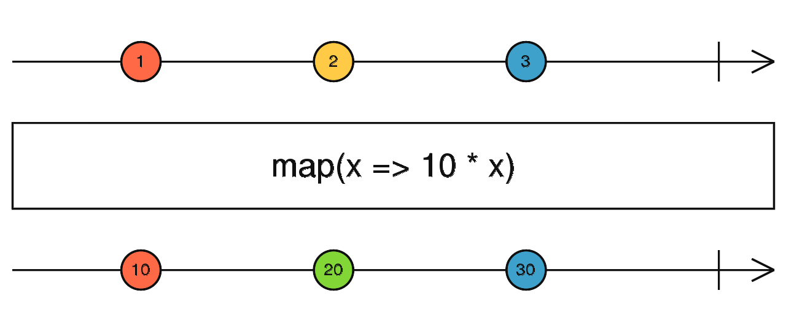
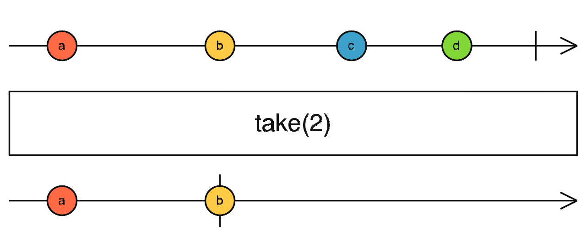

# Módulo 1: Introducción a la programación reactiva en ReactJS

- [Módulo 1: Introducción a la programación reactiva en ReactJS](#módulo-1-introducción-a-la-programación-reactiva-en-reactjs)
  - [Propuesta inicial del módulo](#propuesta-inicial-del-módulo)
  - [Asincronía y programación reactiva](#asincronía-y-programación-reactiva)
    - [Asincronía en JavaScript (ES6+). Promesas y async/await](#asincronía-en-javascript-es6-promesas-y-asyncawait)
      - [🧿Servicio getData: servicios y promesas](#servicio-getdata-servicios-y-promesas)
      - [Tests de promesas em TS](#tests-de-promesas-em-ts)
        - [El método then en Promesas](#el-método-then-en-promesas)
        - [Async/Await](#asyncawait)
        - [Promesas rechazadas](#promesas-rechazadas)
      - [👁️‍🗨️Test del servicio getData: mock de fetch](#️️test-del-servicio-getdata-mock-de-fetch)
    - [Componentes y asincronía](#componentes-y-asincronía)
      - [🧿Componente Search: búsqueda simple](#componente-search-búsqueda-simple)
      - [Test de componentes asíncronos](#test-de-componentes-asíncronos)
        - [👁️‍🗨️Test del componente Search](#️️test-del-componente-search)
        - [Nota: Patrón de importación dinámica](#nota-patrón-de-importación-dinámica)
    - [Gestión de la asincronía con debounce y cancelación](#gestión-de-la-asincronía-con-debounce-y-cancelación)
      - [🧿Componente SearchDebounced: búsqueda con debounce](#componente-searchdebounced-búsqueda-con-debounce)
      - [👁️‍🗨️Test del componente SearchDebounced: búsqueda con debounce](#️️test-del-componente-searchdebounced-búsqueda-con-debounce)
      - [Añadiendo cancelación con AbortController](#añadiendo-cancelación-con-abortcontroller)
        - [🧿Componente SearchControlled](#componente-searchcontrolled)
        - [👁️‍🗨️Test del componente SearchControlled](#️️test-del-componente-searchcontrolled)
  - [Conceptos clave de la programación reactiva](#conceptos-clave-de-la-programación-reactiva)
    - [¿Qué es la programación reactiva?](#qué-es-la-programación-reactiva)
    - [Características principales](#características-principales)
    - [Ejemplo práctico: búsqueda con debounce (enfoque reactivo)](#ejemplo-práctico-búsqueda-con-debounce-enfoque-reactivo)
      - [Fase 1 — Diseñar la pipeline (conceptual)](#fase-1--diseñar-la-pipeline-conceptual)
      - [Fase 2 - Mapeo conceptual a operadores](#fase-2---mapeo-conceptual-a-operadores)
      - [Fase 3 — Implementación reactiva guiada (RxJS)](#fase-3--implementación-reactiva-guiada-rxjs)
  - [Patrones de diseño](#patrones-de-diseño)
    - [Patrón Iterator](#patrón-iterator)
      - [Diseño de los elementos: UML del patrón Iterator](#diseño-de-los-elementos-uml-del-patrón-iterator)
        - [Detalles de la implementación del patrón Iterator](#detalles-de-la-implementación-del-patrón-iterator)
      - [🧿Ejemplo en TypeScript](#ejemplo-en-typescript)
      - [🧿Ejemplo de implementación nativa en ES6](#ejemplo-de-implementación-nativa-en-es6)
    - [Patrón Observer](#patrón-observer)
      - [Diseño de los elementos: UML del patrón Observer](#diseño-de-los-elementos-uml-del-patrón-observer)
        - [Detalles de la implementación del patrón Observer](#detalles-de-la-implementación-del-patrón-observer)
      - [EventManager](#eventmanager)
      - [🧿Ejemplo. Productos](#ejemplo-productos)
    - [Iterator v. Observer](#iterator-v-observer)
      - [Estrategias pull v. push](#estrategias-pull-v-push)
      - [Diferencia entre Iterator y Observer](#diferencia-entre-iterator-y-observer)
  - [Introducción a RxJS: Reactive Extensions for JavaScript](#introducción-a-rxjs-reactive-extensions-for-javascript)
    - [Observables](#observables)
      - [Tipos de observables](#tipos-de-observables)
    - [Implementación de observables cold (Observable)](#implementación-de-observables-cold-observable)
      - [Suscriptores en RxJS](#suscriptores-en-rxjs)
      - [Errores y finalización en observables cold](#errores-y-finalización-en-observables-cold)
    - [Observables hot: Subject](#observables-hot-subject)
      - [BehaviorSubject](#behaviorsubject)
      - [ReplaySubject](#replaysubject)
      - [AsyncSubject](#asyncsubject)
  - [Operaciones con Observables en RxJs](#operaciones-con-observables-en-rxjs)
    - [Creación de Observables](#creación-de-observables)
      - [Operadores de creación](#operadores-de-creación)
      - [A partir de Eventos](#a-partir-de-eventos)
      - [A partir de Promesas](#a-partir-de-promesas)
      - [A partir de un conjunto de datos](#a-partir-de-un-conjunto-de-datos)
        - [Otros operadores de creación](#otros-operadores-de-creación)
        - [A partir de un intervalo de tiempo (setInterval)](#a-partir-de-un-intervalo-de-tiempo-setinterval)
        - [En un momento determinado (setTimeout)](#en-un-momento-determinado-settimeout)
        - [Como resultado de una petición HTTP](#como-resultado-de-una-petición-http)
    - [Operadores en RxJS y la función pipe](#operadores-en-rxjs-y-la-función-pipe)
      - [Operadores de control (filtrado)](#operadores-de-control-filtrado)
      - [Operadores temporales](#operadores-temporales)
      - [Operadores de transformación](#operadores-de-transformación)
      - [Operadores de utilidad](#operadores-de-utilidad)
      - [Operadores de manejo de errores](#operadores-de-manejo-de-errores)
        - [Operadores de combinación](#operadores-de-combinación)
  - [Integración de RxJS con Angular](#integración-de-rxjs-con-angular)
  - [Integración de RxJS con ReactJS](#integración-de-rxjs-con-reactjs)
    - [Observables y estado](#observables-y-estado)
      - [🧿Componente ListNames: Observables y estado](#componente-listnames-observables-y-estado)
      - [Observables externos o internos al componente](#observables-externos-o-internos-al-componente)
      - [👁️‍🗨️Test del componente ListNames](#️️test-del-componente-listnames)
    - [Observables a partir de eventos. Operador fromEvent y de transformación](#observables-a-partir-de-eventos-operador-fromevent-y-de-transformación)
      - [🧿Componente ClickCounter con el evento click del ratón](#componente-clickcounter-con-el-evento-click-del-ratón)
      - [👁️‍🗨️Test del componente ClickCounter](#️️test-del-componente-clickcounter)
      - [🧿Componente ClickCounter refactorizado](#componente-clickcounter-refactorizado)
      - [Algunos operadores de transformación](#algunos-operadores-de-transformación)
      - [Eventos más allá del click](#eventos-más-allá-del-click)
        - [🧿Componente MouseTracker con el evento "mousemove" del ratón](#componente-mousetracker-con-el-evento-mousemove-del-ratón)
        - [👁️‍🗨️Test del componente MouseTracker](#️️test-del-componente-mousetracker)
    - [Observables e intervalos](#observables-e-intervalos)
      - [🧿Componente IntervalCounter con observable de intervalos](#componente-intervalcounter-con-observable-de-intervalos)
      - [👁️‍🗨️Test del componente IntervalCounter](#️️test-del-componente-intervalcounter)
  - [Gestión de observables y suscripciones](#gestión-de-observables-y-suscripciones)
    - [En Angular](#en-angular)
    - [En React](#en-react)
    - [Operadores de control y desuscripción automática en componentes React](#operadores-de-control-y-desuscripción-automática-en-componentes-react)
      - [🧿Componente IntervalCounter2 sin desuscripción manual](#componente-intervalcounter2-sin-desuscripción-manual)
      - [👁️‍🗨️Test del componente IntervalCounter2](#️️test-del-componente-intervalcounter2)

## Propuesta inicial del módulo

- Conceptos clave de la programación reactiva
  - ¿Qué es la programación reactiva?
  - Ventajas de usar programación reactiva en el desarrollo frontend
  - Conceptos como flujos de datos asíncronos y gestión de eventos
- Introducción a RxJS (Reactive Extensions for JavaScript)
  - ¿Qué es RxJS y cómo se integra con ReactJS?
  - Observables, operadores y suscriptores en RxJS

## Asincronía y programación reactiva

La asincronía es un concepto fundamental en el desarrollo web moderno. Permite que las aplicaciones realicen múltiples tareas al mismo tiempo sin bloquear la interfaz de usuario. Sin embargo, manejar la asincronía puede ser complicado, especialmente cuando se trata de eventos que ocurren en diferentes momentos y necesitan ser gestionados de manera eficiente.

Supongamos que tienes una aplicación que muestra los datos recibidos desde un API, por ejemplo la temperatura actual en una ciudad en este preciso momento.

El código síncrono no podría hacerlo, ya que obtener y mostrar la temperatura actual es una tarea en segundo plano, que podría tardar un tiempo indeterminado en completarse, y no es posible bloquear la interfaz de usuario mientras se espera la respuesta.

Mediante la **programación asíncrona**, podemos llamar a una API para obtener la temperatura actual y mostrársela al usuario cuando esté lista. Uno de los problemas es la falta de flexibilidad para reaccionar a cambios en los datos a lo largo del tiempo.

En la programación asíncrona tradicional, un fragmento de código se ejecuta y resuelve ahora o más tarde, pero no está diseñado para manejar flujos continuos de datos. En nuestro ejemplo de la **aplicación meteorológica**, la programación asíncrona nos permite obtener la temperatura actual una vez, pero no está preparada para manejar actualizaciones continuas de la temperatura.

La **programación reactiva** es una modalidad de la programación asíncrona que se basa en la idea
de que los datos pueden cambiar con el tiempo y que debemos reaccionar a esos cambios. Por ejemplo, si quisiéramos convertir la respuesta de la API de temperatura que obtuvimos de otro lugar, usaríamos una técnica llamada programación reactiva.

Para afrontar este planteamiento, la programación reactiva consiste en programar con **flujos de datos asíncronos** (**asynchronous streams**) y la propagación de cambios. En lugar de trabajar con valores estáticos, nos enfocamos en datos que se transmiten de forma constante, cambiando a lo largo del tiempo y que deben procesarse para reaccionar a esos cambios.

Volviendo al ejemplo de la **aplicación meteorológica**, con la programación reactiva, se pueden transmitir nuevos valores de temperatura a nuestra aplicación, y la aplicación reaccionará a esos nuevos valores y podrá transformarlos en grados Celsius, Kelvin o cualquier otra escala.

Es importante recordar que la programación reactiva es una **subcategoría** de la programación asíncrona. Toda programación reactiva es asíncrona, pero no toda la programación asíncrona es reactiva.

Se puede enviar un correo electrónico de forma asíncrona, pero no hay un flujo de datos disponible para aplicar cambios, como las temperaturas en nuestra aplicación meteorológica.

### Asincronía en JavaScript (ES6+). Promesas y async/await

JavaScript ofrece varias formas de manejar la asincronía, incluyendo callbacks, promesas y la sintaxis `async/await` introducida en ES6. Estas herramientas permiten escribir código que puede realizar tareas en segundo plano sin bloquear la ejecución principal.

La promesas son una forma de manejar operaciones asíncronas que representan un valor que puede estar disponible ahora, en el futuro o nunca. Permiten encadenar operaciones asíncronas de manera más legible que los callbacks tradicionales. Una de sus principales aplicaciones esta el la API Fetch, disponible tanto en navegadores como en Node.js.

Por ejemplo, para obtener datos de una API, podríamos usar una promesa de la siguiente manera:

```javascript
fetch('https://api.example.com/data')
  .then((response) => response.json())
  .then((data) => {
    console.log(data);
  })
  .catch((error) => {
    console.error('Error fetching data:', error);
  });
```

La sintaxis `async/await` proporciona una forma aún más sencilla y legible de trabajar con promesas. Permite escribir código asíncrono que se parece al código síncrono, lo que facilita su comprensión. Por ejemplo, podríamos reescribir el ejemplo anterior usando `async/await` de la siguiente manera:

```javascript
async function fetchData() {
  try {
    const response = await fetch('https://api.example.com/data');
    const data = await response.json();
    console.log(data);
  } catch (error) {
    console.error('Error fetching data:', error);
  }
}
```

Como vemos en el caso de fetch, las promesas solucionan bien el problema de manejar una única operación asíncrona, pero

- no incluyen mecanismos para reintentar la operación en caso de fallo,
- no están pensadas para recargar los datos de forma automática a lo largo del tiempo (polling),
- no facilitan la composición de múltiples fuentes de datos asíncronas,
- no facilitan iterar a lo largo de una API paginada,
- la cancelación de operaciones en curso,

Y todo ello porque las promesas no están diseñadas para manejar flujos continuos de datos o eventos que ocurren a lo largo del tiempo.

#### 🧿Servicio getData: servicios y promesas

El código asíncrono que acabamos de escribir no debería ser parte de un componente, sino que se suele ubicar en servicios o hooks personalizados que luego son consumidos por componentes React.

De este modo estaremos creando una separación de responsabilidades clara entre la lógica de negocio (servicios) y la presentación (componentes). Además, en este servicio en concreto estaremos aplicando el patrón de diseño **Repository** para abstraer el acceso a datos.

Comenzando unicamente con el método responsable de obtener los datos, el servicio sería el siguiente:

```ts
// dataService.ts
export type Results = {
  id: number;
  // otros campos según la respuesta de la API
};

export const URL_BASE = 'https://api.example.com/';
export const getData = async (query: string): Promise<Results[]> => {
  const res = await fetch(`${URL_BASE}/search?q=${encodeURIComponent(query)}`);

  if (!res.ok) {
    throw new Error('Error fetching data');
  }

  const data: Results[] = await res.json();
  return data;
};
```

Hemos de tener en cuenta que para fetch existen tres resultados posibles:

- Respuesta exitosa (status 200), con un valor ok true
- Error del cliente o del servidor (status 400 / 500), con un valor ok false
- Error del servidor (no hay respuesta), que da lugar a un rechazo de la promesa (reject)

Un patrón común es comprobar el valor de ok en la respuesta y lanzar un error si no es true. De este modo, el consumidor del servicio puede manejar los errores mediante un bloque try/catch o el método catch de la promesa.

Como veremos más adelante, sería mejor refactorizar el código utilizando genéricos para que el servicio sea reutilizable con diferentes tipos de datos.

#### Tests de promesas em TS

##### El método then en Promesas

Si una función devuelve una promesa, se puede usar .then y .catch para manejar la aserción, de forma similar a como se consumiría la promesa en el código.

Si la promesa se resuelve correctamente, se puede hacer la aserción en el bloque .then.

En **Jest**, es importante devolver la promesa desde el test para que el test espere a que se resuelva antes de considerar que el test ha terminado. En **Vitest**, este paso no es necesario, ya que Vitest detecta automáticamente cuando una prueba asíncrona ha terminado.

```ts
// 05-async.ts
export function fetchDataPromise(): Promise<string> {
  return new Promise((resolve) => {
    setTimeout(() => {
      resolve('sample data');
    }, 1000);
  });
}
```

```ts
// 05-async.test.js
import { fetchDataPromise } from './05-async.js';
test('los datos son sample data', () => {
  fetchDataPromise().then((data) => {
    expect(data).toBe('sample data');
  });
});
```

##### Async/Await

Vitest también soporta async / await , lo que hace que las pruebas asíncronas sean más legibles. Vitest espera a que se resuelva la promesa devuelta por la función async antes de considerar que el test ha terminado. Esta es la forma habitual en que se escriben los test que incluyen promesas.

```ts
//  05-async.test.js con async/await
import { fetchDataPromise } from './05-async.js';
test('los datos son sample data', async () => {
  const data = await fetchDataPromise();
  expect(data).toBe('sample data');
});
```

##### Promesas rechazadas

Si la promesa es rechazada, se puede manejar el error en el bloque .catch y hacer la aserción correspondiente, o el método rejects de expect. La segunda de las opciones es más específica de Jest y proporciona una sintaxis más clara.

```ts
// 05-async.ts
export function fetchDataPromiseWithError(): Promise<string> {
  return new Promise((resolve, reject) => {
    setTimeout(() => {
      reject(new Error('error'));
    }, 1000);
  });
}
```

```ts
// 05-async.test.js
test('la promesa es rechazada', () => {
  fetchDataPromiseWithError().catch((error) => {
    expect(error).toEqual(new Error('error'));
  });
});
```

```ts
// 05-async.test.js
import { fetchDataPromiseWithError } from './fetchDataPromiseRejected';
test('la promesa es rechazada', async () => {
  await expect(fetchDataPromiseWithError()).rejects.toEqual(new Error('error'));
  await expect(fetchDataPromiseWithError()).rejects.toThrow('error');
});
```

#### 👁️‍🗨️Test del servicio getData: mock de fetch

Nuestro servicio utiliza el API nativo `fetch`, disponible tanto en los navegadores como en el entorno de Node.js donde se ejecutan los tests con Vitest. Sin embargo, para testar el servicio sin hacer peticiones reales a la API, es necesario crear un mock de `fetch`.

Para conseguirlo podemos utilizar

- la función `vi.fn()` de Vitest para crear una función mock que simule el comportamiento de `fetch`. Esta función mock puede configurarse para devolver diferentes respuestas según sea necesario para los tests.
- la función `vi.spyOn()` para espiar la función global `fetch` y reemplazar su implementación con una versión mock (tal como aparece comentado en el siguiente código).

```ts
import type { Mock } from 'vitest';
import { getData } from './data.service';

const mockData = [{ id: 1, title: 'sample data' }];

globalThis.fetch = vi.fn().mockResolvedValue({
  ok: true,
  json: vi.fn().mockResolvedValue(mockData),
});

// vi.spyOn(global, 'fetch').mockResolvedValue({
//   ok: true,
//   json: async () => mockData,
// } as unknown as Response);

describe('data.service', () => {
  afterEach(() => {
    vi.clearAllMocks();
  });

  test('should fetch data based on query', async () => {
    const query = 'test';
    const results = await getData(query);

    expect(fetch).toHaveBeenCalledWith(
      `https://api.example.com//search?q=${encodeURIComponent(query)}`
    );
    expect(results).toEqual(mockData);
  });

  test('should throw an error if fetch return an invalid code', async () => {
    (fetch as Mock).mockResolvedValueOnce({
      ok: false,
    });

    await expect(getData('test')).rejects.toThrow('Error fetching data');
  });

  test('should throw an error if fetch fails', async () => {
    (fetch as Mock).mockImplementation(() =>
      Promise.reject(new Error('Network error'))
    );

    await expect(getData('test')).rejects.toThrow('Network error');
  });
});
```

En los dos últimos tests, simulamos errores en la llamada a fetch para comprobar que el servicio maneja correctamente los errores tanto cuando la respuesta tiene un código de error (ok: false) como cuando la llamada a fetch falla completamente (rechazo de la promesa).

### Componentes y asincronía

En React, los componentes pueden manejar operaciones asíncronas utilizando hooks como `useEffect` para realizar tareas como la obtención de datos desde una API cuando el componente se monta. Más adelante veremos este hook en detalle.

En otros casos la asincronía viene de la necesidad de responder a los eventos del usuario, como el click en un botón o la entrada de texto en un campo de formulario. Estos eventos pueden desencadenar operaciones asíncronas, como enviar datos a un servidor o actualizar el estado del componente.

#### 🧿Componente Search: búsqueda simple

Como ejemplo de esto, veamos el código de un sencillo componente de búsqueda que obtiene datos desde una API en función de la entrada del usuario.

```tsx
import { useState } from 'react';
import { Card } from '../core/card/card';
import type { Results } from '../../services/data.service';
import { getData } from '../../services/data.service';

export const Search: React.FC = () => {
  const [results, setResults] = useState<Results[]>([]);

  const handleInput = async (
    event: React.ChangeEvent<HTMLInputElement>
  ): Promise<void> => {
    const value = event.target.value;
    try {
      const data = await getData(value);
      setResults(data);
    } catch (err) {
      // manejar errores
      console.error(err);
    }
  };

  return (
    <Card title="Simple Search">
      <label htmlFor="">
        <span>Search: </span>
        <input onInput={handleInput} />
      </label>
      <ul>
        {results.map((r, i) => (
          <li key={i}>{JSON.stringify(r)}</li>
        ))}
      </ul>
    </Card>
  );
};
```

Manejamos el evento de entrada del usuario en el campo de búsqueda mediante el manejador `handleInput`, que se ejecuta cada vez que el usuario escribe algo. Este manejador llama al servicio `getData` para obtener los datos correspondientes a la consulta y actualiza el estado del componente con los resultados obtenidos.

#### Test de componentes asíncronos

En ocasiones, los componentes de React realizan operaciones asíncronas, como por ejemplo, obtener datos de un servidor. Para testar estos componentes, necesitamos esperar a que se resuelva la operación asíncrona antes de comprobar el resultado. Para ello, Testing Library proporciona dos opciones:

- la función **waitFor** que nos permite esperar a que se resuelva una operación asíncrona.
- los métodos **findBy...** que combinan la búsqueda de un elemento con la espera a que aparezca en el DOM.

##### 👁️‍🗨️Test del componente Search

Veamos un ejemplo del componente search con tests que utilizan en algunos casos `findBy...` y en otros `waitFor`.

```tsx
import { render, screen, waitFor } from '@testing-library/react';
import userEvent from '@testing-library/user-event';
import { Search } from './search';
import { getData } from '../../services/data.service';
import type { Mock } from 'vitest';

vi.mock('../../services/data.service');
const mockData = [{ id: 1, title: 'sample data' }];

describe('Search component', () => {
  afterEach(() => {
    vi.clearAllMocks();
  });

  test('should render search results', async () => {
    (getData as Mock).mockResolvedValue(mockData);
    render(<Search />);
    const input = screen.getByRole('textbox');
    await userEvent.type(input, 'sample');
    expect(await screen.findByText(/sample data/i)).toBeInTheDocument();
  });
  ///
});
```

En este test, simulamos la llamada al servicio `getData` para que devuelva datos de ejemplo. Luego, renderizamos el componente `Search` y simulamos la entrada del usuario en el campo de búsqueda. Finalmente, usamos `findByText` para esperar a que el resultado de la búsqueda aparezca en el documento.

En los siguientes test veremos la segunda alternativa, usando `waitFor` para esperar a que se resuelva la operación asíncrona antes de hacer las aserciones.

```tsx
test('should search for data after 300ms of inactivity', async () => {
  (getData as Mock).mockResolvedValue(mockData);
  render(<Search />);
  const input = screen.getByRole('textbox');
  await userEvent.type(input, 't');
  await userEvent.type(input, 'e');
  await userEvent.type(input, 's');
  await userEvent.type(input, 't');
  await waitFor(() => {
    expect(getData).toHaveBeenNthCalledWith(1, `t`);
    expect(getData).toHaveBeenNthCalledWith(2, `te`);
    expect(getData).toHaveBeenNthCalledWith(3, `tes`);
    expect(getData).toHaveBeenCalledWith(`test`);
  });
});
```

En este test, usamos `waitFor` para esperar a que se realicen las llamadas al servicio `getData` con los términos de búsqueda correctos después de que el usuario haya dejado de escribir. Al simular la entrada sucesiva de caracteres, verificamos que el servicio se llama una vez en cada caso. En consecuencia estaríamos haciendo una serie de peticiones a la API totalmente innecesarias. Para evitar esto, podemos implementar un mecanismo de debounce , es decir, esperar a que el usuario deje de escribir durante un período de tiempo antes de realizar la búsqueda.

Antes, para concluir los casos de uso del test del componente Search, podríamos añadir un test para manejar errores en la llamada al servicio.

```tsx
test('should catch and log error if getData fails', async () => {
  const consoleErrorSpy = vi
    .spyOn(console, 'error')
    .mockImplementation(() => undefined);
  (getData as Mock).mockRejectedValueOnce(new Error('Fetch error'));
  render(<Search />);
  const input = screen.getByRole('textbox');

  await userEvent.type(input, 'error');
  await waitFor(() => {
    expect(getData).toHaveBeenCalledWith('error');
    expect(consoleErrorSpy).toHaveBeenCalled();
  });
});
```

##### Nota: Patrón de importación dinámica

El componente se importa dentro del test en lugar de hacerlo al inicio del fichero para controlar el momento en que se evalúa el módulo. Motivos y gotchas principales:

- Control de mocks: si necesitas crear un mock de fetch, timers o cualquier dependencia, debes configurar esos mocks antes de que el módulo se evalúe. Importar dinámicamente permite instalar los mocks (vi.mock / vi.spyOn) antes de cargar el componente.
- Efectos y evaluación del módulo: aunque useEffect se ejecuta al montar (no en la importación), el módulo puede tener código de nivel superior (o importaciones que inician side-effects) que se ejecuta al importar. Retrasar la importación evita que eso ocurra antes de preparar el entorno del test.
- Orden de inicialización: en entornos como Vitest/ESM los mocks/hoisting pueden requerir que el componente se importe después de la configuración del test; la importación dinámica garantiza ese orden.
- Evitar condiciones de carrera: si el componente dispara fetch/timers al montar, importar y luego renderizar tras haber configurado fake timers o spies elimina condiciones de carrera.

// Ejemplo de patrón: mockear antes de importar y usar waitFor

```tsx
const mockData = [{ id: 1 }, { id: 2 }, { id: 3 }];
vi.spyOn(global, 'fetch').mockResolvedValue({
  json: async () => mockData,
} as unknown as Response);

const { Items } = await import('./sample5.item.effect');
const { render, screen, waitFor } = await import('@testing-library/react');

render(<Items />);

await waitFor(() => {
  expect(screen.getByText('Items number: 3')).toBeInTheDocument();
});
```

### Gestión de la asincronía con debounce y cancelación

#### 🧿Componente SearchDebounced: búsqueda con debounce

Queremos procesar un input de búsqueda, aplicar debounce (esperar 300ms sin teclear antes de buscar) y lanzar una petición HTTP con el término final evitando que respuestas antiguas reescriban la interfaz.

En programación asíncrona, la solución imperativa sería usar `setTimeout`/`clearTimeout` para implementar debounce y luego invocar nuestro servicio responsable del `fetch`.

```tsx
import React, { useState, useRef } from 'react';
export const SearchDebounced: React.FC = () => {
  const [results, setResults] = useState<Results[]>([]);
  const timeoutRef = useRef<NodeJS.Timeout | null>(null);

  const handleInput = (event: React.ChangeEvent<HTMLInputElement>): void => {
    const value = event.target.value;
    // debounce manual de 300ms
    if (timeoutRef.current) {
      clearTimeout(timeoutRef.current);
    }
    timeoutRef.current = setTimeout(async () => {
      try {
        const data = await getData(value);
        setResults(data);
      } catch (err) {
        // manejar errores
        console.error(err);
      }
    }, 300);
  };

  return (
    <Card title="Debounced Search">
      <label htmlFor="">
        <span>Search (debounced): </span>
        <input onInput={handleInput} />
      </label>
      <ul>
        {results.map((r, i) => (
          <li key={i}>{JSON.stringify(r)}</li>
        ))}
      </ul>
    </Card>
  );
};
```

En el código anterior, usamos `setTimeout` para esperar 300ms después de que el usuario deja de escribir antes de realizar la búsqueda. Si el usuario escribe algo nuevo antes de que pasen los 300ms, cancelamos el temporizador anterior con `clearTimeout` pero no cancelamos la petición fetch anterior.

El hook `useRef` nos permite mantener una referencia al ID del temporizador entre renderizados sin causar un nuevo renderizado cuando cambia.

Podemos tener un problema conocido como **race condition** (condición de carrera), donde las respuestas de las peticiones pueden llegar en un orden diferente al que se enviaron, lo que puede resultar en que datos antiguos sobrescriban datos más recientes en la interfaz de usuario. En vez de los resultados de búsqueda del termino completo, podríamos ver resultados de términos anteriores si las respuestas llegan fuera de orden. Como veremos, esto se puede mitigar usando `AbortController` para cancelar peticiones anteriores.

En términos de **testeabilidad**, este enfoque imperativo puede ser más difícil de probar debido a la gestión manual del estado y los temporizadores y a que la lógica de debounce y fetch está mezclada con el UI. Las pruebas unitarias pueden requerir mocks para `setTimeout` y `fetch`, lo que añade complejidad.

#### 👁️‍🗨️Test del componente SearchDebounced: búsqueda con debounce

Un ejemplo de los tests utilizando [Vitest](https://vitest.dev/) y la [testing library](https://testing-library.com/docs/react-testing-library/intro/) podría ser:

```tsx
vi.mock('../../../services/data.service');
const mockData = [{ id: 1, title: 'sample data' }];

describe('SearchDebounced', () => {
  afterEach(() => {
    vi.clearAllMocks();
  });
  test('should search for data after 300ms of inactivity', async () => {
    (getData as Mock).mockResolvedValue(mockData);
    render(<SearchDebounced />);
    const input = screen.getByRole('textbox');

    await userEvent.type(input, 't');
    await userEvent.type(input, 'e');
    await userEvent.type(input, 's');
    await userEvent.type(input, 't');
    await waitFor(() => {
      expect(getData).toHaveBeenNthCalledWith(1, `test`);
      expect(getData).toHaveBeenCalledTimes(1);
    });
  });
});
```

En el test anterior, simulamos la entrada del usuario en el campo de búsqueda y verificamos que la función `getData` se llama solo una vez con el término completo después de 300ms de inactividad.

A continuación añadiríamos el test para manejar errores en la llamada al servicio, que será igual al que utilizamos para el componete Search.

#### Añadiendo cancelación con AbortController

Una mejora sería añadir `AbortController` para cancelar peticiones previas si se inicia una nueva.

AbortController es una API nativa de JavaScript que permite cancelar peticiones fetch. Podemos usarla para cancelar la petición anterior si el usuario escribe algo nuevo antes de que la petición anterior haya terminado.

##### 🧿Componente SearchControlled

```tsx
import React, { useState, useRef } from 'react';
import { Card } from '../../core/card/card';
import type { Results } from '../../../services/data.service';
import { getData } from '../../../services/data.service';

export const SearchControlled: React.FC = () => {
  const [results, setResults] = useState<Results[]>([]);
  const timeoutRef = useRef<NodeJS.Timeout | null>(null);
  const abortControllerRef = useRef<AbortController | null>(null);

  const handleInput = (event: React.ChangeEvent<HTMLInputElement>): void => {
    const value = event.target.value;
    // debounce manual
    if (timeoutRef.current) {
      clearTimeout(timeoutRef.current);
    }
    timeoutRef.current = setTimeout(async () => {
      try {
        // cancelar petición anterior
        if (abortControllerRef.current) {
          abortControllerRef.current.abort();
        }
        // nueva petición con su propio AbortController
        abortControllerRef.current = new AbortController();
        const data = await getData(value);
        setResults(data);
      } catch (err) {
        // manejar errores
        console.error(err);
      }
    }, 300);
  };

  return (
    <Card title="Controlled Search">
      <p>Debounce & AbortController</p>
      <label htmlFor="">
        <span>Search (controlled): </span>
        <input onInput={handleInput} />
      </label>
      <ul>
        {results.map((r, i) => (
          <li key={i}>{JSON.stringify(r)}</li>
        ))}
      </ul>
    </Card>
  );
};
```

El funcionamiento de `AbortController` es sencillo: creamos una nueva instancia cada vez que iniciamos una nueva petición y llamamos a `abort()` en la instancia anterior para cancelar la petición en curso. Pasamos la señal del `AbortController` a la opción `signal` de `fetch`, lo que permite que la petición sea cancelada si es necesario.

Consideraciones:

- Robustez: junto con un manejo de errores adecuado evita condiciones de carrera comunes.
- Limitaciones: sigue siendo una solución imperativa; mover la pipeline fuera del componente (o usar RxJS) mejora la testeabilidad y reusabilidad.

El flujo del proceso es:

input -> debounce (esperar 300ms) -> cancelar petición anterior (si existe) -> nueva petición fetch -> actualizar resultados.

En el artículo de [Cancelando promesas en React](https://lissetteibnz.es/cancelando-promesas-en-react) de Sara Lissette, se revisa este patrón y se propone como encapsularlo en un custom hook

##### 👁️‍🗨️Test del componente SearchControlled

En primer lugar, podemos testar que la búsqueda se realiza correctamente después de 300ms de inactividad, repitiendo el test del componente SearchDebounced.

En segundo lugar, añadimos un test para verificar que las peticiones anteriores son canceladas correctamente cuando se inicia una nueva búsqueda.

```tsx
test('should cancel request if previous request is still pending', async () => {
  vi.spyOn(AbortController.prototype, 'abort');
  (getData as Mock).mockImplementation(() => new Promise(() => undefined));
  render(<SearchControlled />);
  const input = screen.getByRole('textbox');

  // Primera escritura
  await userEvent.type(input, 'test');

  // Esperar a que termine el debounce y se inicie la petición
  await waitFor(
    () => {
      expect(getData).toHaveBeenLastCalledWith(`test`);
      expect(getData).toHaveBeenCalledTimes(1);
    },
    {
      timeout: 400,
    }
  );

  // Verificar que aún NO se ha llamado abort (primera petición activa)
  expect(AbortController.prototype.abort).not.toHaveBeenCalled();

  // Segunda escritura MIENTRAS la primera petición está pendiente
  await userEvent.clear(input);
  await userEvent.type(input, 'to be cancelled');

  // Esperar a que el segundo debounce dispare la segunda petición
  await waitFor(async () => {
    expect(getData).toHaveBeenLastCalledWith(`to be cancelled`);
    expect(getData).toHaveBeenCalledTimes(2);
    expect(AbortController.prototype.abort).toHaveBeenCalled();
  });
});
```

- creamos un spy sobre el método `abort` del prototipo de `AbortController` para verificar si se llama correctamente. Al hacerlo en el prototipo estaremos espiando cualquier instancia del método, incluida la que se crea dentro del componente.
- simulamos la implementación de `getData` para que devuelva una promesa que nunca se resuelve, lo que nos permite mantener la primera petición pendiente mientras iniciamos una segunda.
- renderizamos el componente y simulamos la entrada del usuario.
- esperamos a que se inicie la primera petición y verificamos que `getData` se ha llamado correctamente.
- verificamos que `abort` no se ha llamado todavía, ya que la primera petición aún está activa.
- simulamos una segunda entrada del usuario mientras la primera petición está pendiente.
- esperamos a que se inicie la segunda petición y verificamos que `getData` se ha llamado con el nuevo término de búsqueda. Finalmente, verificamos que `abort` se ha llamado para cancelar la primera petición.

Por último, añadiríamos el test para manejar errores en la llamada al servicio, que será igual al que utilizamos para el componente Search.

## Conceptos clave de la programación reactiva

Los **principios fundamentales** de la programación reactiva:

- **Modelado de flujos de datos** (**streams**) y sistemas basados en eventos. Los streams: secuencias de eventos o valores a lo largo del tiempo (por ejemplo, entradas del usuario, respuestas de red, ticks de un temporizador).
- **Propagación automática de cambios**: cuando una fuente emite, los consumidores reaccionan automáticamente según las transformaciones aplicadas.
- **Composición**: capacidad de combinar y transformar streams mediante operadores para construir lógica compleja a partir de piezas simples.
- **Inmutabilidad y pureza**: transformar datos sin mutar directamente el origen, lo que facilita el razonamiento y testeo.

La programación reactiva implica un cambio de aproximación pasando a pensar en la aplicación como una red de flujos en la que los datos se transforman y propagan automáticamente a los consumidores.

### ¿Qué es la programación reactiva?

Definición corta: un enfoque para trabajar con datos que llegan a lo largo del tiempo. En lugar de preguntar por un valor puntual, nos suscribimos a flujos y declaramos cómo transformarlos.

Extendiendo: la programación reactiva es un **paradigma** de programación orientado a flujos de datos (y eventos) y la propagación de cambios a lo largo del tiempo. Permite manejar datos asíncronos y eventos de manera declarativa, facilitando la composición y transformación de flujos de datos.

En lugar de ejecutar pasos imperativos uno a uno, modelamos la aplicación como un conjunto de streams (fuentes de datos) que se transforman y combinan mediante operaciones declarativas. Esto facilita el manejo de asincronía, concurrencia y la composición de lógica compleja en UIs modernas.

Es especialmente útil para inputs, streams en tiempo real y combinaciones de eventos.

### Características principales

Breve: piensa en la aplicación como flujos de eventos (streams), por ejemplo, lo que escribe el usuario o mensajes del servidor, y en transformar esos flujos con pasos pequeños y encadenables.

- **Stream-oriented**: los datos se consideran secuencias a lo largo del tiempo (streams), no valores estáticos.
- **Transformación y operadores**: las transformaciones se aplican con operadores que se pueden encadenar y reutilizar. Cada uno define una pequeña transformación (map, filter, debounce, merge, etc).
- **Composición**: combinar streams para crear comportamientos más ricos.
- **Gestión de la asincronía**: permite expresar debounce, throttle, buffering y control de concurrencia de forma declarativa.
- **Cancelación y control de ciclo de vida**: la programación reactiva facilita cancelar operaciones pendientes y gestionar la limpieza.

Comparación con enfoques tradicionales:

- Imperativo (callbacks/setTimeout): más verboso y propenso a errores de sincronización y condiciones de carrera.
- Promesas: útiles para operaciones puntuales pero limitadas para flujos continuos y composición de múltiples fuentes.
- Reactivo (RxJS): aporta abstracciones para flujos continuos, operadores de combinación y manejo de cancelación de forma composable.

Las ventajas de usar programación reactiva en el desarrollo frontend son:

- Código más declarativo y legible.
- Control natural de cancelación y concurrencia.
- Composición sencilla de varias fuentes de eventos.
- Facilita cancelar trabajo en curso, combinar fuentes y mantener la UI clara.

En este módulo trabajaremos un ejemplo práctico (autocompletado/búsqueda) paso a paso: versión simple, mejora con cancelación y, finalmente, la versión reactiva.

### Ejemplo práctico: búsqueda con debounce (enfoque reactivo)

#### Fase 1 — Diseñar la pipeline (conceptual)

- Sobre la implementación imperativa, diseñamos de la pipeline

```text
input (evento del DOM)
  └─> extraer valor (map)
    └─> debounce 300ms (esperar silencio)
      └─> cancelar petición previa si existe (cancel)
        └─> lanzar petición HTTP (switch/replace)
          └─> procesar resultados y actualizar UI
```

Se identifican claramente las fuentes de eventos, los puntos de transformación y los límites donde sería conveniente encapsular la lógica.

Ventajas de este enfoque en el curso:

- No asumimos conocimientos previos: los alumnos ven primero el problema y su complejidad.
- Aprenden a diseñar la solución antes de usar una librería.
- La solución con RxJS se presenta como una consecuencia natural del diseño de la pipeline.

#### Fase 2 - Mapeo conceptual a operadores

Dejamos cómo lo implementaremos con RxJS para más adelante:

- `map`: transformar el evento `input` al valor del campo.
- `debounceTime(300)`: esperar 300ms sin nuevos eventos antes de dejar pasar el valor.
- `switchMap` (o `exhaustMap`/`mergeMap` según el caso): mapear el valor a una petición HTTP y garantizar el comportamiento de cancelación/concatenación deseado.
  - `switchMap` reemplaza la petición anterior (útil en autocompletado)
  - `mergeMap` permite concurrencia
  - `concatMap` serializa.
- `catchError`/`retryWhen`: para gestionar errores y reintentos en la pipeline.

Checklist de diseño (preguntas que debemos responder antes de implementar):

1. ¿Qué queremos que pase si el usuario escribe antes de que termine la petición anterior? (reemplazarla → `switchMap`, permitir concurrencia → `mergeMap`)
2. ¿Necesitamos reintentos automáticos en fallos transitorios? ¿Con qué estrategia de backoff?
3. ¿Qué validaciones aplicamos al término antes de lanzar la petición (longitud mínima, filtrado de caracteres)?: aplicar `filter` o `distinctUntilChanged`.
4. ¿Debemos cancelar la petición al desmontar el componente?: sí — gestionar la suscripción o usar `takeUntil` con un subject de destrucción.
5. ¿Dónde colocamos esta lógica para que sea reusable y testable?: hook (ej. `useSearchStream`) o módulo separado que devuelva un Observable.

Con esto claro, la implementación en RxJS se reduce a traducir cada caja del diagrama a un operador y gestionar la suscripción dentro del componente (o via hook) con limpieza adecuada.

#### Fase 3 — Implementación reactiva guiada (RxJS)

Más adelante, a partir de la pipeline diseñada, **implementaremos** la solución con RxJS paso a paso, aplicando conceptos como flujos de datos asíncronos y gestión de eventos:

- crearemos un Observable desde los eventos de input,
- aplicaremos operadores (`map`, `debounceTime`, `switchMap`) y
- nos suscribiremos al resultado.

Veremos cómo cada operador corresponde a una parte del diagrama de la fase 2 y cómo RxJS resuelve de forma natural la cancelación y composición.

Enfoque reactivo como concepto implica:

- modelar el input como un stream de eventos
- aplicar operadores como `debounceTime` y `switchMap` para expresar espera y cancelación de forma declarativa
- en caso de necesitarlos aplicaremos otros operadores comunes para el manejo de flujos de datos asíncronos: filtrado (`filter`), debounce/throttle, combinación de streams y limpieza de suscripciones.

## Patrones de diseño

Si la programación reactiva tiene que ver con la relación entre emisores y receptores de datos, es importante entender algunos patrones de diseño que facilitan esta interacción.

- **Patrón Observer**: permite que un objeto (el sujeto) notifique a otros objetos (los observadores) sobre cambios en su estado.
- **Patrón Iterator**: proporciona una forma de acceder secuencialmente a los elementos de una colección sin exponer su representación subyacente.

Ambos fueron incluidos en el libro "Design Patterns: Elements of Reusable Object-Oriented Software" (1994) de Erich Gamma, Richard Helm, Ralph Johnson y John Vlissides, conocidos como la "banda de los cuatro" (Gang of Four).

### Patrón Iterator

El patrón Iterator es un patrón de diseño de comportamiento que proporciona una forma de acceder secuencialmente a los elementos de una colección sin exponer su representación subyacente. Este patrón es especialmente útil cuando se trabaja con colecciones complejas o cuando se desea ocultar la estructura interna de la colección.

[From Refactoring Guru](https://refactoring.guru/es/design-patterns/iterator)

El patrón Iterator se compone de los siguientes elementos clave:

- **Iterator**: una interfaz que define los métodos para recorrer los elementos de la colección, como `next()`, `hasNext()`, y `current()`.
- **ConcreteIterator**: una implementación concreta de la interfaz Iterator que mantiene el estado actual del recorrido y proporciona la lógica para avanzar a través de los elementos.
- **Aggregate**: una interfaz que define un método para crear un iterador, como `createIterator()`.
- **ConcreteAggregate**: una implementación concreta de la interfaz Aggregate que contiene la colección de elementos y proporciona el método para crear un iterador.
- **Client**: el código que utiliza el iterador para recorrer la colección sin conocer su estructura interna.

#### Diseño de los elementos: UML del patrón Iterator



Relación entre clases:

1. Association: Cliente usa Aggregate
2. Realization: ConcreteIterator implementa Iterator
3. Aggregation: Aggregate **tiene** varios Iterators
4. Realization: ConcreteAggregate implementa Aggregate

##### Detalles de la implementación del patrón Iterator

1. La interfaz Iteradora declara las operaciones necesarias para recorrer una colección: extraer el siguiente elemento, recuperar la posición actual, reiniciar la iteración, etc.
2. Los Iteradores Concretos implementan algoritmos específicos para recorrer una colección. El objeto iterador debe controlar el progreso del recorrido por su cuenta. Esto permite a varios iteradores recorrer la misma colección con independencia entre sí.
3. La interfaz Colección declara uno o varios métodos para obtener iteradores compatibles con la colección. Observa que el tipo de retorno de los métodos debe declararse como la interfaz iteradora de forma que las colecciones concretas puedan devolver varios tipos de iteradores.
4. Las Colecciones Concretas devuelven nuevas instancias de una clase iteradora concreta particular cada vez que el cliente solicita una. Puede que te estés preguntando: ¿dónde está el resto del código de la colección? No te preocupes, debe estar en la misma clase. Lo que pasa es que estos detalles no son fundamentales para el patrón en sí, por eso los omitimos.
5. El Cliente debe funcionar con colecciones e iteradores a través de sus interfaces. De este modo, el cliente no se acopla a clases concretas, permitiéndote utilizar varias colecciones e iteradores con el mismo código cliente.
   Normalmente, los clientes no crean iteradores por su cuenta, en lugar de eso, los obtienen de las colecciones. Sin embargo, en algunos casos, el cliente puede crear uno directamente, como cuando define su propio iterador especial.

#### 🧿Ejemplo en TypeScript

```typescript
interface Iterator<T> {
  next(): T | null;
  hasNext(): boolean;
  current(): T | null;
}
interface Aggregate<T> {
  createIterator(): Iterator<T>;
}

class ConcreteIterator<T> implements Iterator<T> {
  private index: number = 0;
  constructor(private collection: ConcreteAggregate<T>) {}
  public next(): T | null {
    if (this.hasNext()) {
      return this.collection.getItems()[this.index++];
    }
    return null;
  }
  public hasNext(): boolean {
    return this.index < this.collection.getItems().length;
  }
  public current(): T | null {
    if (this.index === 0 || this.index > this.collection.getItems().length) {
      return null;
    }
    return this.collection.getItems()[this.index - 1];
  }
}
class ConcreteAggregate<T> implements Aggregate<T> {
  private items: T[] = [];
  public addItem(item: T): void {
    this.items.push(item);
  }
  public getItems(): T[] {
    return this.items;
  }
  public createIterator(): Iterator<T> {
    return new ConcreteIterator(this);
  }
}
class Client {
  public someMethod(): void {
    const aggregate = new ConcreteAggregate<number>();
    aggregate.addItem(1);
    aggregate.addItem(2);
    aggregate.addItem(3);

    const iterator = aggregate.createIterator();
    while (iterator.hasNext()) {
      console.log(iterator.next());
    }
  }
}
```

#### 🧿Ejemplo de implementación nativa en ES6

```js
const collection = [1, 2, 3];
const iterator = collection[Symbol.iterator]();

while (true) {
  const { value, done } = iterator.next();
  console.log(value, done);
  if (done) break;
}
```

### Patrón Observer

La programación reactiva se basa en el patrón de diseño **Observer** (observador), que es fundamental para entender cómo funcionan los flujos de datos asíncronos.

Observer es un patrón de diseño de comportamiento que te permite definir un mecanismo de suscripción para notificar a varios objetos sobre cualquier evento que le suceda al objeto que están observando

- Un objeto tiene información interesante. No tiene que comunicarla específicamente a otros múltiples objetos del sistema. Este objeto que tiene un estado interesante suele denominarse **sujeto** (**subject**), pero, como también va a notificar a otros objetos los cambios en su estado, también se le llama **publicador** (**publisher**). En RxJS se llama **observer** porque genera valores destinados al observador.
- Otros objetos están interesados en esa información y se suscriben al sujeto para recibir actualizaciones. Así no tienen que consultar constantemente al objeto. Estos objetos que quieren conocer los cambios en el estado del publicador, se denominan **suscriptores** (**subscribers**). En RxJS no deben confundirse con los observadores o publicadores.

[From Refactoring Guru](https://refactoring.guru/es/design-patterns/observer)

Per ejemplo, si tenemos una aplicación relativa a los datos que llegan de una API, podemos tener

- un objeto que obtiene los datos de la API y los publica (**observer** o **publisher**)
- otros objetos pueden suscribirse a este objeto para recibir actualizaciones cuando lleguen nuevos datos (**subscribers**).



La información enviada por el publicador puede ser cualquier cosa, desde un simple mensaje hasta un objeto complejo, y muchas veces tiene el carácter de **eventos**. En RxJS, los eventos pueden ser:

- La llegada de un nuevo dato (next)
- Un error (error)
- La finalización de la transmisión de datos (complete)

El **publicador** no sabe nada sobre los suscriptores, aparte de que implementan una interfaz específica para recibir actualizaciones. Esto permite que el publicador y los suscriptores estén desacoplados, lo que facilita la adición o eliminación de suscriptores sin afectar al publicador.

El **suscriptor** es quien realiza el trabajo implementando la lógica responsable de reaccionar a dichos eventos (la recepción de un nuevo dato, un error, o la finalización de la transmisión de datos).

Un observador puede tener uno o varios suscriptores , y cada uno puede reaccionar de forma diferente a un cambio de datos. Un suscriptor puede convertir los datos a Celsius, otro a Kelvin y otro puede mostrar un icono del tiempo, ya sea soleado o nublado.

#### Diseño de los elementos: UML del patrón Observer

El patrón Observer sugiere que añadas un mecanismo de suscripción a la clase publisher para que los objetos individuales puedan suscribirse o cancelar su suscripción a un flujo de eventos que proviene de esa publisher. Este mecanismo consiste en:

- un campo matriz para almacenar una lista de referencias a objetos suscriptores
- varios métodos públicos que permiten añadir suscriptores y eliminarlos de esa lista.

Es fundamental que todos los suscriptores implementen la misma interfaz y que el publisher únicamente se comunique con ellos a través de esa interfaz. Esta interfaz debe declarar el método de notificación junto con un grupo de parámetros que el publisher puede utilizar para pasar cierta información contextual con la notificación.



Relación entre clases:

1. Association: Cliente usa Publisher
2. Realization: Cliente implementa ConcreteSubscriberA
3. Aggregation: Publisher **tiene** varios Subscribers

##### Detalles de la implementación del patrón Observer

1. El publisher envía eventos de interés a otros objetos. Esos eventos ocurren cuando el publisher cambia su estado o ejecuta algunos comportamientos. Los publishers contienen una infraestructura de suscripción que permite a nuevos y antiguos subscribers abandonar la lista.
2. Cuando sucede un nuevo evento, el publisher recorre la lista de suscripción e invoca el método de notificación (e.g. update) declarado en la interfaz Subscriber en cada objeto subscribers.
3. La interfaz Subscriber declara la interfaz de notificación. En la mayoría de los casos, consiste en un único método actualizar. El método puede tener varios parámetros que permitan al publisher pasar algunos detalles del evento junto a la actualización.
4. Los Subscribers Concretos realizan algunas acciones en respuesta a las notificaciones emitidas por el publisher, en función de su implementación del método update. Todas estas clases deben implementar la misma interfaz de forma que el publisher no esté acoplado a clases concretas.
5. Normalmente, los subscribers necesitan cierta información contextual (payload) para manejar correctamente la actualización. Por este motivo, a menudo los publishers pasan cierta información de contexto (payload o data) como argumentos del método de notificación (update). Opcionalmente, el publisher puede pasarse a sí mismo como argumento, dejando que los subscribers extraigan la información necesaria directamente.
6. El Cliente crea objetos tipo publisher y suscriptor por separado y después registra a los subscribers para las actualizaciones del publisher.

#### EventManager

Una de las implementaciones mas habituales de este patrón es la creación de un gestor de eventos (Event Emitter) que actúa como publicador y permite a los componentes suscribirse a eventos específicos.



#### 🧿Ejemplo. Productos

Tenemos una aplicación que incorpora productos al sistema utilizando el método createProductToAPI. Cada vez que lo hace , debe realizar varias tareas de negocio:

- crear el producto en la API
- enviar un evento de analíticas
- notificar al equipo de operaciones
- registrar en el log

```ts
const createProductToAPI = async (productFormData: FormData): Promise<void> => {
  try {
    const createdProduct: Product = await ProductApiService.createProduct(
      productFormData
    );
    AnalyticsService.trackEvent('product_created', createdProduct);
    OperationTeamBusinessService.notifyAfterProductCreation(createdProduct);
    LoggerService.debug(
      '[CREATE PRODUCT] All business tasks executed successfully'
    );
  } catch (error) {
    LoggerService.error('[CREATE PRODUCT] Error creating the product:', error);
  }
};
```

Este código funciona, pero tiene varios problemas:

- El método createProductToAPI tiene demasiadas **responsabilidades**. No cumple el principio de **Responsabilidad Única** de SOLID. No solo crea el producto, sino que también maneja la lógica de negocio relacionada con la creación del producto.
- El código está **acoplado** a servicios específicos (AnalyticsService, OperationTeamBusinessService, LoggerService). Si necesitamos cambiar la forma en que se manejan las analíticas o las notificaciones, tendremos que modificar este método.
- Si queremos **añadir** más tareas de negocio en el futuro, tendremos que seguir modificando este método, lo que puede llevar a un código difícil de mantener. No cumple el principio de **Abierto/Cerrado** de SOLID.
- Si alguna de las tareas de negocio **falla**, el resto no se ejecutará, lo que puede llevar a un estado inconsistente.

Podemos mejorar este código utilizando el patrón Observer. Crearemos un EventManager que actuará como publicador y permitirá a los diferentes servicios suscribirse a eventos específicos.

```ts
class EventManager {
  private listeners: Map<string, Listener[]> = new Map();

  public subscribe(eventType: string, listener: Listener): void {
    if (!this.listeners.has(eventType)) {
      this.listeners.set(eventType, []);
    }
    this.listeners.get(eventType)?.push(listener);
  }

  public unsubscribe(eventType: string, listener: Listener): void {
    this.listeners.get(eventType)?.filter((l) => l !== listener);
  }

  public emit(eventType: string, data: unknown): void {
    this.listeners.get(eventType)?.forEach((listener) => listener.update(data));
  }
}

interface Listener {
  update(data: unknown): void;
}

class AnalyticsListener implements Listener {
  public update(data: unknown): void {
    if (data && typeof data === 'object' && 'id' in data) {
      AnalyticsService.trackEvent('product_created', data as Product);
    }
  }
}

class OperationTeamListener implements Listener {
  public update(data: unknown): void {
    if (data && typeof data === 'object' && 'id' in data) {
      OperationTeamBusinessService.notifyAfterProductCreation(data as Product);
    }
  }
}
class LoggerListener implements Listener {
  public update(data: unknown): void {
    LoggerService.debug(
      '[CREATE PRODUCT] All business tasks executed successfully'
    );
  }
}
const eventManager = new EventManager();
eventManager.subscribe('product_created', new AnalyticsListener());
eventManager.subscribe('product_created', new OperationTeamListener());
eventManager.subscribe('product_created', new LoggerListener());
const createProductToAPI = async (productFormData: FormData): Promise<void> => {
  try {
    const createdProduct: Product = await ProductApiService.createProduct(
      productFormData
    );
    eventManager.emit('product_created', createdProduct);
  } catch (error) {
    LoggerService.error('[CREATE PRODUCT] Error creating the product:', error);
  }
};
```

Con este enfoque:

- El método createProductToAPI ahora tiene una única responsabilidad: crear el producto y emitir un evento. Esto cumple el principio de **Responsabilidad Única** de SOLID.
- El código está desacoplado de los servicios específicos. Si necesitamos cambiar la forma en que se manejan las analíticas o las notificaciones, podemos hacerlo modificando o añadiendo nuevos listeners sin tocar el método createProductToAPI. Esto cumple el principio de **Abierto/Cerrado** de SOLID.
- Podemos añadir fácilmente más tareas de negocio en el futuro simplemente creando nuevos listeners y suscribiéndolos al EventManager.
- Si alguna de las tareas de negocio falla, el resto seguirá ejecutándose, ya que cada listener maneja su propia lógica de actualización.
- El patrón Observer facilita la **extensibilidad** y el **mantenimiento** del código, ya que los cambios en la lógica de negocio no afectan al flujo principal de creación del producto.
- El patrón Observer mejora la **testeabilidad** del código, ya que cada listener puede ser probado de forma independiente.
- El patrón Observer facilita la **reutilización** del código, ya que los listeners pueden ser reutilizados en diferentes partes de la aplicación o en diferentes proyectos.
- El patrón Observer mejora la **legibilidad** del código, ya que la lógica de negocio está claramente separada del flujo principal de creación del producto.
- El patrón Observer facilita la **colaboración** entre diferentes equipos de desarrollo, ya que cada equipo puede trabajar en sus propios listeners sin interferir con el flujo principal de creación del producto.
- El patrón Observer facilita la **monitorización** y el **registro** de eventos en la aplicación, ya que cada listener puede manejar su propia lógica de registro o monitorización.

### Iterator v. Observer

Lo que no se incluyo en el planteamiento original de estos dos patrones fue la simetría entre ambos, ya que abordan el mismo fenómeno de comunicación entre emisores y receptores, pero dando el control de procesos a distintos actores, aplicando en un caso u otro las estrategias **push** y **pull**.

- El patrón Observer da el control al emisor (sujeto), que decide cuándo notificar a los receptores (observadores). En este caso la estrategia es **push**, ya que el emisor "empuja" los datos a los receptores.
- El patrón Iterator da el control al receptor (iterador), que decide cuándo y cómo acceder a los elementos del emisor (colección). Esta vez la estrategia es **pull**, ya que el receptor "tira" de los datos del emisor.

#### Estrategias pull v. push

En la programación, existen dos estrategias principales para manejar la comunicación entre el publicador (publisher) y los suscriptores (subscribers): **pull** y **push**.

- **Pull**: En esta estrategia no reactiva, cuando se necesita un dato, el se solicita (pull) al origen. El origen ("publicador") no envía datos automáticamente; en su lugar, los consumidores de los datos ("subscribers") deben solicitar los datos cuando los necesitan. Esta estrategia es común en enfoques imperativos y síncronos, donde el flujo de control es explícito y el suscriptor tiene el control sobre cuándo y cómo obtener los datos.

- **Push**: En esta estrategia reactiva, el origen (publicador) envía datos automáticamente a los suscriptores (push) tan pronto como están disponibles. Los suscriptores se suscriben a los flujos de datos y reciben actualizaciones en tiempo real sin tener que solicitarlas explícitamente. Esta estrategia es común en enfoques asíncronos y basados en eventos, donde el flujo de control es implícito y el publicador tiene el control sobre cuándo y cómo enviar los datos.

Si a esto añadimos la posibilidad de que la fuente de datos pueda emitir uno solo o varios valores a lo largo del tiempo, tenemos cuatro posibilidades.

| Estrategia | Un solo valor                                             | Varios valores                             |
| ---------- | --------------------------------------------------------- | ------------------------------------------ |
| Pull       | Función síncrona que devuelve un valor (e.g. `getData()`) | Iterador (e.g. `for...of`, `next()`)       |
| Push       | Promise (e.g. `fetchData()`)                              | Stream (e.g. `Observable`, `EventEmitter`) |

Mas detalles sobre estas estrategias en la [documentación de RxJS](https://rxjs.dev/guide/observable).

#### Diferencia entre Iterator y Observer

Además de la aplicación de estrategias pull (iterador) y push (observador), existen otras diferencias clave entre los patrones Iterator y Observer:

- En la estrategia pull (Iterator), se pueden obtener (pull) valores hasta que se alcanza el final de la colección (done = true) o se produce un error. Hay un único interface claramente definido para las tres situaciones: next, done y error.

- En el patrón push (Observer), los valores pueden ser emitidos (push) indefinidamente, sin que haya una forma estándar de indicar el final del flujo (complete) o la emisión de errores (error) que puede ocurrir en cualquier momento.

Esto refleja la orientación a eventos de este patrón en el contexto de la programación no reactiva: por ejemplo, a un addEventListener se le proporciona el callback que se ejecutará cada vez que ocurra el evento, y no hay un mecanismo estándar para indicar que ya no se recibirán más eventos (a menos que se elimine el listener) o gestionar posibles errores.

En el contexto actual de JavaScript, hay muchas APIS que utilizan la estrategia push mediante streams que finalizan en algún momento, como los IO Streams de Node.js o los WebSockets. En cada caso se ha implementado una forma de que el producer pueda indicar a los consumers que ya no se emitirán más datos (end, close) o que ha ocurrido un error (error).

Los observables son la versión push de un iterator, implementando de forma estándar estos tres canales (next, error, complete) para gestionar flujos de datos asíncronos.

## Introducción a RxJS: Reactive Extensions for JavaScript

[RxJS](https://rxjs.dev/), es la **librería** más usada para programación reactiva en JavaScript. Provee la clase `Observable` y muchos operadores (map, filter, debounceTime, switchMap) que veremos con ejemplos.

Esta librería se integra en un proyecto más extenso, [ReactiveX](http://reactivex.io/), que tiene implementaciones en muchos lenguajes (Java, C#, Python, Swift, etc).

Surgió como parte de un proyecto de Microsoft, conocido como **Live Labs Volta**, para llevar las características de .NET a JavaScript, que posteriormente fue abandonado al sustituirlo por el desarrollo de Typescript. EL proyecto fue retomado en el marco de las **Reactive Extensions** (Rx) con su propia fundación, y se implementó no solo en .NET, portándose a otros lenguajes, incluido JavaScript.

El primer responsable de la librería RxJS fue [Matthew Podwysocki](https://github.com/mattpodwysocki) y posteriormente, y hasta la fecha, quedó en manos de [Ben Lesh](https://github.com/benlesh).

El uso de esta librería, dada su aproximación funcional, usando de forma declarativa la composición de funciones, que se encadenan para formar el flujo de datos, da lugar a lo que se conoce como **programación reactiva funcional** (RFP, "Reactive Functional Programming").

La librería aparece como una dependencia fundamental en Angular, que la usan para gestionar flujos de datos asíncronos, como las peticiones HTTP o eventos del DOM. Pero, sin que sea tan conocido esta presente en gran número de productos no ligados a Angular como:

- Vue
- Svelte
- Redux
- Tanstack (React Query)
- React Router
- MobX
- tRPC
- XState
- Relay
- Recoil
- Apollo GraphQL

De [Ben Lesh - RXJS 8: ENDING OPERATOR MADNESS - RenderATL 2023](https://www.youtube.com/watch?v=oJyEFAqQ7x0)

Los tres elementos clave de RxJS son:

- Observable: fuente que emite valores.
- Subscriber: quien recibe esos valores.
- Operators: transformadores de streams.

En abril de 2025, los **observables nativos** ya están disponibles en **Chrome 135** y ofrecen una integración completa con la API web mediante el método de suscripción .when() y comportamiento de multidifusión predeterminado (como haría un observable hot). Su estructura y comportamiento difieren ligeramente de los observables RxJS (p. ej., métodos que devuelven promesas y AbortController para cancelación).

Más detalles en el artículo [Ng-News 25/15: Native Observables](https://medium.com/ng-news/ng-news-25-15-native-observables-4784d026e136) de Medium.

### Observables

Los observables son la representación de un **flujo de datos** (**stream**) síncrono o asíncrono, como son las peticiones HTTP, eventos del DOM, WebSockets, etc.

- Podemos suscribirnos a estos flujos para recibir los datos que emiten.
- De esa forma cuando el flujo cambia, nuestra suscripción reacciona.
- Los Observables pueden considerarse la versión funcional de la programación orientada a eventos.

En la práctica es similar al then de las promesas, con una diferencia clave

- una promesa solo se resuelve una vez, fulfilled o rejected, mientras que
- un observable puede emitir un número indeterminado de datos y errores

Los Observables son **colecciones lazy de múltiples valores** que se envían a los suscriptores de forma automática.

Observable = Collection + time

Los Observables permiten **modelar** los tres principales escenarios de procesos asíncronos en los interfaces de usuario:

- Eventos: clicks, inputs, movimientos del ratón, etc.
- Datos: respuestas asíncronas del servidor (HTTP), WebSockets, etc.
- Animaciones: transiciones, frames, etc.

En la práctica los Observables ligados al protocolo Http solo emiten una vez,
pero eso es propio del protocolo, no de los observables-

#### Tipos de observables

- **Cold**:
  - Corresponde al comportamiento por defecto de los **Observable**
  - Comienza a emitir datos cuando se suscribe algún observador
  - Cada suscripción crea un **nuevo** flujo de datos
  - **Unicast**: Cada suscripción crea un nuevo flujo de datos
  - **Finitos**: Emite un número finito de datos y luego se completa
- **Hot**:
  - Corresponde al comportamiento de los **Subject** (Subject, ReplaySubject, BehaviorSubject, y AsyncSubject)
  - Comienza a emitir datos al antes de que se suscriba ningún observador
  - Cada suscripción **comparte** el mismo flujo de datos
  - **Multicast**: Cada suscripción comparte el mismo flujo de datos
  - **Infinitos**: Emite un número infinito de datos. En este caso es necesario des-suscribirse manualmente.

### Implementación de observables cold (Observable)

Por convenio, los observables terminan con el signo $, para diferenciarlos de otras variables, lo que se conoce como **nomenclatura finlandesa** ([finish notation](https://benlesh.medium.com/observables-and-finnish-notation-df8356ed1c9b)), por haber sido propuesta por André Staltz.

Los observables se pueden crear utilizando operadores de creación, que luego veremos o directamente con el constructor de la clase Observable.

```ts
import { Observable } from 'rxjs';

export const observable$ = new Observable<number>((subscriber) => {
  // emitir un valor cada segundo
  let count = 0;
  const intervalId = setInterval(() => {
    subscriber.next(++count);
    // completar después de 5 emisiones
    if (count === 5) {
      subscriber.complete();
      clearInterval(intervalId);
    }
  }, 100);
});
```

Por convenio, tal como recoge el tipado:

- la función que se pasa al constructor se denomina `subscribe` y recibe como parámetro un objeto `subscriber`, responsable de comunicarse con el suscriptor, que tiene los métodos `next`, `error` y `complete` para emitir datos, errores y completar el flujo respectivamente.

#### Suscriptores en RxJS

Al suscribirnos a un observable le proporcionamos la callback que se ejecutara ante cada dato

```ts
observable$.subscribe((data) => console.log(data));
```

Si necesitamos pasarle más callback lo haremos en forma de objeto

```ts
export const subs1 = observable$.subscribe({
  next: (value) => console.log('Valor emitido:', value),
  error: (err) => console.error('Error:', err),
  complete: () => console.log('Observable completado'),
});
```

En nuestro ejemplo, el observable emitirá un valor cada segundo, y la suscripción imprimirá ese valor en la consola. Cuando el observable complete después de 5 emisiones, la suscripción también se completará. El resultado en la consola será:

```shell
Valor emitido: 1
Valor emitido: 2
Valor emitido: 3
Valor emitido: 4
Valor emitido: 5
Observable completado
```

También es posible la des-suscripción de un observable, para ello guardamos la suscripción en una variable y llamamos a su método unsubscribe

```ts
const subscription = observable$.subscribe((data) => console.log(data));
subscription.unsubscribe();
```

En el caso de los observables cold, cada suscripción crea un nuevo flujo de datos independiente, por lo que cada suscriptor recibirá su propia secuencia de valores emitidos por el observable.

```ts
// Añadimos junto a la anterior subs1 otra suscripción
export const subs2 = observable$.subscribe({
  next: (value) => console.log('Valor recibido en subs2:', value),
  error: (err) => console.error('Error:', err),
  complete: () => console.log('Observable completado'),
});
```

El resultado será el siguiente, donde cada suscripción recibe su propia secuencia de valores:

```shell
Valor emitido: 1
Valor recibido en subs2: 1
Valor emitido: 2
Valor recibido en subs2: 2
Valor emitido: 3
Valor recibido en subs2: 3
Valor emitido: 4
Valor recibido en subs2: 4
Valor emitido: 5
Observable completado
Valor recibido en subs2: 5
Observable completado
```

#### Errores y finalización en observables cold

```ts
import { Observable } from 'rxjs';

const observable$: Observable<number> = new Observable((subscriber) => {
  // emitir un valor cada segundo
  let count = 0;
  const intervalId = setInterval(() => {
    subscriber.next(count++);
    // completar después de 5 emisiones
    if (count === 5) {
      subscriber.complete();
      clearInterval(intervalId);
    }
    // Error en el valor 3 (descomentar para probar)
    if (count === 3) {
      subscriber.error(new Error('Se produjo un error en el observable'));
      clearInterval(intervalId);
    }
  }, 1000);
});
```

Mantenemos el mismo código de suscripción que antes, y ahora veremos como se maneja el error

```ts
export const subs1 = observable$.subscribe({
  next: (value) => console.log('Valor emitido:', value),
  error: (err) => console.error('Error:', err),
  complete: () => console.log('Observable completado'),
});
```

El resultado en la consola será:

```shell
Valor emitido: 1
Valor emitido: 2
Error: Se produjo un error en el observable ...
```

Cuando se produce un error, el observable se cancela, deja de emitir valores y no se llama al callback de complete.

### Observables hot: Subject

Los [Subject](https://rxjs.dev/guide/subject) y demás **"hot observables"** son observables y observadores al mismo tiempo, es decir, pueden emitir valores y suscribirse a ellos.

Los Subject son útiles para compartir un flujo de datos entre varios observadores, ya que todos los observadores comparten el mismo flujo de datos.

```ts
// source.ts
import { Subject } from 'rxjs';

const subject = new Subject<number>();
export const subject$ = subject.asObservable();
subject.next(1);

const subscription = subject.subscribe({
  next: (data) => console.log('Valor emitido:', data),
  error: (error) => console.log('Error:', error.message),
  complete: () => {
    console.log('Observable completado');
  },
});

subject.next(2);

// Consola: Valor emitido: 2

subject.error(new Error('Se produjo un error en el observable'));

// Consola: Error: Se produjo un error en el observable

// Al emitir un error, el observable se cancela y no se emiten más valores ni se llama a complete
subject.next(3); // Este valor no se emitirá

subscription.unsubscribe();
```

- El Subject puede usarse para emitir valores después de haber sido creado, ya que expone el **subscriber** al exterior, con sus métodos next, error y complete.
- Al mismo tiempo es un observable al que puede suscribirse varios observadores, que compartirán el mismo flujo de datos emitidos por el Subject.
- Cada observador solo recibirá los valores emitidos después de su suscripción.
- Al emitir un error, el Subject se cancela y no se emiten más valores ni se llama a complete.

Como veremos, los subjects son útiles para implementar el **patrón Observer** vinculado al concepto de **estado compartido**, ya que permiten a los observadores suscribirse a un flujo de datos compartido y recibir actualizaciones en tiempo real que pueden utilizarse para mantener el estado de la aplicación.

```ts
import { subject } from 'source';

let state: number;
subject.subscribe((value) => {
  state = value;
  console.log(state);
});
```

Existen varias clases en RxJS que extienden la clase Subject y proporcionan funcionalidades adicionales:

- **BehaviorSubject**
- **ReplaySubject**
- **AsyncSubject**

#### BehaviorSubject

Mantiene el último valor emitido y lo emite a nuevos suscriptores inmediatamente después de la suscripción.

```ts
import { BehaviorSubject } from 'rxjs';

const subject = new BehaviorSubject<number>(0);
subject.next(1);

console.log('Suscripción');

const subscription = subject.subscribe({
  next: (data) => console.log('Valor recibido:', data),
  error: (error) => console.log('Error:', error.message),
  complete: () => {
    console.log('Observable completado');
  },
});
// Valor recibido: 1

console.log('Emitido 2');

subject.next(2);

// Consola: Valor recibido: 2

subject.error(new Error('Se produjo un error en el observable'));

// Consola: Error: Se produjo un error en el observable

// Al emitir un error, el observable se cancela y no se emiten más valores ni se llama a complete
subject.next(3); // Este valor no se emitirá

subscription.unsubscribe();
```

#### ReplaySubject

Almacena un número determinado de valores emitidos y los emite a nuevos suscriptores.

```ts
import { ReplaySubject } from 'rxjs';

const subject = new ReplaySubject<number>();
subject.next(1);
subject.next(2);

console.log('Suscripción');

const subscription = subject.subscribe({
  next: (data) => console.log('Valor recibido:', data),
  error: (error) => console.log('Error:', error.message),
  complete: () => {
    console.log('Observable completado');
  },
});

// Valor recibido: 1
// Valor recibido: 2

console.log('Emitido 3');

subject.next(3);

// Consola: Valor recibido: 3

subject.error(new Error('Se produjo un error en el observable'));

// Consola: Error: Se produjo un error en el observable

// Al emitir un error, el observable se cancela y no se emiten más valores ni se llama a complete
subject.next(3); // Este valor no se emitirá

subscription.unsubscribe();
```

#### AsyncSubject

Emite solo su último valor cuando el observable se completa

```ts
import { AsyncSubject } from 'rxjs';

const subject = new AsyncSubject<number>();
subject.next(1);
subject.next(2);

console.log('Suscripción');

const subscription = subject.subscribe({
  next: (data) => console.log('Valor recibido:', data),
  error: (error) => console.log('Error:', error.message),
  complete: () => {
    console.log('Observable completado');
  },
});

console.log('Emitido 3');
subject.next(3);

// subject.error(new Error('Se produjo un error en el observable'));
// Consola: Error: Se produjo un error en el observable

subject.next(100);
subject.complete(); // Se llama a complete

// Consola: Valor recibido: 100
// Consola: Observable completado

subscription.unsubscribe();
```

Si descomentamos la línea del error, el AsyncSubject emitirá el error y no emitirá ningún valor, ya que nunca se completa.

## Operaciones con Observables en RxJs

### Creación de Observables

Existen muchas APIs que utilizan la estrategia push y el patrón Observer, como son

- los eventos del DOM (DOM Events)
- las peticiones HTTP (XMLHttpRequest, fetch)
- WebSockets
- Server-Sent Events (SSE)
- Node Streams
- Service Workers
- setInterval

RxJS proporciona varios operadores para crear observables a partir de estas APIs.

#### Operadores de creación

Operadores comunes para la creación de observables:

- **of**: Crea un observable a partir de una lista de valores
- **from**: Crea un observable a partir de un array, un iterable, un promise, un observable, etc.
- **fromEvent**: Crea un observable a partir de un evento del DOM
- **range**: Crea un observable que emite un rango de valores
- **interval**: Crea un observable que emite un número infinito de valores a intervalos regulares
- **timer**: Crea un observable que emite un valor después de un tiempo determinado
- **throwError**: Crea un observable que emite un error
- **empty**: Crea un observable que no emite ningún valor
- **never**: Crea un observable que no emite ningún valor y nunca se completa
- **defer**: Crea un observable que se crea cada vez que se suscribe
- **ajax** del paquete `rxjs/ajax`
- **fromFetch** del paquete `rxjs/fetch` incorporado en la version 6.5.0

#### A partir de Eventos

**fromEvent**: Crea un observable a partir de un evento del DOM, recibiendo como parámetros el objeto que emite el evento (el elemento del DOM) y el nombre del evento (como string).

```ts
import { fromEvent } from 'rxjs';
const clicks$ = fromEvent(document, 'click');
clicks$.subscribe((event) => console.log(event));
```

Una forma alternativa de suscripción es el método `forEach` del observable

forEach(next: (value: T) => void): Promise\<void>

```ts
clicks$.forEach((event) => console.log(event)); // devuelve una promesa
```

#### A partir de Promesas

**from**: Crea un observable a partir de una promesa, recibiendo como parámetro la promesa.

```ts
import { from } from 'rxjs';
const promise = new Promise((resolve) => resolve('Hello World'));
const promise$ = from(promise);
promise$.subscribe((value) => console.log(value)); // Hello World
```

El operador **from** tiene más usos, pudiendo crear un observable a partir de elementos que en cierta medida son iterables, o parecidos a observables (observable-like) como son

- un array
- un iterable, un promise, un observable, etc.
- un promise
- un observable, etc.

Por ejemplo, con un array

```ts
import { from } from 'rxjs';
const array = [1, 2, 3, 4, 5];
const array$ = from(array);
array$.subscribe((value) => console.log(value)); // 1, 2, 3, 4, 5
```

#### A partir de un conjunto de datos

**of**: Crea un observable a partir de una lista de valores no iterables, recibiendo como parámetros los valores (primitivos u objetos).

```ts
import { of } from 'rxjs';
const of$ = of(1, 2, 3, 4, 5);
of$.subscribe((value) => console.log(value)); // 1, 2, 3, 4, 5
```

Si el valor es un array, lo emite como un único valor

```ts
import { of } from 'rxjs';
const of$ = of([1, 2, 3, 4, 5]);
of$.subscribe((value) => console.log(value)); // [1, 2, 3, 4, 5]
```

**range**: Crea un observable que emite un rango de valores

```ts
import { range } from 'rxjs';
const range$ = range(1, 5);
range$.subscribe((value) => console.log(value)); // 1, 2, 3, 4, 5
```

##### Otros operadores de creación

**throwError**: Crea un observable que emite un error

```ts
import { throwError } from 'rxjs';
const error$ = throwError(() => new Error('Something went wrong'));
error$.subscribe({
  next: (value) => console.log(value),
  error: (error) => console.error(error.message), // Something went wrong
});
```

**empty**: Crea un observable que no emite ningún valor

```ts
import { EMPTY } from 'rxjs';
const empty$ = EMPTY;
empty$.subscribe({
  next: (value) => console.log(value),
  complete: () => console.log('Complete'), // Complete
});
```

**never**: Crea un observable que no emite ningún valor y nunca se completa

```ts
import { NEVER } from 'rxjs';
const never$ = NEVER;
never$.subscribe({
  next: (value) => console.log(value),
  complete: () => console.log('Complete'),
});
```

**defer**: Crea un observable que se crea cada vez que se suscribe

```ts
import { defer } from 'rxjs';
let count = 0;
const defer$ = defer(() => of(++count));
defer$.subscribe((value) => console.log(value)); // 1
defer$.subscribe((value) => console.log(value)); // 2
defer$.subscribe((value) => console.log(value)); // 3
```

##### A partir de un intervalo de tiempo (setInterval)

**interval**: Crea un observable que emite un número infinito de valores a intervalos regulares, recibiendo como parámetro el intervalo en milisegundos.

```ts
import { interval } from 'rxjs';
const interval$ = interval(1000);
interval$.subscribe((value) => console.log(value));
```

##### En un momento determinado (setTimeout)

**timer**: Crea un observable que emite un valor después de un tiempo determinado

```ts
import { timer } from 'rxjs';
const timer$ = timer(3000);
timer$.subscribe((value) => console.log(value));
```

##### Como resultado de una petición HTTP

**ajax** del paquete `rxjs/ajax`: Crea un observable que emite la respuesta de una petición HTTP.

```ts
import { ajax } from 'rxjs/ajax';
const ajax$ = ajax('https://jsonplaceholder.typicode.com/posts/1');
ajax$.subscribe((response) => console.log(response));
```

**fromFetch** del paquete `rxjs/fetch`: Crea un observable que emite la respuesta de una petición HTTP usando la API fetch.

```ts
import { fromFetch } from 'rxjs/fetch';
const fetch$ = fromFetch('https://jsonplaceholder.typicode.com/posts/1');
fetch$.subscribe((response) => console.log(response));
```

### Operadores en RxJS y la función pipe

Los **operadores** son funciones que permiten transformar, filtrar y combinar flujos de datos (observables) de manera declarativa. Estas funciones toman un observable como entrada y devuelven un nuevo observable como salida, por lo que es posible encadenarlos para crear flujos complejos.

Para usar un operador, se aplica al observable usando el método `pipe`, que encadena múltiples operadores.

Veamos un ejemplo de algunos operadores comunes encadenados usando el método `pipe`:

```ts
observable$
  .pipe(
    map((data) => data.value),
    filter((value) => value > 10),
    tap((value) => console.log(value)),
    catchError((error) => of('Error: ' + error.message)),
    finalize(() => console.log('Complete'))
  )
  .subscribe((data) => console.log(data));
```

#### Operadores de control (filtrado)

- **take**: Emite un número determinado de valores emitidos por un observable
- **takeUntil**: Emite los valores emitidos por un observable hasta que se emita un valor por otro observable
- **takeWhile**: Emite los valores emitidos por un observable mientras se cumpla una condición
- **skip**: Ignora un número determinado de valores emitidos por un observable
- **skipUntil**: Ignora los valores emitidos por un observable hasta que se emita un valor por otro observable
- **skipWhile**: Ignora los valores emitidos por un observable mientras se cumpla una condición

#### Operadores temporales

Operadores como debounce y throttle que permiten controlar la frecuencia de emisión de valores:

- **debounce**: Emite un valor después de un tiempo determinado desde la última emisión
- **throttle**: Emite un valor y luego ignora los valores emitidos durante un tiempo determinado
- **debounceTime**: Emite un valor después de un tiempo determinado desde la última emisión
- **throttleTime**: Emite un valor y luego ignora los valores emitidos durante un tiempo determinado
- **delay**: Retrasa la emisión de los valores emitidos por un observable
- **timeout**: Emite un error si no se emite ningún valor en un tiempo determinado

#### Operadores de transformación

Operadores comunes para la transformación de observables:

- **map**: Transforma los valores emitidos por un observable
- **scan**: Acumula los valores emitidos por un observable, emitiendo el resultado en cada paso
- **reduce**: Acumula los valores emitidos por un observable, emitiendo el resultado al final
- **filter**: Filtra los valores emitidos por un observable

- **switchMap**: Transforma los valores emitidos por un observable en otro observable
- **mergeMap**: Transforma los valores emitidos por un observable en otro observable y los combina
- **concatMap**: Transforma los valores emitidos por un observable en otro observable y los concatena
- **exhaustMap**: Transforma los valores emitidos por un observable en otro observable y los ignora hasta que se complete

#### Operadores de utilidad

- **tap**: Realiza una acción sin modificar los valores emitidos por un observable
- **finalize**: Realiza una acción cuando un observable se completa

#### Operadores de manejo de errores

- **catchError**: Captura los errores emitidos por un observable y los maneja
- **throwError**: Emite un error
- **retry**: Reintenta emitir los valores emitidos por un observable un número determinado de veces

##### Operadores de combinación

Operadores comunes para la combinación de observables:

- **concat**: Combina los valores emitidos por varios observables en un solo observable
- **merge**: Combina los valores emitidos por varios observables en un solo observable
- **combineLatest**: Combina los valores emitidos por varios observables en un solo observable, emitiendo un array con los últimos valores emitidos
- **zip**: Combina los valores emitidos por varios observables en un solo observable, emitiendo un array con los valores emitidos en el mismo índice
- **forkJoin**: Combina los valores emitidos por varios observables en un solo observable, emitiendo un array con los últimos valores emitidos por cada observable

## Integración de RxJS con Angular

RxJS está integrado en Angular a través del módulo HttpClient y el sistema de estados reactivos (Reactive Forms, State Management, etc).

Cuando se utiliza **HttpClient** la respuesta del servidor HTTP es un observable **Cold**, ya que cada suscripción crea un nuevo flujo de datos que se completa y finaliza al llegar la respuesta Http o al cabo de un tiempo si ésta no llega.

```ts repo.service.ts
  getPosts(): Observable<any> {
    return this.http.get('https://jsonplaceholder.typicode.com/posts');
  }
```

```ts component.ts
  public repoService inject(RepoService): any[] = [];
  const observable$ = this.repoService.getPosts();
  observable$.subscribe( data => console.log(data));
```

El patrón declarativo para este caso usaría el pipe async en el template

```ts component.ts
  public repoService inject(RepoService): any[] = [];
```

```html component.ts
@if(repoService.getPosts() | async; as posts) { @for(post of posts; trackBy:
post.id) {
<div *ngFor="let post of ">{{ post.title }}</div>
} }
```

Los **estados** reactivos de Angular son observables **Hot**, basados en algún tipo de Subject, de modo que pueden compartirse entre todos los componentes que los usan.

```ts state.service
  private stateSubject = new BehaviorSubject<State>({});
  public state$ = this.stateSubject.asObservable();
```

```ts component.ts
  public stateService inject(StateService): State = {};
  const observable$ = this.stateService.state$;
```

```html component.ts
@if(stateService.state$ | async; as state) {
<div>{{ state.value }}</div>
}
```

## Integración de RxJS con ReactJS

RxJS se integra bien con ReactJS, especialmente en componentes funcionales usando hooks como `useEffect` y `useState`. Permite manejar flujos de eventos y datos de manera declarativa.

Para usar RxJS en React, primero se instala la librería:

```bash
npm install rxjs
```

### Observables y estado

Tomando un estado, por ejemplo una lista de nombres, la integración más sencilla de RxJS en React es usar un observable como fuente de datos para el estado del componente, que se actualizará en un useEffect al suscribirse al observable.

#### 🧿Componente ListNames: Observables y estado

Para crear el observable usaremos el operador `of`, que crea un observable que emite los valores pasados como argumentos.

```tsx
import { useEffect, useState } from 'react';
import { Observable, of } from 'rxjs';

const names = ['Alice', 'Bob', 'Charlie', 'Diana'];

const names$: Observable<string[]> = of(names);

export const ListNamesBasic: React.FC = () => {
  const [names, setNames] = useState<string[]>([]);

  useEffect(() => {
    const subscription = names$.subscribe(setNames);
    return () => subscription.unsubscribe();
  }, []);

  return (
    <Card title="Names List from Observable">
      <ul>
        {names.map((name) => (
          <li key={name}>{name}</li>
        ))}
      </ul>
    </Card>
  );
};
```

EL useEffect es el responsable del side-effect: sincronizar el estado con el observable, suscribiéndose a este último y des-suscribiéndose al desmontar el componente.

> Los conceptos y las API de RxJS y React son muy compatibles: la simbiosis entre ambos se muestra en la forma en que useEffect se alinea con una suscripción de RxJS y cómo la llamada de limpieza del hook es el momento perfecto para cancelar la suscripción.

[RxJS con React - Adam L. Barret](https://dev.to/bitovi/rxjs-with-react-jek)

#### Observables externos o internos al componente

En el ejemplo anterior, el observable existe fuera del componente, como parte del módulo, Esto no suele ser realmente útil, ya que los datos suelen venir de props o de algún servicio externo. Probemos a hacerlo con props.

```tsx
import { useEffect, useState } from 'react';
import { Observable, of } from 'rxjs';

const NAMES = ['Alice', 'Bob', 'Charlie', 'Diana'];
const NAMES$: Observable<string[]> = of(NAMES);

type Props = {
  names$?: Observable<string[]>;
};

export const ListNames: React.FC<Props> = ({ names$ = NAMES$ }) => {
  const [names, setNames] = useState<string[]>([]);

  useEffect(() => {
    const subscription = names$.subscribe(setNames);
    return (): void => subscription.unsubscribe();
  }, [names$]);

  // React Hook useEffect has a missing dependency: 'names$'

  return (
    <Card title="Names List from Observable">
      <ul>
        {names.map((name) => (
          <li key={name}>{name}</li>
        ))}
      </ul>
    </Card>
  );
};
```

Al llegar por props, el linter nos indica que names$ debe ser una dependencia del useEffect, ya que si cambia, debemos volver a suscribirnos al nuevo observable. En este caso esto no es un problema pero lo sería si creamos el observable dentro del componente, ya que en cada render se crearía un nuevo observable y se volvería a suscribir, creando una fuga de memoria.

```tsx
export const ListNamesIntra: React.FC = () => {
  const NAMES = ['Alice', 'Bob', 'Charlie', 'Diana'];
  const names$: Observable<string[]> = of(NAMES);
  const [names, setNames] = useState<string[]>([]);

  useEffect(() => {
    console.log('Use effect');
    const subscription = names$.subscribe(setNames);
    return (): void => subscription.unsubscribe();
  }, [names$]);

  return (
    <Card title="Names List from Observable">
      <ul>
        {names.map((name) => (
          <li key={name}>{name}</li>
        ))}
      </ul>
    </Card>
  );
};
```

Para evitar este problema, debemos asegurarnos de que el observable no se recrea en cada render. Una forma de hacerlo es usando el hook `useMemo` para memorizar el observable.

```tsx
import { useEffect, useState, useMemo } from 'react';
import { Observable, of } from 'rxjs';

export const ListNames: React.FC = () => {
  const NAMES = ['Alice', 'Bob', 'Charlie', 'Diana'];
  const names$: Observable<string[]> = useMemo(() => of(NAMES), [NAMES]);

  // Resto del código
};
```

En otros casos, si lo que tenemos es una función factory que genera un observable, podemos usar el hook `useCallback` para memorizar la función y evitar que se recree en cada render.

Como veremos más adelante, para integrar RxJS en React, se pueden usar hooks personalizados para suscribirse a observables y actualizar el estado del componente cuando llegan nuevos datos.

#### 👁️‍🗨️Test del componente ListNames

Tomando el caso en que el observable es externo, e.g. por props, como el más realista, vemos que su test se limita a pasar por props un determinado observable y comprobar que sus valores se renderizan correctamente.

```tsx
import { render, screen } from '@testing-library/react';
import { ListNames } from './list-names';
import { of } from 'rxjs';

const mockNames$ = of(['Pepe', 'Rosa', 'Juan', 'Diana']);

describe('ListNames component', () => {
  // La lista es fija en el componentes
  // por lo que se testa con los valores esperados

  test('renders names from observable', () => {
    // Test implementation
    render(<ListNames names$={mockNames$} />);
    const listItems = screen.getAllByRole('listitem');
    expect(listItems).toHaveLength(4);
    expect(listItems[0]).toHaveTextContent('Pepe');
    expect(listItems[1]).toHaveTextContent('Rosa');
    expect(listItems[2]).toHaveTextContent('Juan');
    expect(listItems[3]).toHaveTextContent('Diana');
  });
});
```

En este componente el observable es síncrono, con un único valor, por lo que el test es muy sencillo.

### Observables a partir de eventos. Operador fromEvent y de transformación

Como ya sabemos los observables pueden crearse a partir de eventos del DOM usando el operador `fromEvent`.



En React, los elementos del DOM se crean y destruyen dinámicamente, por lo que es una mala practica acceder a ellos directamente (e.g. `querySelector`). El procedimiento correcto es usar referencias (refs) para acceder a los elementos del DOM.

1. Definimos una referencia al elemento del DOM usando `useRef`
2. Usamos `useEffect` para registrar el elemento del DOM usando la referencia

El valor emitido por el observable creado con `fromEvent` es el evento del DOM, que puede ser tipado usando genéricos. Con frecuencia no se necesita toda la información del evento, por lo que se suelen usar operadores de transformación como `map` para quedarnos con los datos que nos interesan.



Veamos un ejemplo en un componente muy sencillo.

#### 🧿Componente ClickCounter con el evento click del ratón

1. Definimos una referencia al elemento del DOM usando `useRef`
2. Definimos el estado del componente usando `useState` y almacenando el número de clicks. Previamente tendremos un tipo para las coordenadas
3. Usamos `useEffect` para
   - registrar el elemento del DOM usando la referencia
   - crear el observable y modificar los datos para quedarnos con las coordenadas (map)
   - suscribirnos a él
   - limpiar la suscripción cuando el componente se desmonte

Todo lo relativo a la creación del observable y sus transformaciones se hace dentro del useEffect, pero en este caso lo hemos encapsulado en una función que sigue el **patrón factory**, devolviendo un objeto: el observable ya transformado.

```tsx
export const CounterClicks: React.FC = () => {
  const startRef = useRef<HTMLButtonElement | null>(null);
  const [count, setCount] = React.useState(0);

  const createObservable = (): Observable<Event> | null => {
    const btn = startRef.current;
    if (!btn) return null;
    const click$ = fromEvent<MouseEvent>(btn, 'click');
    return click$;
  };

  useEffect(() => {
    const counter$ = createObservable();
    if (!counter$) return;
    const subscription = counter$.subscribe(() => setCount((c) => c + 1));
    return (): void => subscription.unsubscribe();
  }, []);

  return (
    <Card title="Counter Clicks">
      <button ref={startRef}>Click count: {count}</button>
    </Card>
  );
};
```

Al margen de la factory, la relación entre el observable y el estado del componente se establece en el useEffect, que se encarga de la suscripción y des-suscripción, exactamente igual que vimos en el ejemplo del componente ListNames.

#### 👁️‍🗨️Test del componente ClickCounter

Desde el punto de vista del interfaz, el componente se limita a mostrar un botón con el número de clicks, por lo que el test se centra en comprobar que el número de clicks se incrementa al hacer click en el botón. No necesitamos saber si la implementación de la respuesta a eventos la hace un habitual addEventListener o si se gestiona mediante observables.

```tsx
describe('CounterClicks', () => {
  test('should render correctly', () => {
    render(<CounterClicks />);
    const heading = screen.getByRole('heading', { name: /counter/i });
    expect(heading).toBeInTheDocument();
  });

  test('should increment count on button click', () => {
    render(<CounterClicks />);
    const button = screen.getByRole('button', { name: /click count/i });
    expect(button).toBeInTheDocument();
    expect(button).toHaveTextContent('Click count: 0');
    // Simular clicks y verificar el conteo
    button.click();
    expect(button).toHaveTextContent('Click count: 1');
    button.click();
    button.click();
    expect(button).toHaveTextContent('Click count: 3');
  });
});
```

#### 🧿Componente ClickCounter refactorizado

Inicialmente createObservable devolvía Observable<Event\> y en el useEffect se hacía la suscripción al observable y se actualizaba el estado del contador de clicks calculándose el nuevo valor.

Lo ideal, gracias a los operadores de transformación, es que el observable ya emita el valor transformado, es decir, el nuevo contador de clicks. De este modo, el useEffect se simplifica mucho, ya que solo se encarga de suscribirse al observable y actualizar el estado con el valor emitido.

```tsx
export const CounterClicks: React.FC = () => {
  const startRef = useRef<HTMLButtonElement | null>(null);
  const [count, setCount] = React.useState(0);

  const createObservable = (): Observable<number> | null => {
    const btn = startRef.current;
    if (!btn) return null;
    const click$ = fromEvent<MouseEvent>(btn, 'click')
      .pipe(map(() => 1))
      .pipe(scan((acc, curr) => acc + curr, 0));
    return click$;
  };

  useEffect(() => {
    console.log('Use effect: CounterClicks');
    const counter$ = createObservable();
    if (!counter$) return;
    const subscription = counter$.subscribe(setCount);
    return (): void => subscription.unsubscribe();
  }, []);

  return (
    <Card title="Counter Clicks">
      <button ref={startRef}>Click count: {count}</button>
    </Card>
  );
};
```

#### Algunos operadores de transformación

Entre los operadores de transformación más comunes están:

- **map**: Transforma cada valor emitido por un observable aplicando una función a cada valor.

```ts
import { map } from 'rxjs/operators';
const doubledNumbers$ = of(1, 2, 3);
doubledNumbers$.pipe(map((value) => value * 2));

doubledNumbers$.subscribe((value) => console.log(value));
// Logs: 2, 4, 6
```

- **filter**: Filtra los valores emitidos por un observable, emitiendo solo aquellos que cumplen una condición.

```ts
import { filter } from 'rxjs/operators';
const evenNumbers$ = of(1, 2, 3, 4, 5);

evenNumbers$.pipe(filter((value) => value % 2 === 0));

evenNumbers$.subscribe((value) => console.log(value));
// Logs: 2, 4
```

- **reduce**: Acumula los valores emitidos por un observable en un solo valor, aplicando una función reductora.

```ts
import { reduce } from 'rxjs/operators';

const sum$ = of(1, 2, 3, 4).pipe(reduce((acc, value) => acc + value, 0));

sum$.subscribe((value) => console.log(value));
// Logs: 10
```

- **scan**: Similar a reduce, pero emite el valor acumulado en cada paso, no solo al final.

```ts
import { scan } from 'rxjs/operators';

const accumulated$ = of(1, 2, 3).pipe(scan((acc, value) => acc + value, 0));
accumulated$.subscribe((value) => console.log(value));
// Logs: 1, 3, 6
```

- **distinctUntilChanged**: Emite un valor solo si es diferente del valor anterior, evitando emisiones duplicadas consecutivas.

```ts
import { distinctUntilChanged } from 'rxjs/operators';
const source$ = of(1, 1, 2, 2, 3
source$.pipe(
  distinctUntilChanged()
);
source$.subscribe(value => console.log(value));
// Logs: 1, 2, 3
```

Otro operador frecuente, que no es de transformación, es `tap`, que permite ejecutar efectos secundarios (side effects) sin modificar los valores emitidos.

```ts
import { tap } from 'rxjs/operators';
const numbers$ = of(1, 2, 3).pipe(
  tap((value) => console.log('Side effect:', value))
);
numbers$.subscribe((value) => console.log('Value:', value));
// Logs: Side effect: 1
//       Value: 1
//       Side effect: 2
//       Value: 2
//       Side effect: 3
//       Value: 3
```

Iremos viéndolos a lo largo de los ejemplos del módulo.

#### Eventos más allá del click

##### 🧿Componente MouseTracker con el evento "mousemove" del ratón

Veamos un ejemplo sencillo de un componente que crea un observable a partir de los eventos `mouseMove` del ratón para detectar sus coordenadas mientras este se mueve por un área determinada. A diferencia del contador de clicks, en el estado estamos almacenando las coordenadas del ratón. Usaremos el operador `map` para transformar el evento del ratón en un objeto con las coordenadas x e y.

```tsx
type Coords = {
  x: number;
  y: number;
};

export const MouseTracker: React.FC = () => {
  const areaRef = useRef<HTMLDivElement>(null);
  const [coords, setCoords] = useState<Coords>({ x: 0, y: 0 });

  const factory = (): Observable<Coords> | null => {
    const div = areaRef.current;
    if (!div) return null;

    const events$: Observable<Coords> = fromEvent<MouseEvent>(div).pipe(
      map((event) => ({ x: event.clientX, y: event.clientY }))
    );
    return events$;
  };

  useEffect(() => {
    console.log('Use effect: MouseTracker');
    const events$ = factory();
    if (!events$) return;
    const subscription = events$.subscribe(setCoords);
    return (): void => subscription.unsubscribe();
  }, []);

  return (
    <Card title="Mouse Tracker (with RxJS)">
      <div
        className="event-div"
        role="region"
        aria-label="tracking-area"
        ref={areaRef}
      >
        Move de mouse (Events)
      </div>
      <output>
        x: {coords.x} y: {coords.y}
      </output>
    </Card>
  );
};
```

En este componente podemos ver la des-suscripción del observable en el return de `useEffect`, que se ejecuta cuando el componente se desmonta.

Vemos otros enfoques en el tema de des-suscripción basados en el uso de multiples observables y de operadores de control de los observables.

##### 👁️‍🗨️Test del componente MouseTracker

En el primer test comprobamos que el componente renderiza correctamente y muestra las coordenadas iniciales (0,0).

En el segundo test comprobamos que al simular un movimiento del ratón sobre el área de seguimiento, las coordenadas se actualizan correctamente. Para lo primero usamos el evento Pointer de userEvent con un par de coordenadas validas en el área delimitada en el componente.

```tsx
test('should display initial coordinates', () => {
  render(<MouseTracker />);
  const output = screen.getByText(/x: 0 y: 0/i);
  expect(output).toBeInTheDocument();
});

test('should update coordinates on mouse move', async () => {
  render(<MouseTracker />);
  const output = screen.getByText(/x: 0 y: 0/i);
  const trackingArea = screen.getByRole('region', { name: /tracking-area/i });
  expect(output).toBeInTheDocument();

  await userEvent.pointer({
    target: trackingArea,
    coords: { clientX: 300, clientY: 300 },
  });

  expect(screen.getByText(/x: 300 y: 300/i)).toBeInTheDocument();
});
```

Aparte de la asincronía de userEvent, no es necesario usar waitFor ya que la actualización del estado del componente provoca un re-renderizado automático que se refleja en el output. El que estemos trabajando con observables a nivel de implementación no cambia el comportamiento del componente, ni la forma en que lo testamos.

### Observables e intervalos

Uno de los ejemplos más comunes de uso de observables es la creación de un observable que emite valores a intervalos regulares usando el operador `interval`.

Los valores emitidos son una secuencia de ascendente de números enteros que comienzan en 0 y se incrementan en 1.

```ts
const interval$ = interval(1000);
interval$.subscribe((val) => console.log(val));
// Logs: 0, 1, 2, 3, 4, ...
```

Sin embargo, en muchos casos el valor es irrelevante, y lo que nos interesa es el momento en que se emite el valor, utilizándolo como un **tick** (pulso) para definir una frecuencia.


En la misma línea de uso del tiempo, existen otros operadores como `timer` que crea un observable que emite un único valor después de un retraso especificado.

```ts
const startingTime = Date.now();
const tick$ = timer(5000);
tick$.subscribe(() => console.log(Date.now() - startingTime));
// Logs: 5002
```

`timer` también puede aceptar un segundo parámetro que define un intervalo de tiempo para emitir valores periódicamente.

```ts
const startingTime = Date.now();
const tick$ = timer(2000, 1000);
tick$.subscribe(() => console.log(Date.now() - startingTime));
// Logs: 2003, 3004, 4005, 5006, ...
```

#### 🧿Componente IntervalCounter con observable de intervalos

Nos planteamos un componente con botones para iniciar y detener un contador que se incrementa cada segundo.

Usaremos el operador `interval` para crear el observable, pero sólo en el momento en que se pulse el botón de iniciar.

A su vez las respuestas a los botones de iniciar y detener serán eventos que capturaremos con `fromEvent`.

Tenemos por tanto tres flujos de datos:

1. El observable de intervalos que emite un valor cada segundo
2. El observable de eventos del botón iniciar (start$)
3. El observable de eventos del botón detener (stop$)

Por otro lado el valor del contador se almacenará en el estado del componente usando `useState`.

Todos los flujos de datos se gestionan en el hook `useEffect`.

En esta primera versión no utilizaremos los operadores, sino que gestionaremos la suscripción y des-suscripción manualmente.

```tsx
import React, { useEffect, useRef, useState } from 'react';
import { fromEvent, interval, Subscription } from 'rxjs';

export const IntervalCounter: React.FC = () => {
  const startRef = useRef<HTMLButtonElement | null>(null);
  const stopRef = useRef<HTMLButtonElement | null>(null);

  const [counter, setCounter] = useState(0);
  const interval$ = interval(500);

  const factory = (): [Observable<Event>, Observable<Event>] | null => {
    const btnStart = startRef.current;
    const btnStop = stopRef.current;
    if (!btnStart || !btnStop) return null;
    const start$ = fromEvent(btnStart, 'click');
    const stop$ = fromEvent(btnStop, 'click');
    return [start$, stop$];
  };

  useEffect(() => {
    console.log('Use Effect');
    const [start$, stop$] = factory() ?? [null, null];
    if (!start$ || !stop$) return;

    let subscriptionInterval: Subscription;

    const subscription1 = start$.subscribe(() => {
      console.log('Start button clicked');

      subscriptionInterval = interval$.subscribe(() => {
        setCounter((c) => c + 1);
      });
    });

    const subscription2 = stop$.subscribe(() => {
      console.log('Stop button clicked');
      subscriptionInterval?.unsubscribe();
    });

    return (): void => {
      subscription1.unsubscribe();
      subscription2.unsubscribe();
    };
  }, [interval$]);

  return (
    <Card title="Interval Counter 1">
      <p>Interval Counter 1 (no operators)</p>
      <p>
        Counter <output className="counter">{counter}</output>
      </p>
      <button ref={startRef}>Start</button>
      <button ref={stopRef}>Stop</button>
    </Card>
  );
};
```

Al suscribirnos al observable de eventos del botón iniciar, creamos la suscripción al observable de intervalos y almacenamos la suscripción en una variable.

Al suscribirnos al observable de eventos del botón detener, des-suscribimos la suscripción al observable de intervalos.

En la suscripción al observable de intervalos, actualizamos el estado del componente para incrementar el contador. En lugar de una función anónima usamos una función nombrada `subscriber`.

#### 👁️‍🗨️Test del componente IntervalCounter

En este caso el funcionamiento del test depende del tiempo, ya que el contador se actualiza con un intervalo de 100ms. En casos así hay dos enfoques

- el más realista, asumiendo el paso del tiempo real como parte del test
- el más determinista, usando temporizadores simulados (fake timers) para controlar el paso del tiempo

En el primero de los casos es test sería el siguiente

```tsx
test('should display initial count', () => {
  render(<IntervalCounter1 />);
  const output = screen.getByRole('status');
  expect(output).toHaveTextContent(/^0$/);
});

test('should increment count', async () => {
  render(<IntervalCounter1 />);
  const button = screen.getByRole('button', { name: /start/i });
  await userEvent.click(button);
  const output = screen.getByRole('status');

  await waitFor(
    () => {
      expect(output).toHaveTextContent(/^1$/);
    },
    { timeout: 120 }
  );
});
```

Después de pulsar el botón, esperamos 120 ms en el timeout del waitfor antes de comprobar que el contador se ha incrementado a 1.

La alternativa determinista utiliza los temporizadores simulados de Vitest (vi,fakeTimers) para avanzar el reloj de forma controlada, activándolos en el beforeEach y desactivándolos en el afterEach.

```tsx
beforeEach(function () {
  vi.useFakeTimers();
});

afterEach(function () {
  vi.useRealTimers();
});

test('should increment count after start click', async function () {
  render(<IntervalCounter1 />);
  const button = screen.getByRole('button', { name: /start/i });

  await act(async () => {
    button.click();
    // Avanzamos el reloj para que interval(100) emita al menos 1 vez
    vi.advanceTimersByTime(120);
  });
  const output = screen.getByRole('status');
  expect(output).not.toHaveTextContent(/^0$/);
});
```

Al usar temporizadores simulados, el avance del reloj no es asíncrono, por lo que no es necesario usar waitFor. En caso de usar useEvent, habria que ajustarlo al so del timer, por lo que en este caso se emplea el método nativo `click` del elemento HTML.

El click en el botón va seguido de un avance del reloj de 120 ms con `vi.advanceTimersByTime(120)`. Como ambos pasos desencadenan una actualización del estado y por tanto un nuevo renderizado, quedan envueltos en un `act`.

## Gestión de observables y suscripciones

La des-suscripción es un aspecto crucial en la gestión de observables en RxJS, especialmente para evitar fugas de memoria y comportamientos inesperados en aplicaciones que manejan múltiples flujos de datos asíncronos.

La forma imperativa o "manual" de gestionar las suscripciones es guardar la suscripción en una variable y llamar a su método `unsubscribe` cuando ya no se necesite.

En React este patrón se implementa comúnmente dentro del hook `useEffect`, donde

```ts
const subscription = observable$.subscribe((data) => console.log(data));
// resto del código
subscription.unsubscribe();
```

### En Angular

En Angular, una práctica común es utilizar el hook `ngOnDestroy` para des-suscribirse de todos los observables cuando el componente se destruye. Esto se puede hacer manualmente o utilizando un patrón como `takeUntil` con un `Subject`.

```ts
import { Subject } from 'rxjs';
import { takeUntil } from 'rxjs/operators';

export class MyComponent implements OnDestroy {
  private destroy$ = new Subject<void>();

  ngOnInit() {
    this.observable$
      .pipe(takeUntil(this.destroy$))
      .subscribe((data) => console.log(data));
  }

  ngOnDestroy() {
    this.destroy$.next();
    this.destroy$.complete();
  }
}
```

### En React

En React, como venimos haciendo, se puede utilizar el hook `useEffect` para gestionar las suscripciones. El retorno de la función pasada a `useEffect` es la función de limpieza (cleanup function) que se ejecuta cuando el componente se desmonta y
se utiliza para des-suscribirse de los observables.

```ts
import { useEffect } from 'react';
import { Subscription } from 'rxjs';

const MyComponent = () => {
  useEffect(() => {
    const subscription = observable$.subscribe((data) => console.log(data));
    return () => {
      subscription.unsubscribe();
    };
  }, []);

  return <div>My Component</div>;
};
```

Como en Angular, en este caso también podría utilizarse el operador `takeUntil` con un `Subject`, pero es menos común en React.

```ts
import { useEffect } from 'react';
import { Subject } from 'rxjs';

const MyComponent = () => {
  const destroy$ = new Subject<void>();

  useEffect(() => {
    const subscription = observable$
      .pipe(takeUntil(destroy$))
      .subscribe((data) => console.log(data));
    return () => {
      destroy$.next();
      destroy$.complete();
    };
  }, []);

  return <div>My Component</div>;
};
```

### Operadores de control y desuscripción automática en componentes React

Existen diversos operadores que podemos decir que controlan el funcionamiento de los observables, ya que permiten gestionar las emisiones, las suscripciones y las des-suscripciones.

- **take**: Emite un número determinado de valores emitidos por un observable. A continuación el observable se completa automáticamente.
- **takeUntil**: Emite los valores de un observable hasta que se emita un valor por otro observable. El primero se completa automáticamente.
- **takeWhile**: Emite los valores de un observable mientras se cumpla una condición. Cuando la condición deja de cumplirse, el observable se completa automáticamente.



- **skip**: Ignora un número determinado de valores emitidos por un observable
- **skipUntil**: Ignora los valores emitidos por un observable hasta que se emita un valor por otro observable
- **skipWhile**: Ignora los valores emitidos por un observable mientras se cumpla una condición


Como vemos en el siguiente ejemplo. estos operadores, al completar los observables, permiten gestionar las **suscripciones** y **des-suscripciones** de forma automática, evitando tener que hacerlo manualmente.

#### 🧿Componente IntervalCounter2 sin desuscripción manual

A partir de un observable de intervalos y dos observables de eventos (iniciar y detener) vamos a crear un componente que implemente un contador que se incrementa cada segundo al pulsar el botón de iniciar y se detiene al pulsar el botón de detener.

En este caso vamos a usar operadores para gestionar las suscripciones y des-suscripciones del observable de intervalos.

- el operador `skipUntil` para ignorar las emisiones del observable de intervalos hasta que se pulse el botón de iniciar.
- el operador `takeUntil` para completar el observable de intervalos cuando se pulse el botón de detener. Como nuestro observable de intervalos es infinito, este operador es necesario para que se complete y se des-suscriba automáticamente.
  Además, usaremos el operador `scan` para acumular el valor del contador. Funciona como un reducer que recibe la función reductora y el valor inicial.

```tsx
import React, { useEffect, useRef, useState } from 'react';
import { fromEvent, interval, scan, skipUntil, takeUntil } from 'rxjs';

export const IntervalCounter2: React.FC = () => {
  const startRef = useRef<HTMLButtonElement | null>(null);
  const stopRef = useRef<HTMLButtonElement | null>(null);

  const [counter, setCounter] = useState(0);

  useEffect(() => {
    const btnStart = startRef.current;
    const btnStop = stopRef.current;
    if (!btnStart || !btnStop) return;

    const start$ = fromEvent(btnStart, 'click');
    const stop$ = fromEvent(btnStop, 'click');
    const interval$ = interval(100);

    interval$
      .pipe(
        skipUntil(start$),
        scan((a) => a + 1, 0),
        takeUntil(stop$)
      )
      .subscribe((data) => setCounter(data));
  }, []);

  return (
    <div>
      <h2>Interval Counter v2 (con operadores)</h2>
      <p>
        Counter <output className="counter">{counter}</output>
      </p>
      <button ref={startRef}>Start</button>
      <button ref={stopRef}>Stop</button>
    </div>
  );
};
```

En este caso, no es necesario gestionar las suscripciones y des-suscripciones manualmente, ya que los operadores `skipUntil` y `takeUntil` se encargan de ello automáticamente. Sin embargo, la consecuencia es que una vez pulsado el botón de detener, el observable de intervalos se completa y no se puede reiniciar el contador sin volver a montar el componente.

Es un ejemplo de uso de operadores de control, más que un patrón recomendable para este caso concreto.

#### 👁️‍🗨️Test del componente IntervalCounter2

Aunque la implementación es diferente, la interfaz y el comportamiento es igual que en el contador1, por lo que utilizamos exactamente el mismo test.
