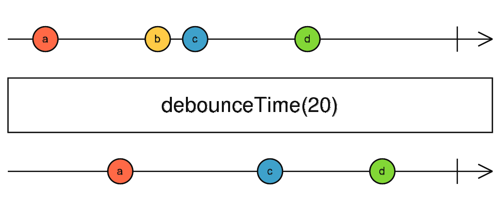
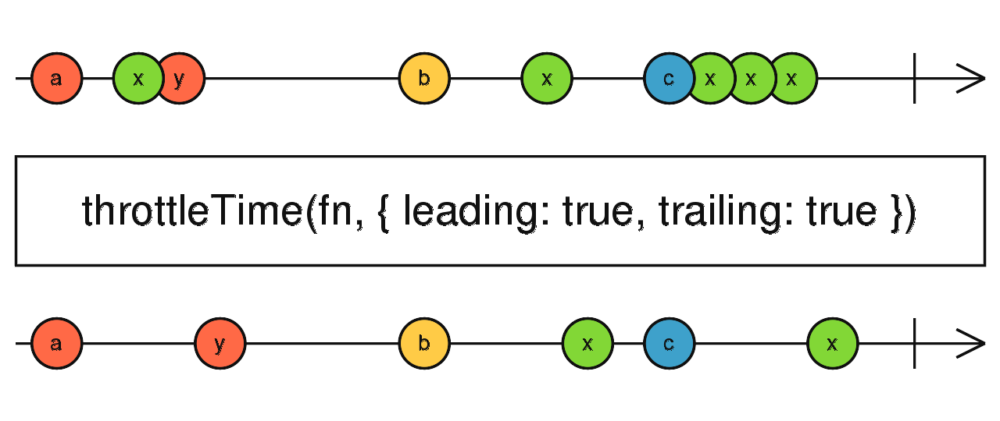
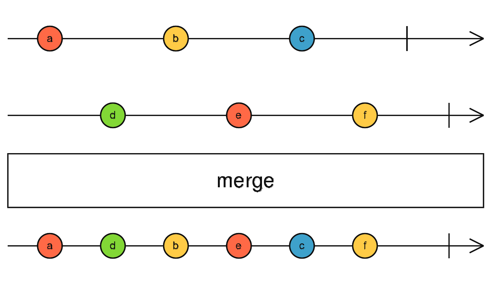
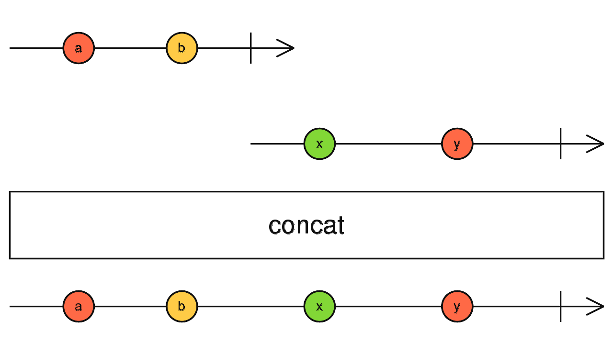
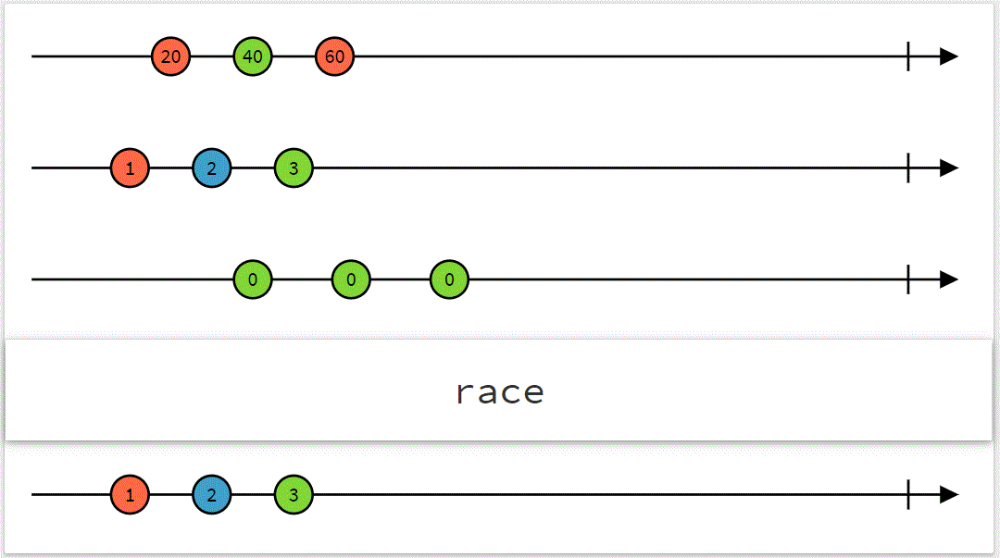
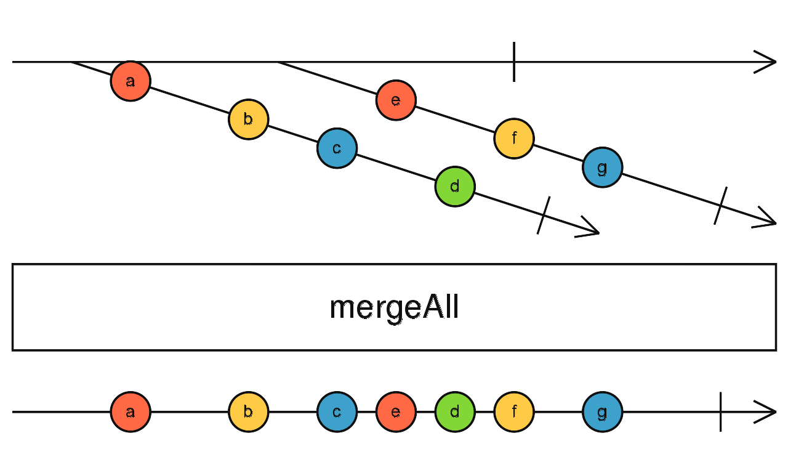
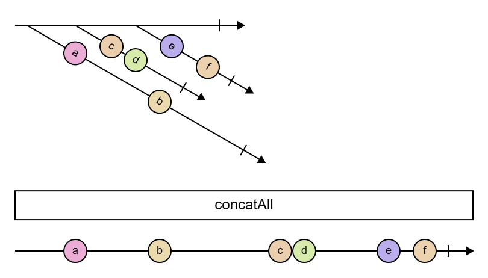
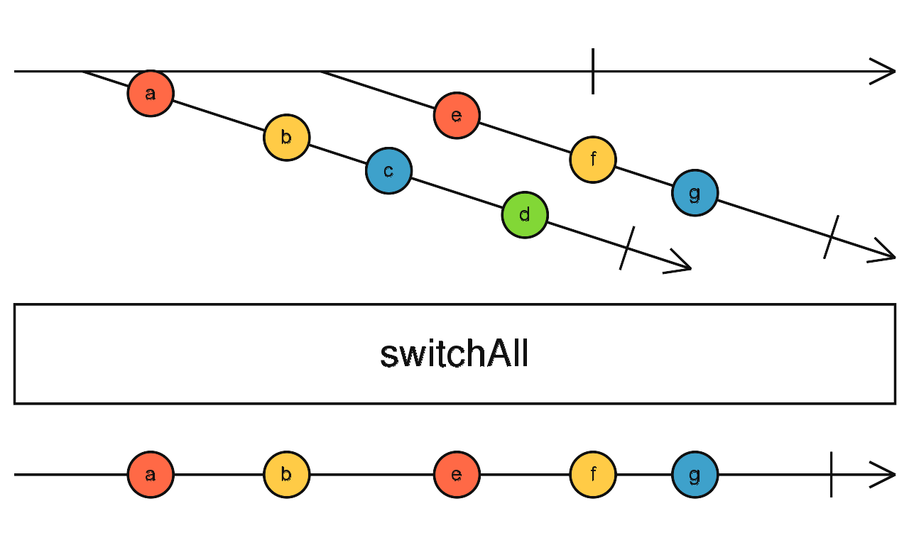

# Módulo 3: Hooks avanzados y programación reactiva en ReactJS

- [Módulo 3: Hooks avanzados y programación reactiva en ReactJS](#módulo-3-hooks-avanzados-y-programación-reactiva-en-reactjs)
  - [Propuesta inicial del módulo](#propuesta-inicial-del-módulo)
  - [Hooks personalizados en React con TypeScript](#hooks-personalizados-en-react-con-typescript)
    - [Hooks personalizados (custom hooks) tipados](#hooks-personalizados-custom-hooks-tipados)
      - [⚙️Hook básico useToggle](#️hook-básico-usetoggle)
      - [⚙️Hook genérico useLocalStorage\<T\>()](#️hook-genérico-uselocalstoraget)
      - [Tests de hooks personalizados](#tests-de-hooks-personalizados)
      - [👁️‍🗨️Test del hook básico useToggle](#️️test-del-hook-básico-usetoggle)
      - [👁️‍🗨️Test del hook genérico useLocalStorage\<T\>()](#️️test-del-hook-genérico-uselocalstoraget)
      - [Hooks personalizados y side effects](#hooks-personalizados-y-side-effects)
        - [Hooks sin useEffect](#hooks-sin-useeffect)
        - [Hooks con useEffect](#hooks-con-useeffect)
        - [⚙️Hook useLoadUser](#️hook-useloaduser)
    - [Hooks personalizados con RxJS y gestión de side effects (useEffect)](#hooks-personalizados-con-rxjs-y-gestión-de-side-effects-useeffect)
      - [Hooks para observables y suscripciones](#hooks-para-observables-y-suscripciones)
        - [⚙️Hook useObservable: primera versión](#️hook-useobservable-primera-versión)
        - [Asincronía y useObservable](#asincronía-y-useobservable)
        - [🧿Componente ListNames (1) con useObservable](#componente-listnames-1-con-useobservable)
      - [Hooks y single responsibility](#hooks-y-single-responsibility)
        - [⚙️Hooks useSubscription](#️hooks-usesubscription)
        - [⚙️Hooks useObservable (segunda versión)](#️hooks-useobservable-segunda-versión)
        - [🧿Componente ListNames (2) con useObservable (v.2)](#componente-listnames-2-con-useobservable-v2)
        - [Single Component Hooks](#single-component-hooks)
      - [Hooks y observables de eventos](#hooks-y-observables-de-eventos)
        - [⚙️Hook useObservableEvent: suscripción a un observable de eventos](#️hook-useobservableevent-suscripción-a-un-observable-de-eventos)
        - [🧿Componente CounterWithHook: Uso de useMemo y useCallback para optimización](#componente-counterwithhook-uso-de-usememo-y-usecallback-para-optimización)
        - [⚙️Hooks useSubscription y useObservable refactorizados](#️hooks-usesubscription-y-useobservable-refactorizados)
      - [Datos y multiples estado en useEffect: Single Component Hooks](#datos-y-multiples-estado-en-useeffect-single-component-hooks)
        - [🧿Componente UserLogged: estados y asincronía](#componente-userlogged-estados-y-asincronía)
        - [⚙️Estados, hooks y asincronía (RxJS): hook useUserLogged](#️estados-hooks-y-asincronía-rxjs-hook-useuserlogged)
      - [🧿Componente UserLogged](#componente-userlogged)
        - [⚙️Hook más genérico: useObservableLoad](#️hook-más-genérico-useobservableload)
        - [🧿Componente agrupando los estados UserLogged3](#componente-agrupando-los-estados-userlogged3)
  - [Integración y operaciones con Observables en componentes React](#integración-y-operaciones-con-observables-en-componentes-react)
    - [Debounces y Throttles](#debounces-y-throttles)
      - [🧿Componente Fibonacci: take, takeWhile, debounceTime, merge](#componente-fibonacci-take-takewhile-debouncetime-merge)
      - [👁️‍🗨️Test del componente Fibonacci](#️️test-del-componente-fibonacci)
      - [Refactorizando Fibonacci en varios Componentes](#refactorizando-fibonacci-en-varios-componentes)
      - [🧿Componentes Fibonacci.v2](#componentes-fibonacciv2)
      - [🧿Componentes FiboItems](#componentes-fiboitems)
    - [Combinación de observables](#combinación-de-observables)
    - [Constantes Observables](#constantes-observables)
    - [Observables de Orden Superior (Higher-Order Observables)](#observables-de-orden-superior-higher-order-observables)
      - [🧿Evolución del componente Fibonacci: SwitchMap](#evolución-del-componente-fibonacci-switchmap)
      - [🧿Componente GetData: MergeMap v. SwitchMap](#componente-getdata-mergemap-v-switchmap)
      - [👁️‍🗨️Test del componente GetData](#️️test-del-componente-getdata)
      - [🧿Componente IntervalCounter3 (2 botones con switchMap)](#componente-intervalcounter3-2-botones-con-switchmap)
      - [👁️‍🗨️Test del componente IntervalCounter3 (2 botones con switchMap)](#️️test-del-componente-intervalcounter3-2-botones-con-switchmap)
      - [🧿Componente IntervalCounter4 (3 botones con switchMap y merge)](#componente-intervalcounter4-3-botones-con-switchmap-y-merge)
      - [👁️‍🗨️Test del componente IntervalCounter4 (3 botones con switchMap)](#️️test-del-componente-intervalcounter4-3-botones-con-switchmap)
  - [Rxjs en React: Subjects en Componentes React](#rxjs-en-react-subjects-en-componentes-react)

## Propuesta inicial del módulo

- Revisión de hooks básicos
  - Repaso de useState, useEffect y useContext con TypeScript
- Introducción a hooks personalizados para flujos reactivos
  - Creación de hooks personalizados con RxJS y TypeScript
  - Hooks para manejar observables y suscripciones
  - Gestión de side effects reactivos usando useEffect
- Uso de useMemo y useCallback para optimización
- Mejoras de rendimiento en aplicaciones reactivas

## Hooks personalizados en React con TypeScript

### Hooks personalizados (custom hooks) tipados

Los hooks personalizados (useX) permiten extraer y reutilizar lógica con estado. Son funciones con ciertas restricciones exigidas por React:

- su nombre empieza por "use"
- utilizan otros hooks de React como useState, useEffect, etc.
- por tanto pueden incluir un estado y manipularlo
- solo pueden ser llamados desde el primer nivel de un componente o de otro hook.
- por tanto no pueden ser llamados dentro de condicionales, bucles o funciones anidadas.

Pueden recibir argumentos y retornar datos o funciones, todos con tipos explícitos.
Puedes usar genéricos (\<T>) para hacerlos más reutilizables.

#### ⚙️Hook básico useToggle

En el siguiente ejemplo se muestra un hook que alterna entre dos estados, devolviendo un array con el estado actual y una función para alternar entre ellos. Este tipo de retorno como un array con el estado y la función, sigue el patrón de los hooks de React, como useState o useReducer.

```ts
import { useState } from 'react';

export function useToggle(initial: boolean = false): [boolean, () => void] {
  const [state, setState] = useState<boolean>(initial);
  const toggle = () => setState((prev) => !prev);
  return [state, toggle];
}
```

Al utilizar el hook, se puede ver como se obtiene el estado y la función para alternar entre los dos estados, ambos tipados correctamente

```tsx
import { useToggle } from './useToggle';

export const TestComponent = () => {
  const [state, toggle] = useToggle();
  console.log(typeof state, typeof toggle); // boolean function
  return <> </>;
};
```

Sin el tipado explícito del valor devuelto, el tipo de `state` y de `toggle` sería una unión de tipos `boolean | () => void`, sin que typescript pudiera discriminar el tipo exacto de ambos.

#### ⚙️Hook genérico useLocalStorage\<T>()

En el segundo ejemplo que veremos, algo más complejo, se muestra un hook que guarda un valor en localStorage. En su tipado es necesario utilizar un genérico para que el valor pueda ser de cualquier tipo, y no solo de un tipo específico. El hook devuelve el valor almacenado y una función para actualizarlo.

```ts
export function useLocalStorage<T>(
  key: string,
  initialValue: T
): [T, (value: T) => void] {
  const [storedValue, setStoredValue] = useState<T & Object>(() => {
    const item = localStorage.getItem(key);
    return item ? JSON.parse(item) : initialValue;
  });

  const setValue = (value: T) => {
    setStoredValue(value);
    localStorage.setItem(key, JSON.stringify(value));
  };

  return [storedValue, setValue];
}
```

El parámetro de `useState<T>` puede ser T o un callback que retorne T, como en este caso, podría ser definida previamente como función con nombre `calculateInitialValue`, y que se llamaría en el primer argumento de useState.

```ts
const calculateInitialValue = (): T => {
  const item = localStorage.getItem(key);
  return item ? JSON.parse(item) : initialValue;
};
```

La función setter `setValue` actualiza el valor en el estado y en localStorage. El valor se guarda como una cadena JSON, por lo que al recuperarlo se debe parsear de nuevo a su tipo original.
El uso del hook es similar al de useState, pero con la diferencia de que el valor se guarda en localStorage y persiste entre recargas de página.

```tsx
import { useLocalStorage } from './useLocalStorage';
export const TestComponent = () => {
  const [name, setName] = useLocalStorage<string>('name', 'Juan');

  return (
    <div>
      <input
        type="text"
        value={name}
        onChange={(e) => setName(e.target.value)}
      />
      <p>Hola, {name}!</p>
    </div>
  );
};
```

#### Tests de hooks personalizados

Los hooks no se pueden testar directamente,sino que dependen de un componente

- si están vinculados directamente a un componente, puede optarse por un test del componente más de integración, no creando un mock del hook y comprobando al mismo tiempo el componente y su hook.

- si se decide testar el hook de forma independiente, habrá que proporcionarle un componente de prueba, que puede codificarse en el propio test del hook.

- finalmente, existen librerías específicas para testar hooks, como `@testing-library/react-hooks`, que facilitan la creación de tests para hooks personalizados.

En su artículo al respecto, [Kent C. Dodds](https://kentcdodds.com/blog/how-to-test-custom-react-hooks) recomienda testar los hooks personalizados de forma independiente, utilizando un componente de prueba simple que utilice el hook y permita verificar su comportamiento. Esto permite aislar la lógica del hook y asegurarse de que funciona correctamente en diferentes escenarios. Solo en casos complejos, recomienda el so de librerías como `@testing-library/react-hooks`.

#### 👁️‍🗨️Test del hook básico useToggle

En primer lugar se crea un componente para la prueba, con botones que llaman a una de las funciones del hook y presentando en pantalla cada uno de los valores, En este caso

- state
- toggle()

```tsx
describe('useToggle', () => {
  const TestHookComponent: React.FC = () => {
    const [state, toggle] = useToggle();

    console.log(state, toggle);

    return (
      <>
        <h3>Test Hook</h3>
        <p>
          {state ? 'On' : 'Off'}
          <span> </span>
          <button onClick={toggle}>Toggle</button>
        </p>
      </>
    );
  };
```

En el test, se renderiza el componente de prueba y se simulan clics en el botón para alternar el estado. Luego, se verifica que el estado cambia correctamente entre "On" y "Off".

```tsx
  test('should toggle state', async () => {
    render(<TestHookComponent />);
    const button = screen.getByRole('button', { name: /toggle/i });
    const paragraph = screen.getByText('Off');
    await userEvent.click(button);
    expect(paragraph).toHaveTextContent('On');
    await userEvent.click(button);
    expect(paragraph).toHaveTextContent('Off');
  });
});
```

#### 👁️‍🗨️Test del hook genérico useLocalStorage\<T>()

De nuevo se crea en primer lugar un componente para la prueba, con botones que llaman a una de las funciones del hook y presentando en pantalla cada uno de los valores, En este caso

- value
- setValue()
- getValue()

```tsx
describe('useLocalStorage', () => {
  const TestHookComponent: React.FC = () => {
    const [value, setValue, getValue] = useLocalStorage<string>(
      'test-key',
      'Initial Value'
    );

    return (
      <>
        <h3>Test Hook</h3>
        <button onClick={() => setValue('New Value')}>Set Value</button>
        <button onClick={() => getValue()}>Get Value</button>
        <output>{value}</output>
      </>
    );
  };

  afterEach(() => {
    vi.clearAllMocks();
  });

```

En los test, se utilizan mocks para simular el comportamiento de `localStorage`, permitiendo verificar que las funciones del hook interactúan correctamente con el almacenamiento local.

```tsx
  test('should set localStorage value', async () => {
    vi.spyOn(Storage.prototype, 'setItem').mockReturnValue(undefined);
    render(<TestHookComponent />);
    const output = screen.getByRole('status');
    const setButton = screen.getByRole('button', { name: /set value/i });
    await userEvent.click(setButton);
    expect(output).toHaveTextContent('New Value');
    expect(localStorage.setItem).toHaveBeenCalledWith(
      'test-key',
      JSON.stringify('New Value')
    );
  });

  test('should get localStorage value', async () => {
    vi.spyOn(Storage.prototype, 'getItem').mockReturnValue(null);
    render(<TestHookComponent />);
    screen.debug();
    const output = screen.getByRole('status');
    const getButton = screen.getByRole('button', { name: /get value/i });
    await userEvent.click(getButton);
    expect(output).toHaveTextContent('Initial Value');
    expect(localStorage.getItem).toHaveBeenCalledWith('test-key');
  });

  test('should get localStorage value without value', async () => {
    vi.spyOn(Storage.prototype, 'getItem').mockReturnValue('"JSON value"');
    render(<TestHookComponent />);
    screen.debug();
    const output = screen.getByRole('status');
    const getButton = screen.getByRole('button', { name: /get value/i });
    await userEvent.click(getButton);
    expect(output).toHaveTextContent('JSON value');
    expect(localStorage.getItem).toHaveBeenCalledWith('test-key');
  });
});
```

#### Hooks personalizados y side effects

Los hooks personalizados pueden incluir efectos secundarios, como el uso de `useEffect` para realizar acciones cuando cambian los valores del estado.

##### Hooks sin useEffect

En algunos casos, se opta por no incluir efectos dentro de un hook personalizado, ya que puede hacer que el código sea más difícil de entender y mantener. En su lugar, es mejor dejar que el componente que utiliza el hook maneje los efectos secundarios.

Cuando el componentes que utiliza el hook necesita realizar un efecto secundario, utilizará una función del hook dentro de `useEffect`. Estaremos por tanto en la misma situación que si se usa una función recibida por props, y como ya hemos visto, el linter nos avisará de que la función no está incluida en el array de dependencias. En este caso, es recomendable usar `useCallback` para evitar que la función cambie su referencia y provoque un bucle infinito.

##### Hooks con useEffect

En el contexto de la asincronía, y sobre todo con los flujos de datos reactivos (observables) lo habitual es llevarnos los efectos al custom hook, que se encargara de la conexión (binding) entre el estado y el flujo.

##### ⚙️Hook useLoadUser

Con un componente que carga datos de un usuario desde una API, podemos crear un hook personalizado que maneje la carga de datos y el estado del usuario.

```tsx
export const useLoadUser = (): User | null => {
  const [user, setUser] = useState<User | null>(null);

  useEffect(() => {
    const loadUser = async (): Promise<void> => {
      const response = await fetch(
        'https://jsonplaceholder.typicode.com/users/1'
      );
      const data = await response.json();
      setUser(data);
    };

    console.log('Sample11b: useEffect');
    loadUser();
  }, []);

  return user;
};
```

Como el estado y los efectos están en el hook, la lógica del componente es mínima

```tsx
export const ShowLoadUser: React.FC = () => {
  const user = useLoadUser();

  return (
    <Card title="Show Load User">
      <p>Component consuming useLoadUser</p>
      {user ? (
        <div>
          <h2>User Loaded</h2>
          <p>
            ID: {user.id} - Name: {user.name}
          </p>
        </div>
      ) : (
        <div>
          <h2>No User Loaded</h2>
        </div>
      )}
    </Card>
  );
};
```

### Hooks personalizados con RxJS y gestión de side effects (useEffect)

En el contexto de la programación reactiva con RxJS, los hooks personalizados pueden ser una herramienta poderosa para encapsular la lógica de manejo de **observables** y **suscripciones** dentro de componentes React.

Podemos crear hooks que utilicen operadores de RxJS para transformar y combinar flujos de datos, lo que permite una gestión más eficiente de la asincronía y los efectos secundarios.

#### Hooks para observables y suscripciones

En todos los componentes que utilizan observables repetimos el proceso de

- crear el observable
- suscribirnos a él en useEffect
- actualizar el estado del componente con los valores emitidos por el observable
- desuscribirnos en la función de limpieza de useEffect para evitar fugas de memoria

Con excepción de la primera parte, el resto del código es repetitivo y puede ser abstraído en hooks personalizados.

##### ⚙️Hook useObservable: primera versión

Volvamos al primer ejemplo de observable planteado, capaz de listar una serie de elementos.

```tsx
import { useEffect, useState } from 'react';
import { Observable, of } from 'rxjs';

const names = ['Alice', 'Bob', 'Charlie', 'Diana'];

const names$: Observable<string[]> = of(names);

const ListComponent = () => {
  const [names, setNames] = useState<string[]>([]);

  useEffect(() => {
    const subscription = names$.subscribe(setNames);
    return () => subscription.unsubscribe();
  }, []);

  return (
    <Card title="Names List from Observable">
      <ul>
        {names.map((name) => (
          <li key={name}>{name}</li>
        ))}
      </ul>
    </Card>
  );
};
```

Nuestro objetivo es crear un hook personalizado `useObservable` que

- maneje la suscripción al observable
- actualiza el estado del componente con los valores emitidos por el observable
- se desuscribe automáticamente cuando el componente se desmonte, evitando fugas de memoria.
- devuelva el valor actual del estado.

```tsx
// Primera versión del hook useObservable
// Estado sencillo y un solo hook

export const useObservable = <T,>(
  observable$: Observable<T>,
  initial: T | null = null
): T | null => {
  const [state, setState] = useState<T | null>(initial);

  useEffect(() => {
    const sub = observable$.subscribe({
      next: (v) => setState(v),
      error: (err) => console.error('useObservable error', err),
    });
    return (): void => {
      sub.unsubscribe();
    };
  }, []);

  return state;
};
```

##### Asincronía y useObservable

Aunque más adelante hablaremos más en profundidad sobre la asincronía en RxJS, veamos un ejemplo sencillo para comprobar que el hook `useObservable` funciona correctamente con observables asíncronos.

Si convertimos el observable en un flujo asíncrono con los distintos nombres emitidos con un retardo, el hook `useObservable` seguirá funcionando correctamente, actualizando el estado del componente a medida que llegan los nuevos valores.

```tsx
const source = ['Adam', 'Brian', 'Christine'];
const names$ = interval(1000).pipe(map((i) => source.slice(0, i + 1)));
```

##### 🧿Componente ListNames (1) con useObservable

Al usar el hook habrá que tener en cuenta que el estado es null hasta que el observable emite su primer valor, por lo que habrá que manejar ese caso en el componente.

```tsx
import { useObservable } from './use-observable';

const names$ = interval(1000).pipe(map((i) => names.slice(0, i + 1)));

const ListNames: React.FC = () => {
  const names = useObservable<string[]>(names$, []);

  return (
    <Card title="Names List from Observable">
      <ul>{names && names.map((name) => <li key={name}>{name}</li>)}</ul>
    </Card>
  );
};
```

La lógica del componente es mínima, gracias a que el hook `useObservable` se encarga de gestionar la suscripción al observable y actualizar el estado del componente. Además el hook es reutilizable en otros componentes que necesiten suscribirse a observables.

#### Hooks y single responsibility

El hook que hemos creado puede considerarse que tiene dos responsabilidades:

1. Gestionar la suscripción a un observable
2. Gestionar la actualización del estado del componente.

De acuerdo con la sugerencia de **Ben Lesh** (creador de RxJS) en [🌍Introduction to RxJS Patterns in React Part 1/2 (Ft. Ben Lesh)](https://www.youtube.com/watch?v=qF8XcEwwPpU), podemos separar ambas funciones en dos hooks distintos

##### ⚙️Hooks useSubscription

El hook `useSubscription` se encarga únicamente de gestionar la suscripción a un observable y la limpieza de la suscripción cuando el componente se desmonta.

```tsx
export const useSubscription = <T,>(
  observable$: Observable<T>,
  onNext: (value: T) => void,
  onError?: (error: any) => void
): void => {
  useEffect(() => {
    const sub = observable$.subscribe({
      next: onNext,
      error: onError || ((err) => console.error('useSubscription error', err)),
    });
    return (): void => {
      sub.unsubscribe();
    };
  }, [observable$, onNext, onError]);
};
```

En el ejemplo anterior, recibimos el observable y dos funciones callback para manejar los valores emitidos y los errores. El hook se suscribe al observable en `useEffect` y llama a las funciones proporcionadas cuando se emiten nuevos valores o errores.

Una alternativa es recibir un Partial del objeto Observer, con las funciones next, error y complete.

```tsx
export const useSubscription = <T,>(
  observable$: Observable<T>,
  observer: Partial<Observer<T>>
): void => {
  useEffect(() => {
    const sub = observable$.subscribe(observer);
    return (): void => {
      sub.unsubscribe();
    };
  }, [observable$, observer]);
};
```

##### ⚙️Hooks useObservable (segunda versión)

La nueva versión del hook `useObservable` utiliza `useSubscription` para gestionar la suscripción al observable y actualizar el estado del componente. Si usamos la versión del hook `useSubscription` que recibe un Partial del objeto Observer, el código queda más limpio.

```tsx
// Segunda versión del hook useObservable
// Separación de la lógica de suscripción en un hook aparte

export const useObservable = <T,>(
  observable$: Observable<T>,
  initial: T | null = null
): T | null => {
  const [state, setState] = useState<T | null>(initial);

  const observer: Partial<Observer<T>> = {
    next: (v) => setState(v),
    error: (err) => console.error('useObservable error', err),
  };

  useSubscription<T>(observable$, observer);

  return state;
};
```

Si queremos incluir una gestión del error mas allá de un simple console.error, podemos modificar ligeramente la implementación para recibir incluir una función error en el observer y añadir el correspondiente estado en el hook.

```tsx
// Segunda versión del hook useObservable
// Separación de la lógica de suscripción en un hook aparte
// Manejo de errores y estado inicial

export const useObservableWithError = <T,>(
  observable$: Observable<T>,
  initial: T | null = null
): [T | null, Error | null] => {
  const [state, setState] = useState<T | null>(initial);
  const [error, setError] = useState<Error | null>(null);

  const observer: Partial<Observer<T>> = useMemo(
    () => ({
      next: (value: T): void => {
        setState(value);
      },
      error: (error: Error): void => {
        // console.error('Error in observable:', error);
        setError(error);
        setState(initial);
      },
    }),
    [initial]
  );

  useSubscription<T>(observable$, observer);
  return [state, error];
};
```

##### 🧿Componente ListNames (2) con useObservable (v.2)

Nuestro componente quedará como antes, dado que sigue utilizando el hook `useObservable`.

```tsx
export const ListWithHook: React.FC = () => {
  const [items, setItems] = React.useState<string[]>([]);

  const names$ = useMemo(() => {
    return interval(1000).pipe(map((i) => names.slice(0, i + 1)));
  }, []);

  const items = useObservable<string[]>(names$, []);

  return (
    <Card title="List">
      <ul>
        {items.map((item) => (
          <li key={item}>{item}</li>
        ))}
      </ul>
    </Card>
  );
};
```

En este caso hemos incluido la generación del observable dentro del componente, pero podría estar definido en otro módulo y ser importado. En cualquier caso, al estar dentro se genera un nuevo observable en cada renderizado, por lo que hemos tenido que memorizarlo con useMemo para evitar que el hook `useObservable` se vuelva a suscribir en cada renderizado.

##### Single Component Hooks

Algunos autores utilizan el patron de diseño **Single Component Hooks**, que consiste en crear un hook personalizado para cada componente que encapsula toda la lógica del componente, incluyendo el estado, los efectos y la renderización. Estos hooks pueden ser muy pequeños (micro hooks) o más grandes, dependiendo de la complejidad del componente.

En nuestro caso, podríamos crear un hook `useList` que encapsule toda la lógica del componente `ListWithHook`, incluyendo la creación del observable, la suscripción y el estado.

```tsx
export const useList = (): string[] => {
  const names$ = useMemo(() => {
    return interval(1000).pipe(map((i) => names.slice(0, i + 1)));
  }, []);

  const items = useObservable<string[]>(names$, []);
  return items;
};
```

El componente `ListWithHook` quedaría entonces muy simple, simplemente llamando al hook `useList` para obtener los datos.

```tsx
export const ListWithHook: React.FC = () => {
  const items = useList();

  return (
    <Card title="List">
      <ul>
        {items.map((item) => (
          <li key={item}>{item}</li>
        ))}
      </ul>
    </Card>
  );
};
```

Autores como **Ben Lesh** (creador de Redux y miembro del equipo de React) han expresado opiniones críticas sobre este patrón, argumentando que puede llevar a una sobre-abstracción y dificultar la comprensión del código. En su opinión, los hooks personalizados deben ser utilizados para compartir lógica entre componentes, pero no para encapsular toda la lógica de un componente en un solo hook. [🌍Introduction to RxJS Patterns in React Part 1/2 (Ft. Ben Lesh)](https://www.youtube.com/watch?v=qF8XcEwwPpU).

#### Hooks y observables de eventos

Los observables de eventos en React presentan una dificultad extra, ya que para crear el observable necesitamos acceder al DOM, y eso solo es posible desde useEffect, pero los hooks deben ejecutarse en el nivel superior del componente.

Veamos como podemos afrontar este problema en un hook personalizado

##### ⚙️Hook useObservableEvent: suscripción a un observable de eventos

Veamos un ejemplo básico partiendo de un contador de clics utilizando RxJS.

```tsx
export const CounterClicks: React.FC = () => {
  const startRef = useRef<HTMLButtonElement | null>(null);
  const [count, setCount] = React.useState(0);

  useEffect(() => {
    const btn = startRef.current;
    if (!btn) return;
    const click$ = fromEvent<MouseEvent>(btn, 'click').pipe(map(() => 1));
    const counter$ = click$.pipe(scan((acc, curr) => acc + curr, 0));
    const subscription = counter$.subscribe(setCount);
    return (): void => subscription.unsubscribe();
  }, []);

  return (
    <Card title="Counter Clicks">
      <button ref={startRef}>Click count: {count}</button>
    </Card>
  );
};
```

Nuestro objetivo es crear un hook `useObservableEvent` que maneje la suscripción al observable y devuelva el valor actual de un hook personalizado que utiliza RxJS para manejar un observable.

La implementación del hook `useObservableEvent` presenta algunas dificultades:

- el hook debe aceptar un observable como argumento y devolver el valor emitido por el observable.
- como todos los hooks, debe ejecutarse a nivel superior del componente, no dentro de condicionales o funciones anidadas, como es la llamada a useEffect .
- sin embargo solo desde useEffect podemos acceder al DOM para crear el observable a partir de eventos, que necesitaríamos haberle pasado a useObservableEvent.

La solución es pasarle a useObservableEvent en vez de un observable ya creado, una función factory que lo cree, con el código que ahora tenemos en useEffect.

```ts
    const createObservable = (): Observable<number> | null => {
        console.log("Create Observable");
        const btn = startRef.current;
        if (!btn) return null;
        const click$ = fromEvent<MouseEvent>(btn, 'click').pipe(
            map(() => 1)
        );
        const counter$ = click$.pipe(
            tap((v) => console.log('Click detected:', v)),
            scan((acc, curr) => acc + curr, 0)
        );
        return counter$;
    };

    const count = useObservableEvent<number>(createObservable, 0) || 0;
};
```

Este hook `useObservableEvent` acepta un observable y su valor inicial como argumentos y devuelve un estado con el valor emitido por el observable. Utiliza `useEffect` para suscribirse al observable cuando el componente se monta y se desuscribe cuando el componente se desmonta, evitando fugas de memoria.

```tsx
export const useObservableEvent = <T,>(
  factory: () => Observable<T> | null,
  initial: T | null = null
): T | null => {
  const [value, setValue] = useState<T | null>(initial);

  useEffect(() => {
    const obs = factory();
    if (!obs) return;
    const sub = obs.subscribe({
      next: (v) => setValue(v),
      error: (err) => console.error('useObservableEvent error', err),
    });
    return (): void => {
      sub.unsubscribe();
    };
  }, [factory]);

  return value;
};
```

##### 🧿Componente CounterWithHook: Uso de useMemo y useCallback para optimización

En el ejemplo anterior, el hook `useObservableEvent` depende de la función `factory` para crear el observable. Si `factory` se define dentro del componente, su referencia cambiará en cada renderizado, lo que provocará que el efecto se vuelva a ejecutar y se cree un nuevo observable.

Para comprobarlo, podemos ver que en la consola se imprime "Create Observable" varias veces, al hacer clic en el botón, ya que cada vez que se hace clic, el componente se vuelve a renderizar y se crea una nueva función `factory`.

Para evitar esto, podemos utilizar `useMemo` y `useCallback` para memorizar la función `factory` y el observable resultante.

```tsx
const CounterWithHook: React.FC = () => {
  const startRef = useRef<HTMLButtonElement | null>(null);
  const createObservable = useCallback((): Observable<number> | null => {
    const btn = startRef.current;
    if (!btn) return null;
    const click$ = fromEvent<MouseEvent>(btn, 'click').pipe(map(() => 1));
    const counter$ = click$.pipe(
      tap((v) => console.log('Click detected:', v)),
      scan((acc, curr) => acc + curr, 0)
    );
    return counter$;
  }, []);

  const count = useObservableEvent<number>(createObservable, 0) || 0;
};
```

##### ⚙️Hooks useSubscription y useObservable refactorizados

El hook useObservableEvent podría descomponerse en 2 hooks, uno para la suscripción (useSubscription) y otro para manejar el estado (useObservable), como ya hemos visto anteriormente.

Incluso podríamos ampliar la funcionalidad de los hook antes creados, para que fueran capaces de manejar observables o funciones factory, como en este caso.

Este sería el resultado para useSubscription:

```tsx
export const useSubscription = <T,>(
  source: Observable<T> | (() => Observable<T> | null),
  observer: Partial<Observer<T>>
): void => {
  useEffect(() => {
    const obs = typeof source === 'function' ? source() : source;
    if (!obs) return;
    const sub = obs.subscribe(observer);
    return (): void => {
      sub.unsubscribe();
    };
  }, [source, observer]);
};
```

Y este para useObservable:

```tsx
export const useObservable = <T,>(
  source: Observable<T> | (() => Observable<T> | null),
  initial: T
): [T, Error | null] => {
  const [state, setState] = useState<T>(initial);
  const [error, setError] = useState<Error | null>(null);

  const observer: Partial<Observer<T>> = useMemo(
    () => ({
      next: (value: T): void => {
        setState(value);
      },
      error: (error: Error): void => {
        // console.error('Error in observable:', error);
        setError(error);
        setState(initial);
      },
    }),
    [initial]
  );

  useSubscription<T>(source, observer);
  return [state, error];
};
```

#### Datos y multiples estado en useEffect: Single Component Hooks

Otra situación común es cuando necesitamos cargar datos asíncronos (e.g. de una API) y actualizar varios estados del componente en función de esos datos.

Si un hook más genérico, como useObservable, no es suficiente para manejar la complejidad del estado, podemos crear un hook personalizado específico para el componente (single component hook) que utilice RxJS para manejar la carga de datos y el estado asociado.

En primer lugar vamos a ver un componente que completa toda la lógica de carga de datos internamente, para luego refactorizarlo utilizando un hook personalizado con RxJS.

##### 🧿Componente UserLogged: estados y asincronía

Para empezar tenemos una función que simula la llamada a una API para obtener datos de un usuario.

```tsx
export const fetchUserMock = (delay = 0, isError = false): Observable<User> => {
  return new Observable((observer) => {
    setTimeout(() => {
      if (isError) {
        observer.error(new Error('Error al obtener el usuario'));
      } else {
        observer.next({
          id: 1,
          name: 'Pepe Pérez',
          email: 'pepe.perez@example.com',
          username: 'pepe-p',
        });
      }
    }, delay);
  });
};
```

Definimos también el modelo de datos del usuario.

```ts
type User = {
  id: number;
  name: string;
  email: string;
  username: string;
};
```

Vamos a crear un componente que carga datos de una API y muestra un "spinner" mientras espera. El componente utiliza `useState` para manejar el estado de carga y `useEffect` para cargar los datos al montar el componente.

```tsx
export const UserLogged: React.FC = () => {
  const [user, setUser] = useState<User | null>(null);
  const [loading, setLoading] = useState<boolean>(true);
  const [error, setError] = useState<Error | null>(null);

  useEffect(() => {
    fetchUserMock(1000, false)
      .pipe(tap(() => setLoading(true)))
      .subscribe({
        next: (userData) => {
          setUser(userData);
          setLoading(false);
        },
        error: (err) => {
          setError(err);
          setLoading(false);
        },
      });
  }, []);

  return (
    <Card title="User Info">
      {loading && <p>Loading...</p>}
      {error && <p>Error: {error.message}</p>}
      {user && (
        <div>
          <h4>{user.name}</h4>
          <p>Email: {user.email}</p>
          <p>Username: {user.username}</p>
        </div>
      )}
    </Card>
  );
};
```

1. el acceso a los datos remotos esta encapsulado en una función `fetchUser`, independiente del componente, que se encarga de realizar la llamada a la API y devolver el resultado. Este es el concepto de **servicios**, que más adelante veremos incluyendo la posibilidad de incorporar clases y métodos para encapsular la lógica de acceso a datos.

2. el componente `UserComponent` utiliza `useState` para manejar dos estados:

   - el estado del usuario, que se inicializa como `null`, pero definiendo que su tipo es `User | null`
   - el estado de carga, que se inicializa como `true`, y se establece en `false` una vez que se han cargado los datos o ha ocurrido un error.
   - el estado de error, que se inicializa como `null`, y se establece en el error capturado si ocurre uno.

3. los procesos asíncronos, en este caso la llamada a la API, se manejan dentro de un `useEffect`, que se ejecuta al montar el componente.

4. los procesos asíncronos se manejan con las propiedades del objeto `subscribe`, que permiten definir funciones para manejar los casos de éxito (`next`) y error (`error`), equivalentes al método `.then()` y `.catch()` de las promesas. El método `finally` de las promesas no tiene un equivalente directo en RxJS, pero se puede simular usando el operador `finalize`, que se ejecuta cuando el observable completa o error.

##### ⚙️Estados, hooks y asincronía (RxJS): hook useUserLogged

La lógica de negocio que gestiona los estados del componente, incluyendo la carga de datos, y los efectos, se puede encapsular en un hook personalizado. Este hook puede manejar el estado de carga, el estado de error y la lógica de carga de datos, permitiendo que el componente sea más limpio y fácil de entender.

```tsx
type UseUserHook = {
    user: User | null;
    loading: boolean;
    error: Error | null;
};

export const useLoggedUser = () : UseUserHook => {
    const [user, setUser] = useState<User | null>(null);
    const [loading, setLoading] = useState<boolean>(true);
    const [error, setError] = useState<Error | null>(null);

    useEffect(() => {
        const load = (): void => {
            fetchUserMock(1000, false)
                .pipe(tap(() => setLoading(true)))
                .subscribe({
                    next: (userData) => {
                        setUser(userData);
                        setLoading(false);
                    },
                    error: (err) => {
                        setError(err);
                        setLoading(false);
                    },
                });
        };

        load();
    }, []);

    return { user, loading, error };
};
```

#### 🧿Componente UserLogged

Como consecuencia, el componente `UserComponent` se simplifica, ya que solo tiene que llamar al hook y manejar los estados expuestos por el hook`.

```tsx
export const UserComponent: React.FC = () => {
  const { user, loading, error } = useLoggedUser();

  return (
    <div>
      <h3>User</h3>
      {loading && <p>Loading...</p>}
      {error && <p>Error: {error.message}</p>}
      {user && (
        <div>
          <h4>{user.name}</h4>
          <p>Email: {user.email}</p>
          <p>Username: {user.username}</p>
        </div>
      )}
    </div>
  );
};
```

##### ⚙️Hook más genérico: useObservableLoad

A partir de este punto, podemos crear un hook más genérico, que admita como estados los datos, load y el error, similar al useObservable que ya tenemos, e.g. use-observable-load.

```tsx
type LoadState<T> = {
  value: T | null;
  loading: boolean;
  error: Error | null;
};

export const useLoadObservable = <T,>(
  getData: () => Observable<T>
): LoadState<T> => {
  const [value, setValue] = useState<T | null>(null);
  const [loading, setLoading] = useState<boolean>(true);
  const [error, setError] = useState<Error | null>(null);

  const observer: Partial<Observer<T>> = useMemo(
    () => ({
      next: (data): void => {
        setValue(data);
        setLoading(false);
      },
      error: (error: Error): void => {
        setError(error);
        setLoading(false);
      },
    }),
    []
  );

  const data$ = useMemo(
    () => getData().pipe(tap(() => setLoading(true))),
    [getData]
  );
  useSubscription<T>(data$, observer);
  return { value, loading, error };
};
```

El componente sería prácticamente igual que en el caso anterior, excepto que le pasaríamos el observable a cargar como una función factory.

```tsx
export const UserLogged2: React.FC = () => {
  const {
    value: user,
    loading,
    error,
  } = useLoadObservable<User>(fetchUserMock);

  return (
    <Card title="User Logged">
      {loading && <p>Loading...</p>}
      {error && <p>Error: {error.message}</p>}
      {user && (
        <div>
          <h4>{user.name}</h4>
          <p>Email: {user.email}</p>
          <p>Username: {user.username}</p>
        </div>
      )}
    </Card>
  );
};
```

##### 🧿Componente agrupando los estados UserLogged3

Otra opción es agrupar los estados en un único objeto, de forma que pueda ser gestionado por nuestro observable genérico useObservable.

```tsx
export type UserState = {
    user: User | null;
    loading: boolean;
    error: Error | null;
};

export const UserLogged3: React.FC = () => {
    const initialState: UserState = useMemo(
        () => ({
            user: null,
            loading: true,
            error: null,
        }),
        []
    );
    const source$: Observable<UserState> = useMemo(() => {
        return fetchUserMock(3_000, false).pipe(
            map((user) => ({
                user,
                loading: false,
                error: null,
            })),
            startWith(initialState),
            catchError((error) =>
                of({
                    user: null,
                    loading: false,
                    error,
                })
            )
        );
    }, [initialState]);

    const [{ user, loading, error }] = useObservable<UserState>(source$, initialState);
```

## Integración y operaciones con Observables en componentes React

### Debounces y Throttles

`debounceTime` y `debounce`

- Funcionamiento: Espera a que haya un silencio en las emisiones durante un tiempo determinado. Si llega un nuevo evento antes de que termine el tiempo, reinicia el temporizador. Solo emite el último evento que llegó después de que el silencio dure el tiempo especificado.
- Caso de uso: Búsqueda autocompletada. Permite esperar a que el usuario termine de escribir antes de enviar la solicitud de búsqueda.
- Diferencia: el operador `debounce` permite definir una función que retorna un observable para cada valor emitido, mientras que `debounceTime` simplemente usa un tiempo fijo.



```ts
import { of } from 'rxjs';
import { debounce } from 'rxjs/operators';

const startingTime = Date.now();
const elapsed = () => Date.now() - startingTime;
const example$ = of(1, 2, 3, 4).pipe(debounce(1000));
example$.subscribe((value) => {
  console.log({
    value,
    emittedAt: elapsed(),
  });
});
// Logs: {value: 4, emittedAt: 1}
```

`throttleTime` y `throttle`

- Funcionamiento: Permite que el primer evento pase inmediatamente. Luego, bloquea todos los eventos posteriores durante un intervalo de tiempo. Una vez que el intervalo expira, permite que el siguiente evento pase y comienza el ciclo nuevamente.
- Caso de uso: Actualizaciones de la interfaz de usuario durante un desplazamiento. Se emite un valor cada cierto tiempo, incluso si el evento ocurre con más frecuencia, como en un ejemplo de desplazamiento del ratón para actualizar una barra de progreso.
- Diferencia: el operador `throttle` permite definir una función que retorna un observable para cada valor emitido, mientras que `throttleTime` simplemente usa un tiempo fijo. Este último recibe opcionalmente un objeto de configuración con la propiedad `leading` (por defecto true) y `trailing` (por defecto false) para controlar si se emite el primer y/o el último valor del intervalo.



```ts
import { of } from 'rxjs';
import { throttleTime } from 'rxjs/operators';

const startingTime = Date.now();
const elapsed = () => Date.now() - startingTime;
const example$ = of(1, 2, 3, 4).pipe(throttleTime(1000));
example$.subscribe((value) => {
  console.log({
    value,
    emittedAt: elapsed(),
  });
});
// Logs: {value: 1, emittedAt: 1}
```

`delay`

- Funcionamiento: Retrasa la emisión de cada valor por un tiempo especificado.
- Caso de uso: Simular latencia en pruebas o retrasar la visualización de notificaciones.

`timeout`

- Funcionamiento: Emite un error si no se emite ningún valor en un tiempo determinado.
- Caso de uso: Manejo de solicitudes de red que no responden en un tiempo razonable.

#### 🧿Componente Fibonacci: take, takeWhile, debounceTime, merge

- El algoritmo de Fibonacci para obtener números donde cada uno es la suma de los dos anteriores se implementa mediante un **generador** de ES6
- El operador **from** crea un observable a partir del generador (entre otros usos)
- Si usuario indica un número de elementos, usamos el operador **take** para limitar la emisión a ese número de elementos

```tsx
const getFibonacciItems = (n: number): void => {
  setSeries([]);
  from(fibonacci())
    .pipe(take(n))
    .subscribe({
      next: (val) => setSeries((prev) => [...prev, val]),
      complete: () => console.log('Completed 1'),
    });
};

const getFibonacciLimited = (limit: number): void => {
  from(fibonacci())
    .pipe(takeWhile((val) => val < limit))
    .subscribe({
      next: (val) => setSeries((prev) => [...prev, val]),
      complete: () => console.log('Completed 2'),
    });
};
```

- Si el usuario indica un límite máximo, usamos el operador **takeWhile** para emitir valores
- Usamos el operador **debounceTime** para esperar a que el usuario deje de escribir en el input antes de generar la secuencia
- Anticipamos el uso de **merge** que permite combinar varios observables en uno solo

```tsx
useEffect(() => {
  console.log('Fibonacci component show selected');
  const inputNumber = inputNumberRef.current;
  const inputLimit = inputLimitRef.current;

  if (!inputNumber || !inputLimit) return;

  const input$ = merge(
    fromEvent<React.InputEvent<HTMLInputElement>>(inputNumber, 'input'),
    fromEvent<React.InputEvent<HTMLInputElement>>(inputLimit, 'input')
  );

  input$
    .pipe(
      // extraer el valor del input
      map((ev) => (ev.target as HTMLInputElement).value),
      // esperar 300ms de silencio y emitir solo el último valor
      debounceTime(300)
      // evitar emitir si el valor no cambia
      // distinctUntilChanged()
    )
    .subscribe((input) => observerInput(input));

  const observerInput = (value: string): void => {
    const num = Number(value);
    if (Number.isNaN(num) || num < 1) {
      setSeries([]);
      return;
    }
    if (show === 'numbers') {
      getFibonacciItems(num);
    } else {
      getFibonacciLimited(num);
    }
  };

  return (): void => {
    console.log('Fibonacci show unselected');
  };
}, [show]);
```

#### 👁️‍🗨️Test del componente Fibonacci

Tenemos que testar las dos funcionalidades del componente

- calcular el número de items solicitado
- calcular todos lo items por debajo de un límite

Para el primer caso, el test seria el siguiente:

- chequeamos el radiobutton de la primera opción
- escribimos el número en el input
- en un waitFor, comprobamos que la secuencia de números se renderiza

```tsx
test('should display fibonacci sequence of n number', async () => {
  render(<Fibonacci />);
  const checkOptions = screen.getByRole('radio', { name: /items/i });
  await userEvent.click(checkOptions);
  const inputNumber = screen.getByRole('textbox');
  await userEvent.type(inputNumber, '10');

  await waitFor(() => {
    const output = screen.getByRole('status');
    expect(output).toHaveTextContent(/^0, 1, 1, 2, 3, 5/);
  });
});
```

En el segundo caso el los pasos del test serían los mismos, cambiando unicamente la opción seleccionada en el primero de ellos:

```tsx
test('should calculate fibonacci sequence with a limit', async () => {
  render(<Fibonacci />);
  const checkOptions = screen.getByRole('radio', { name: /limit/i });
  await userEvent.click(checkOptions);
  const inputNumber = screen.getByRole('textbox');
  await userEvent.type(inputNumber, '10');

  await waitFor(() => {
    const output = screen.getByRole('status');
    expect(output).toHaveTextContent(/^0, 1, 1, 2, 3, 5/);
  });
});
```

Una vez mas vemos, que al estar testando las funcionalidades, la implementación basada en observables no tiene ningún efecto sobre los tests.

#### Refactorizando Fibonacci en varios Componentes

Partiendo del ejemplo anterior, tiene sentido separar la lógica de generación de la secuencia en un componente hijo, que reciba los parámetros necesarios para generar la secuencia y renderice el resultado, frente a un componente que nos permita decidir el tamaño de la serie: valor límite o número de items

#### 🧿Componentes Fibonacci.v2

El primer componente nos da un ejemplo de como gestionar un conjunto de radio buttons

```tsx
export type TypeLimits = 'numbers' | 'limit';

export const Fibonacci2: React.FC = () => {
  const radioRef = useRef<HTMLInputElement | null>(null);

  const factoryRadio = (): Observable<TypeLimits> | null => {
    const radio = radioRef.current;
    if (!radio) return null;
    return fromEvent<React.ChangeEvent<HTMLInputElement>>(radio, 'change').pipe(
      map((event) => {
        const { value } = event.target;
        return value as TypeLimits;
      })
    );
  };

  const [typeLimit] = useObservable(factoryRadio, 'numbers');

  return (
    <Card title="Fibonacci sequences v.2">
      <div className="options" ref={radioRef}>
        <label>
          <input type="radio" name="fibonacci" value="numbers" defaultChecked />
          Generate by number of items
        </label>
        <label>
          <input type="radio" name="fibonacci" value="limit" />
          Generate by limit value
        </label>
      </div>
      <FiboItems typeLimit={typeLimit} />
    </Card>
  );
};
```

#### 🧿Componentes FiboItems

El segundo componente recibe el tipo de límite y gestiona el input y la generación de la secuencia

```tsx
type Props = {
  typeLimit: TypeLimits;
};

export const FiboItems: React.FC<Props> = ({ typeLimit = 'numbers' }) => {
  const inputRef = useRef<HTMLInputElement | null>(null);
  const [series, setSeries] = useState<number[]>([]);

  const inputLabel =
    typeLimit === 'numbers' ? 'Number of items' : 'Limit of numbers';

  const getFibonacciItems = useCallback(
    (value: string): void => {
      setSeries([]);
      const num = Number(value);
      if (Number.isNaN(num) || num < 1) {
        return;
      }
      from(fibonacci())
        .pipe(
          typeLimit === 'numbers' ? take(num) : takeWhile((val) => val < num),
          toArray()
        )
        .subscribe({
          next: (val) => setSeries(val),
          complete: () => console.log('Completed 1'),
        });
    },
    [typeLimit]
  );

  const inputFactory = (): Observable<string> | null => {
    const inputNumber = inputRef.current;
    if (!inputNumber) return null;
    inputNumber.value = '';
    setSeries([]);

    const input$ = fromEvent<React.InputEvent<HTMLInputElement>>(
      inputNumber,
      'input'
    );

    return input$.pipe(
      // esperar 300ms de silencio y emitir solo el último valor
      debounceTime(300),
      // extraer el valor del input
      map((ev) => (ev.target as HTMLInputElement).value),
      // evitar emitir si el valor no cambia
      distinctUntilChanged()
    );
  };

  useSubscription(
    useCallback(inputFactory, []),
    useMemo(() => ({ next: getFibonacciItems }), [getFibonacciItems])
  );

  return (
    <Card>
      <div>
        <label>
          <span>{inputLabel}</span>
          <input name="value" type="text" ref={inputRef} />
        </label>
        <p>
          Series: <output className="series">{series.join(', ')}</output>
        </p>
      </div>
    </Card>
  );
};
```

La función getFibonacciItems recibe el valor del input y genera la secuencia de Fibonacci en función del tipo de límite seleccionado. Internamente utiliza un observable, aplica el operador toArray y en la suscripción actualiza el estado con el array de valores de la serie de Fibonacci.

La función inputFactory crea un observable a partir del evento input del input de texto, aplicando los operadores debounceTime, map y distinctUntilChanged para optimizar la emisión de valores.

Más adelante retomaremos este ejemplo y veremos lo errores de diseño en el uso de los observables y los operadores de RxJS.

### Combinación de observables

Junto con el operador `merge`, utilizado en la primera versión del ejemplo anterior, existen otros operadores que permiten combinar múltiples observables en uno solo.

- **merge**: Combina múltiples observables en uno solo, emitiendo valores a medida que llegan de cualquiera de los observables fuente.

```ts
import { merge, of } from 'rxjs';
import { delay } from 'rxjs/operators';

const obs1$ = of('A', 'B', 'C').pipe(delay(1000));
const obs2$ = of(1, 2, 3).pipe(delay(500));

const merged$ = merge(obs1$, obs2$);
merged$.subscribe((value) => console.log(value));
// Logs: 1, 2, 3, A, B, C
```



- **concat**: Combina múltiples observables en uno solo, pero espera a que cada observable se complete antes de suscribirse al siguiente.

```ts
import { concat, of } from 'rxjs';
import { delay } from 'rxjs/operators';
const obs1$ = of('A', 'B', 'C').pipe(delay(1000));
const obs2$ = of(1, 2, 3).pipe(delay(500);
const concatenated$ = concat(obs1$, obs2$);
concatenated$.subscribe(value => console.log(value));
// Logs: A, B, C, 1, 2, 3
```



- **race**: Combina múltiples observables y emite valores del primero que emita un valor, ignorando los demás.

```ts
import { race, of } from 'rxjs';
import { delay } from 'rxjs/operators';
const obs1$ = of('A', 'B', 'C').pipe(delay(1000));
const obs2$ = of(1, 2, 3).pipe(delay(500));
const raced$ = race(obs1$, obs2$);
raced$.subscribe((value) => console.log(value));
// Logs: 1, 2, 3
```



- **zip**: Combina los valores de múltiples observables en **tuplas**, emitiendo un nuevo valor solo cuando todos los observables han emitido un valor.

```ts
import { zip, of } from 'rxjs';
const obs1$ = of('A', 'B', 'C');
const obs2$ = of(1, 2, 3);
const zipped$ = zip(obs1$, obs2$);
zipped$.subscribe((value) => console.log(value));
// Logs: ['A', 1], ['B', 2], ['C', 3]
```

- **forkJoin**: Combina múltiples observables y emite un solo valor cuando todos los observables fuente se han completado, proporcionando los últimos valores emitidos por cada uno.

Puede recibir un array o una colección (objeto) de observables. La entrada como lista de parámetros está deprecada.

```ts
import { forkJoin, of } from 'rxjs';
import { delay } from 'rxjs/operators';
const obs1$ = of('A', 'B', 'C').pipe(delay(100
0));
const obs2$ = of(1, 2, 3).pipe(delay(500));
const forked$ = forkJoin([obs1$, obs2$]);
forked$.subscribe(value => console.log(value));
// Logs: ['C', 3]
```

En lugar de combinar observables, también existe el operador `partition` que divide un observable en dos basándose en una condición.

```ts
import { partition, of } from 'rxjs';
const source$ = of(1, 2, 3, 4, 5
const [even$, odd$] = partition(source$, value => value % 2 === 0);
even$.subscribe(value => console.log('Even:', value));
odd$.subscribe(value => console.log('Odd:', value));
// Logs: Even: 2
//       Even: 4
//       Odd: 1
//       Odd: 3
//       Odd: 5
```

### Constantes Observables

RxJS proporciona algunas constantes observables que son útiles en diferentes situaciones:

- **EMPTY**: Un observable que no emite ningún valor y se completa inmediatamente.

```ts
import { EMPTY } from 'rxjs';
EMPTY.subscribe({
  next: () => console.log('Next'),
  complete: () => console.log('Completed'),
});
// Logs: Completed
```

- **NEVER**: Un observable que nunca emite ningún valor ni se completa.

```ts
import { NEVER } from 'rxjs';
NEVER.subscribe({
  next: () => console.log('Next'),
  complete: () => console.log('Completed'),
});
// No logs
```

### Observables de Orden Superior (Higher-Order Observables)

Los observables de orden superior son aquellos que emiten otros observables como valores. Estos son útiles para manejar flujos de datos dinámicos y anidados.

```ts
import { of } from 'rxjs';
import { map } from 'rxjs/operators';
const higherOrder$ = of(1, 2, 3).pipe(map((value) => of(value * 10)));
higherOrder$.subscribe((inner$) => {
  console.log(inner$);
  inner$.subscribe((value) => console.log(value));
});
//
// Logs: Observable { ... }
//       10
//       Observable { ... }
//       20
//       Observable { ... }
//       30
```

Por lo general, no es buena práctica suscribirse a observables internos directamente. En su lugar, se utilizan operadores de aplanamiento para manejar estos casos.

Los observables de orden superior son muy frecuentes cuando se trabaja en RxJS, por ejemplo cuando los eventos de un observable desencadenan la creación de nuevos observables.

Un caso muy simple es un observable de eventos de clic que desencadena una petición de datos al API.

```ts
const results$ = fromEvent(button, 'click').pipe(
  map(() => fromFetch('/api/important-stuff'))
);
```

Como analogía en el mundo de los arrays, un array de arrays se puede aplanar usando `flat` o `flatMap`.

Existen diferentes operadores de aplanamiento, cada uno con un comportamiento diferente:

- **mergeAll**: Aplana todos los observables internos y emite todos los valores a medida que llegan.

```ts
import { mergeAll, of } from 'rxjs';
const source$ = of(1, 2, 3).pipe(map((value) => of(value * 10)));
source$.pipe(mergeAll()).subscribe((value) => console.log(value));
// Logs: 10, 20, 30
```



- **mergeMap**: Aplana los observables internos y emite todos los valores a medida que llegan. Viene a ser un `map` seguido de un `mergeAll`, como veíamos en el ejemplo anterior.

```ts
import { mergeMap, of } from 'rxjs';
const source$ = of(1, 2, 3);
const result$ = source$.pipe(mergeMap((value) => of(value * 10)));
result$.subscribe((value) => console.log(value));
// Logs: 10, 20, 30
```

- **concatAll**: Aplana los observables internos y espera a que cada uno complete antes de pasar al siguiente.

```ts
import { concatAll, of } from 'rxjs';
const source$ = of(1, 2, 3).pipe(map((value) => of(value * 10)));
source$.pipe(concatAll()).subscribe((value) => console.log(value));
// Logs: 10, 20, 30
```



- **concatMap**: Aplana los observables internos y espera a que cada uno complete antes de pasar al siguiente. Viene a ser un `map` seguido de un `concatAll`.

```ts
import { concatMap, of } from 'rxjs';
const source$ = of(1, 2, 3);
const result$ = source$.pipe(concatMap((value) => of(value * 10)));
result$.subscribe((value) => console.log(value));
// Logs: 10, 20, 30
```

- **switchAll**: Aplana los observables internos, pero cancela las suscripciones anteriores si llega un nuevo valor.

```ts
import { switchAll, of } from 'rxjs';
const source$ = of(1, 2, 3).pipe(map((value) => of(value * 10)));
source$.pipe(switchAll()).subscribe((value) => console.log(value));
// Logs: 30
```



- **switchMap**: Aplana los observables internos, pero cancela las suscripciones anteriores si llega un nuevo valor.

```ts
import { switchMap, of } from 'rxjs';
const source$ = of(1, 2, 3);
const result$ = source$.pipe(switchMap((value) => of(value * 10)));
result$.subscribe((value) => console.log(value));
// Logs: 30
```

- **exhaustMap**: Aplana los observables internos, pero ignora nuevos valores si ya hay una suscripción activa.

```ts
import { exhaustMap, of } from 'rxjs';
const source$ = of(1, 2, 3);
const result$ = source$.pipe(exhaustMap((value) => of(value * 10)));
result$.subscribe((value) => console.log(value));
// Logs: 10
```

Los operadores de aplanamiento son especialmente útiles en escenarios donde los eventos de un observable desencadenan la creación de nuevos observables.

Gracias a estos operadores, podemos gestionar de manera eficiente flujos de datos dinámicos y anidados sin necesidad de suscribirnos manualmente a cada observable interno.

#### 🧿Evolución del componente Fibonacci: SwitchMap

Si recuperamos el componente FiboItems de Fibonacci.v2, podemos ver que

- la función getFibonacciItems crea un nuevo observable cada vez que se escribe en el input, y se suscribe a él para obtener los valores de la secuencia.
- la función inputFactory crea un observable a partir del evento input del input de texto.
- en la suscripción al observable del input, se llama a getFibonacciItems para generar la secuencia.

Por tanto tenemos una suscripción dentro de una suscripción, lo que no es una buena práctica, sino un anti-patrón, que se evita usando operadores de aplanamiento.

En la cadena de manipulación del observable del input, podemos usar **switchMap** para aplanar el observable creado en getFibonacciItems. A switchMap le podemos pasar una función que recibe el valor del input y devuelve el observable de la secuencia, pero aplanando el resultado. Como si nos hubiéramos suscrito y accediéramos al valor.

Si necesitamos un valor inicial de array vacío, podemos empezar con un observable que lo emita y luego concatenar el observable de la secuencia usando el operador **concatWith**.

```tsx
const inputFactory = (): Observable<number[]> | null => {
  const inputNumber = inputRef.current;
  if (!inputNumber) return null;

  const source$ = of([])
    // equivale a setSeries([]);
    .pipe(
      tap(() => {
        inputNumber.value = '';
      }),
      concatWith(
        fromEvent<React.InputEvent<HTMLInputElement>>(inputNumber, 'input')
          .pipe(
            // esperar 300ms de silencio y emitir solo el último valor
            debounceTime(300),
            // extraer el valor del input
            map((ev) => {
              const { value } = ev.target as HTMLInputElement;
              const num = Number(value);
              if (Number.isNaN(num) || num < 1) {
                return 0;
              }
              return num;
            }),
            // evitar emitir si el valor no cambia
            distinctUntilChanged()
          )
          .pipe(
            switchMap((num) =>
              from(fibonacci()).pipe(
                typeLimit === 'numbers'
                  ? take(num)
                  : takeWhile((val) => val < num),
                toArray()
              )
            )
          )
      )
    );

  return source$;
};
```

Como toda la lógica esta en el observable creado por inputFactory, solo tenemos que suscribirnos a él para actualizar el estado de la serie, utilizando nuestro hook useObservable

```tsx
type Props = {
    typeLimit: TypeLimits;
};

const EMPTY_ARRAY: number[] = [];

export const FiboItems: React.FC<Props> = ({ typeLimit = 'numbers' }) => {
  const inputRef = useRef<HTMLInputElement | null>(null);
  const inputLabel = typeLimit === 'numbers'
    ? 'Number of items' : 'Limit of numbers';

  const inputFactory = (): Observable<number[]> | null => {
    // código que crea y modifica el observable
  };

  const [series, error] = useObservable(
      useCallback(inputFactory, [typeLimit]),
      EMPTY_ARRAY
  );

  return (
      // Igual que en versiones anteriores
  );
};
```

Como parte del módulo tenemos una constante EMPTY_ARRAY que usamos como valor inicial del estado de la serie. Eso nos asegura que siempre será el mismo valor y que no provocara nuevos renderizados que nos lleven a un bucle infinito.

#### 🧿Componente GetData: MergeMap v. SwitchMap

Uno de los principales casos de uso de observables de orden superior es la gestión de los datos devueltos por las llamadas a una api.

Como no nos interesa ahora la llamada en si mismo, la simulamos en un servicio que devuelve una promesa.

```tsx
const fetchMock = (): Promise<string> => {
  return new Promise((resolve) => {
    // Simulamos una petición a un API
    setTimeout(() => {
      console.log('Fetching data...');
      resolve('Data from API');
    }, 1000);
  });
};
```

En el componente que queremos lanzar la llamada en respuesta a un botón, solo si fuera un submit, por lo que construimos un factory como siempre que tenemos un observable de eventos

```tsx
import React, { useEffect, useRef, useState } from 'react';
import { fromEvent, of, switchMap } from 'rxjs';
export const GetDataSwitchMap: React.FC = () => {
  const buttonRef = useRef<HTMLButtonElement | null>(null);

  const factory = (): Observable<string> | null => {
    const button = buttonRef.current;
    if (!button) return null;

    const button$ = fromEvent(button, 'click');
    const data$ = button$.pipe(
      switchMap(() =>
        from(fetchMock()).pipe(tap(() => console.log('Receiving data...')))
      )
    );
    return data$;
  };

  const [data] = useObservable(factory, null);

  return (
    <Card title="Higher-Order Observable Example">
      <button ref={buttonRef}>Fetch Data</button>
      {data && <p>Received: {data}</p>}
    </Card>
  );
};
```

El mismo componente lo podemos crear usando **mergeMap** en lugar de switchMap, para poder ver las diferencias de funcionamiento.

- Con el switchMap, si el usuario pulsa varias veces el botón rápidamente, solo se procesa la última petición, cancelando las anteriores. Vemos en consola varios mensajes "Fetching data", procedentes del servicio mock pero un solo mensaje "Receiving data...", procedente del observable interno.

- Con el mergeMap, todas las peticiones se procesan, por lo que en consola vemos varios mensajes "Receiving data...", uno por cada petición realizada.

#### 👁️‍🗨️Test del componente GetData

Como la llamada a la api ya es un mock en el componente, lo testamos directamente y comprobamos que se renderiza correctamente y que al pulsar el botón se muestra el resultado esperado.

```tsx
describe('GetData', () => {
  test('should render correctly', () => {
    render(<GetDataSwitchMap />);
    const heading = screen.getByRole('heading', { name: /higher-order/i });
    expect(heading).toBeInTheDocument();
  });

  test('should fetch mock data correctly', async () => {
    render(<GetDataSwitchMap />);
    const button = screen.getByRole('button', { name: /fetch data/i });
    await userEvent.click(button);
    const receivedText = await screen.findByText(
      /received:/i,
      {},
      { timeout: 2000 }
    );
    expect(receivedText).toBeInTheDocument();
    expect(receivedText).toHaveTextContent('Received: Data from API');
  });
});
```

#### 🧿Componente IntervalCounter3 (2 botones con switchMap)

Los operadores de aplanamiento nos pueden ayudar a refactorizar el componente del contador de intervalos para evitar la gestión manual de las suscripciones.

```tsx
iexport const IntervalCounter3: React.FC = () => {
    const startRef = useRef<HTMLButtonElement | null>(null);
    const stopRef = useRef<HTMLButtonElement | null>(null);

    const factory = useCallback((): Observable<number> | null => {
        const btnStart = startRef.current;
        const btnStop = stopRef.current;
        const interval$ = interval(100);

        if (!btnStart || !btnStop) return null;

        const start$ = fromEvent(btnStart, 'click');
        const stop$ = fromEvent(btnStop, 'click');

        const counter$ = start$.pipe(
            switchMap(() =>
                interval$.pipe(
                    // incrementar el contador
                    scan((a) => a + 1, 0),
                    // detener cuando se pulse stop
                    takeUntil(stop$)
                )
            )
        );

        return counter$;
    }, []);

    const [counter] = useObservable(factory, 0);

    return (
        <Card title="2 Buttons counter">
            <p>
                Counter <output className="counter">{counter}</output>
            </p>
            <button ref={startRef}>Start</button>
            <button ref={stopRef}>Stop</button>
        </Card>
    );
};
```

En el observable del evento de iniciar, usamos `switchMap` para crear un nuevo observable de intervalos cada vez que se pulsa el botón de iniciar.

El observable interno basado en intervalos se encarga de incrementar el contador y se completa automáticamente cuando se pulsa el botón de detener, gracias al operador `takeUntil`.

#### 👁️‍🗨️Test del componente IntervalCounter3 (2 botones con switchMap)

Aunque la implementación es diferente, la interfaz y el comportamiento es igual que en el contador1, por lo que utilizamos exactamente el mismo test.

#### 🧿Componente IntervalCounter4 (3 botones con switchMap y merge)

Lo mismo sucede en el contador al que le hemos añadido un tercer botón para poder pausarlo.

```tsx
import { useCallback, useRef } from 'react';
import { fromEvent, interval, merge, NEVER, Observable, of } from 'rxjs';
import { switchMap, scan, map, startWith } from 'rxjs/operators';
import { useObservable } from '../../../hooks/rx/use-observable.v3';
import { Card } from '../../core/card/card';

type ControlEvent = { running: boolean; reset?: boolean };

export const IntervalCounter4: React.FC = () => {
  const startRef = useRef<HTMLButtonElement | null>(null);
  const pauseRef = useRef<HTMLButtonElement | null>(null);
  const stopRef = useRef<HTMLButtonElement | null>(null);

  const factory = ():
    | [
        Observable<ControlEvent>,
        Observable<ControlEvent>,
        Observable<ControlEvent>
      ]
    | null => {
    const btnStart = startRef.current;
    const btnPause = pauseRef.current;
    const btnStop = stopRef.current;

    if (!btnStart || !btnPause || !btnStop) return null;
    const start$ = fromEvent(btnStart, 'click').pipe(
      map((): ControlEvent => ({ running: true }))
    );
    const pause$ = fromEvent(btnPause, 'click').pipe(
      map((): ControlEvent => ({ running: false }))
    );
    const stop$ = fromEvent(btnStop, 'click').pipe(
      map((): ControlEvent => ({ running: false, reset: true }))
    );
    return [start$, pause$, stop$];
  };

  const factoryCounter = useCallback((): Observable<number> | null => {
    const [start$, pause$, stop$] = factory() || [];
    if (!start$ || !pause$ || !stop$) return null;

    const counter$ = merge(start$, pause$, stop$)
      // En este caso el StartWith no es necesario, pero lo dejamos para ver su uso
      .pipe<ControlEvent>(startWith({ running: false }))
      .pipe(
        switchMap((control) => {
          if (control.reset) {
            // reset Counter a 0;
            return of(-1);
          }
          return control.running ? interval(100) : NEVER;
        }),
        scan((a, val) => {
          if (val === -1) return 0; // reset explícito
          return a + 1;
        }, 0)
      );
    return counter$;
  }, []);

  const [counter] = useObservable<number>(factoryCounter, 0);

  return (
    <Card title="3 Buttons counter">
      <p>
        Counter <output className="counter">{counter}</output>
      </p>
      <button ref={startRef}>Start</button>
      <button ref={pauseRef}>Pause</button>
      <button ref={stopRef}>Stop</button>
    </Card>
  );
};
```

- Los observables de eventos de los tres botones emiten un objeto de tipo `ControlEvent` y se combinan en un solo observable usando `merge`.
- El operador `switchMap` crea un nuevo observable basado en el estado del contador (iniciado, pausado o detenido).
- El operador `scan` se usa para incrementar el contador.
- La suscripción al observable del contador actualiza el estado del componente.

#### 👁️‍🗨️Test del componente IntervalCounter4 (3 botones con switchMap)

Aunque la implementación es diferente,

En este caso, al tener 3 botones, la interfaz y el comportamiento son igual que en los contadores anteriores, por lo que necesitamos un nuevo test, con planteamientos muy similares, pero comprobando el funcionamiento de los 3 botones.

En código siguiente se utiliza el enfoque determinista, con temporizadores simulados.

```tsx
describe('IntervalCounter4', () => {
  beforeEach(() => {
    vi.useFakeTimers();
  });

  afterEach(() => {
    vi.useRealTimers();
  });
  //...
});
```

El primer test comprueba que el contador se incrementa al pulsar el botón de iniciar.

```tsx
test('should increment count after start click', async () => {
  render(<IntervalCounter4 />);
  const buttonStart = screen.getByRole('button', { name: /start/i });

  await act(async () => {
    buttonStart.click();
    // Avanzamos el reloj para que interval(100) emita al menos 1 vez
    vi.advanceTimersByTime(1200);
  });
  const output = screen.getByRole('status');
  expect(output).toHaveTextContent(/^12$/);
});
```

El segundo test comprueba que el contador se detiene al pulsar el botón de pausar. Para ello primero necesitamos volver a reproducir lo ya testado, y luego pulsar el botón de pausar y avanzar el reloj.

```tsx
test('should pause count after pause click', async () => {
  render(<IntervalCounter4 />);
  const buttonStart = screen.getByRole('button', { name: /start/i });
  const buttonPause = screen.getByRole('button', { name: /pause/i });

  await act(async () => {
    buttonStart.click();
    // Avanzamos el reloj para que interval(100) emita al menos 1 vez
    vi.advanceTimersByTime(1200);
  });
  const output = screen.getByRole('status');
  expect(output).toHaveTextContent(/^12$/);

  await act(async () => {
    buttonPause.click();
    vi.advanceTimersByTime(1200);
  });
  expect(output).toHaveTextContent(/^12$/);
});
```

Finalmente, el tercer test comprueba que el contador se reinicia al pulsar el botón de detener. Nuevamente, primero necesitamos reproducir lo ya testado, y luego pulsar el botón de detener y avanzar el reloj.

```tsx
test('should reset count after stop click', async () => {
  render(<IntervalCounter4 />);
  const buttonStart = screen.getByRole('button', { name: /start/i });
  const buttonStop = screen.getByRole('button', { name: /stop/i });
  const output = screen.getByRole('status');

  await act(async () => {
    buttonStart.click();
    // Avanzamos el reloj para que interval(100) emita al menos 1 vez
    vi.advanceTimersByTime(1200);
  });
  expect(output).toHaveTextContent(/^12$/);

  await act(async () => {
    buttonStop.click();
    // Avanzamos el reloj para que interval(100) emita al menos 1 vez
    vi.advanceTimersByTime(120);
  });

  expect(output).toHaveTextContent(/^0$/);
});
```

## Rxjs en React: Subjects en Componentes React

ver módulo 5: Estados y acciones
