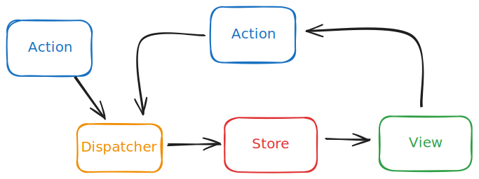
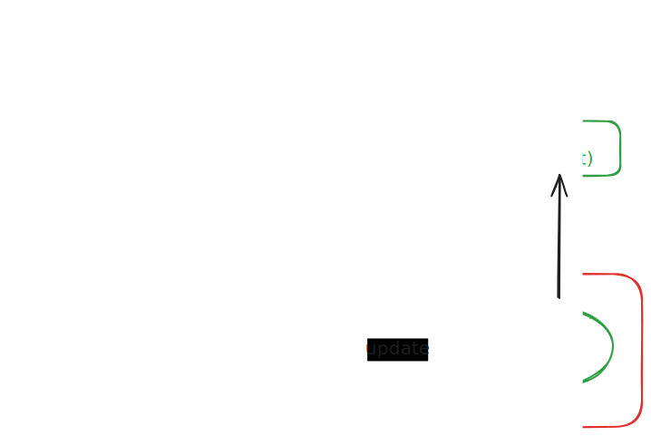

# Módulo 4: Gestión de estado con React y RxJS

- [Módulo 4: Gestión de estado con React y RxJS](#módulo-4-gestión-de-estado-con-react-y-rxjs)
  - [Propuesta inicial del módulo](#propuesta-inicial-del-módulo)
  - [Creación de flujos de datos reactivos con RxJS: Hot Observables](#creación-de-flujos-de-datos-reactivos-con-rxjs-hot-observables)
    - [Concepto de Hot Observables](#concepto-de-hot-observables)
    - [🧿Componente ClicksCounter (con un Subject): Eventos y Subjects](#componente-clickscounter-con-un-subject-eventos-y-subjects)
    - [Acciones con Subjects: patrón Flux](#acciones-con-subjects-patrón-flux)
      - [🧿Componente Counter3Buttons](#componente-counter3buttons)
      - [Mejora del "reducer" y tipos de acciones](#mejora-del-reducer-y-tipos-de-acciones)
      - [El patrón flux nativo en react: useReducer](#el-patrón-flux-nativo-en-react-usereducer)
    - [Combinación de flujos y operadores complejos](#combinación-de-flujos-y-operadores-complejos)
      - [⚙️Servicios getByUrl y searchPokemon](#️servicios-getbyurl-y-searchpokemon)
      - [🧿Componente SearchPokemon](#componente-searchpokemon)
    - [Flujos de datos en múltiples componentes](#flujos-de-datos-en-múltiples-componentes)
      - [⚙️SubjectManager: servicio para compartir flujos](#️subjectmanager-servicio-para-compartir-flujos)
      - [🧿DemoPage con componentes que comparten flujos](#demopage-con-componentes-que-comparten-flujos)
  - [React Context y programación reactiva](#react-context-y-programación-reactiva)
    - [Inyección en React: Contexto](#inyección-en-react-contexto)
      - [Contextos de React, Hooks y servicios](#contextos-de-react-hooks-y-servicios)
        - [🌐Creación del contexto y del proveedor](#creación-del-contexto-y-del-proveedor)
      - [Acceso al contexto](#acceso-al-contexto)
    - [Contexto dinámico](#contexto-dinámico)
      - [🌐Theme \& Language Context](#theme--language-context)
    - [Contexto dinámico y custom Hooks](#contexto-dinámico-y-custom-hooks)
      - [🌐User Context](#user-context)
    - [Contexto en React19. El API `use`](#contexto-en-react19-el-api-use)
  - [Gestión avanzada del estado con BehaviorSubject](#gestión-avanzada-del-estado-con-behaviorsubject)

## Propuesta inicial del módulo

- Flujos de estado reactivos
- Creación de flujos de datos reactivos con RxJS
- Gestión avanzada del estado con BehaviorSubject y ReplaySubject
- Integración de flujos de estado con Redux y RxJS
- React Context y programación reactiva
- Uso de Context API en combinación con RxJS
- Mejores prácticas para compartir datos reactivos entre componentes

## Creación de flujos de datos reactivos con RxJS: Hot Observables

### Concepto de Hot Observables

Como vimos en el módulo uno existe un tipo de observable llamado "Hot Observable" con algunas características diferentes:

- Comienza a emitir datos al antes de que se suscriba ningún observador
- Cada suscripción **comparte** el mismo flujo de datos
- **Multicast**: Cada suscripción comparte el mismo flujo de datos
- **Infinitos**: Emite un número infinito de datos. En este caso es necesario des-suscribirse manualmente.

Partiendo de un observable "cold" (Observable) podemos crear un "hot observable" usando algunos operadores:

- share(): Devuelve un nuevo Observable que reenvía (comparte) el Observable original. Cada suscriptor recibe los mismos valores emitidos por el Observable original.
- shareReplay() Comparte la fuente y reproduce un número determinado de emisiones mediante suscripción, según el parámetro que recibe
- publish() y publishReplay(): Similar a share() y shareReplay(), pero devuelve un ConnectableObservable que requiere llamar a connect() para comenzar a emitir valores.

La principal diferencia radica en que `shareReplay` almacena en caché y reenvía varios valores anteriores a los nuevos suscriptores, mientras que `share` almacena valores en caché por defecto. `share` comparte una única suscripción a un observable fuente, ejecutándola solo una vez y pasando sus emisiones a todos los suscriptores.

`shareReplay` es ideal para situaciones con suscriptores que se conectan tarde y necesitan valores anteriores, o para evitar volver a ejecutar operaciones costosas como solicitudes HTTP, lo cual `share` haría para cada nuevo suscriptor una vez que el original haya finalizado.

Al margen de estos operadora los principales ejemplos de hot observables en RxJS son los **Subject** (Subject, ReplaySubject, BehaviorSubject, y AsyncSubject), que también mencionamos en el módulo 1.

Su principal utilidad, al combinar un observable y un observer, es que permiten crear flujos de datos imperativos, donde podemos emitir nuevos valores manualmente desde cualquier parte de la aplicación. Por ejemplo, en respuesta a un evento de usuario o una llamada a una API.

En primer lugar veremos su relación con los eventos, y como permiten cambiar la forma en que hasta ahora venimos tratándolo, usando el operador `fromEvent`.

### 🧿Componente ClicksCounter (con un Subject): Eventos y Subjects

Para ver la relación entre ambos vamos a reescribir nuestro componente contador de clicks.

```tsx
export const ClicksCounter: React.FC = () => {
  const [count, setCount] = React.useState(0);

  const counter$ = useMemo(() => new Subject<number>(), []);

  const handleClick = (): void => counter$.next(1);

  useEffect(() => {
    console.log('Use effect: CounterClicks');
    const subscription = counter$
      .pipe(scan((acc, curr) => acc + curr, 0))
      .subscribe(setCount);
    return (): void => subscription.unsubscribe();
  }, [counter$]);

  return (
    <Card title="Counter Clicks">
      <button onClick={handleClick}>Click count: {count}</button>
    </Card>
  );
};
```

- creamos un subject counter$, memoizado para evitar re-renderizados, que inicialmente no emite ningún valor
- el manejador del evento onClick del botón llama a counter$.next(1) para emitir un nuevo valor (1) cada vez que se hace click
- en el useEffect nos suscribimos al subject y usamos el operador scan para acumular los valores emitidos (1 por cada click) y actualizar el estado count con setCount
- devolvemos una función de limpieza que des-suscribe del subject al desmontar el componente

La parte final del proceso ya la conocemos, y podemos delegarla en nuestro hook, useObservable

```tsx
export const ClicksCounter: React.FC = () => {
  const counter$ = useMemo(() => new Subject<number>(), []);

  const handleClick = (): void => counter$.next(1);

  const source$ = useMemo(
    () => counter$.pipe(scan((acc, curr) => acc + curr, 0)),
    [counter$]
  );

  const [count] = useObservable(source$, 0);

  return (
    <Card title="Counter Clicks">
      <p>Versión usando Hook personalizado</p>
      <button onClick={handleClick}>Click count: {count}</button>
    </Card>
  );
};
```

- creamos un subject counter$, memoizado para evitar re-renderizados, que inicialmente no emite ningún valor
- el manejador del evento onClick del botón llama a counter$.next(1) para emitir un nuevo valor (1) cada vez que se hace click
- creamos source$ que es el flujo resultante de aplicar operadores a counter$
- usamos useObservable para suscribirnos a source$ y obtener un estado correspondiente al valor acumulado count

Puede parecer mucho código para algo tan sencillo como un contador de clicks, pero la ventaja es que ahora tenemos un flujo de datos reactivo (source$) que podemos combinar con otros flujos, aplicar operadores más complejos, y compartir entre múltiples componentes si es necesario. De todo ellos veremos ejemplos a continuación.

### Acciones con Subjects: patrón Flux

En el ejemplo anterior hemos visto como usar un subject para emitir eventos de usuario (clicks). Este patrón puede extenderse para manejar otras **acciones** en la aplicación, como cambios de estado, navegación, o cualquier otro evento relevante.

Con el termino acciones podemos referirnos a:

- eventos que representan cambios en el estado de la aplicación o interacciones del usuario.
- de modo más formal, una acción es un objeto que describe un cambio o evento específico en la aplicación, generalmente con un tipo y una carga útil (payload) asociada. De esta forma se define en patrones como Flux o Redux.

Veamos un ejemplo básico en un componente contador con 3 botones, para incrementar, decrementar y resetear el contador.

#### 🧿Componente Counter3Buttons

El patrón es similar al del contador de clicks, pero en este caso emitimos diferentes tipos de acciones (strings) desde los distintos botones que tendremos en el template

```tsx
return (
  <Card>
    <p>
      <button onClick={handleClick} title="Decrement" data-action={'DECREMENT'}>
        ➖
      </button>
      <span className="count-value">count is {count}</span>
      <button onClick={handleClick} title="Increment" data-action={'INCREMENT'}>
        ➕
      </button>
      <button onClick={handleClick} title="Reset" data-action={'RESET'}>
        🔄
      </button>
    </p>
  </Card>
);
```

En el manejador de eventos extraemos el tipo de acción desde el atributo data-action del botón pulsado, y lo emitimos a través del subject action$.

```tsx
const action$ = useMemo(() => new Subject<string>(), []);

const handleClick: React.MouseEventHandler<HTMLButtonElement> = (event) => {
  const {
    dataset: { action },
  } = event.currentTarget;

  if (action) {
    action$.next(action);
  }
};
```

El flujo source$ se encarga de procesar las acciones emitidas por action$, usando el operador scan para acumular el estado del contador según el tipo de acción recibida.

```tsx
const source$ = useMemo(
  () =>
    action$.pipe(
      scan((acc, curr) => {
        switch (curr) {
          case 'INCREMENT':
            return acc + 1;
          case 'DECREMENT':
            return acc - 1;
          case 'RESET':
            return 0;
          default:
            return acc;
        }
      }, initialCount)
    ),
  [action$, initialCount]
);
```

Lo que acabamos de aplicar es una versión sencilla del patrón Flux, donde:

- las acciones (action$) representan eventos que pueden cambiar el estado
- el flujo source$ actúa como un "reducer" que procesa las acciones y actualiza el estado del contador
- el estado resultante (count) se obtiene suscribiéndose a source$ mediante el hook useObservable

**Flux** es una arquitectura para el manejo y el flujo de los datos en una aplicación web, particularmente en el Front-End, que permite gestionar el estado de la aplicación de forma más eficiente y escalable.

- vendría a sustituir el patrón MVC (o MVVM).
- fue ideada por Facebook ante el problema de una comunicación bidireccional entre numerosos modelos y controladores, haciéndoles muy difícil poder depurar y rastrear errores.
- el patrón Flux se basa en un flujo unidireccional de datos
  - los datos viajan desde la vista por medio de acciones que llegan a un Store (son despachadas a un Store)
  - desde el Store se actualizará la vista de nuevo.



#### Mejora del "reducer" y tipos de acciones

Para mejorarlo podríamos definir las acciones con un tipo adecuado. También podríamos definir una interfaz para las acciones que incluya una carga útil (payload) si fuera necesario. Igualmente podríamos extraer la lógica del "reducer" a una función separada para mejorar la legibilidad y reutilización, utilizando en ella un diccionario de funciones para manejar cada tipo de acción sin necesidad de usar un switch.

```tsx
const ACTIONS = ['INCREMENT', 'DECREMENT', 'RESET'] as const;
type ActionType = (typeof ACTIONS)[number];

// Si hubiera acciones con y sin payload, podríamos definirlas
// como uniones discriminadas:
// type IncrementAction = { type: 'INCREMENT' };
// type DecrementAction = { type: 'DECREMENT' };
// type ResetAction = { type: 'RESET' };
// type ActionType = IncrementAction | DecrementAction | ResetAction;

const isActionType = (value: string): value is ActionType =>
  (ACTIONS as readonly string[]).includes(value);

// Si quisieramos generalizar la guardia de literales, podríamos hacer algo así:
// function createLiteralGuard<const T extends readonly string[]>(...lits: T) {
//   return (value: string): value is T[number] =>
//     (lits as readonly string[]).includes(value);
// }
// const isActionType = createLiteralGuard('INCREMENT', 'DECREMENT', 'RESET');

const reducers: Record<ActionType, (count: number) => number> = {
  INCREMENT: (c) => c + 1,
  DECREMENT: (c) => c - 1,
  RESET: () => 0,
};
```

Todos estos elementos pueden extraerse a uno o varios módulos separados para mejorar la organización del código.

Finalmente el componente quedaría como sigue:

```tsx
type Props = {
  initialCount?: number;
};

export const Counter3Buttons: React.FC<Props> = ({ initialCount = 0 }) => {
  const action$ = useMemo(() => new Subject<ActionType>(), []);

  const handleClick: React.MouseEventHandler<HTMLButtonElement> = (event) => {
    const {
      dataset: { action },
    } = event.currentTarget;

    if (!action || !isActionType(action)) return;

    action$.next(action);
  };

  const count$ = useMemo(
    () =>
      action$.pipe(
        scan((count, action) => reducers[action](count), initialCount)
      ),
    [action$, initialCount]
  );

  const [count] = useObservable(count$, initialCount);

  return <Card>{/* template como antes */}</Card>;
};
```

#### El patrón flux nativo en react: useReducer

En react

- el Store corresponde a un **estado** más o menos complejos y la lógica para actualizarlo por medio de un reducer.
- el Store utiliza un **reducer**, una función responsable de recibir las acciones y actualizar el estado en consecuencia. Es una función pura que toma el estado actual y una acción, y devuelve un nuevo estado.

```tsx
type Reducer = (state: State, action: Action): State
```

- los cambios de estado se definen como **acciones**, que son objetos que describen el cambio que se quiere realizar en el estado y que son despachadas al Store,
- gracias al **dispatcher**, los componentes pueden enviar (despachar) acciones al Store para actualizar el estado, y se actualizan automáticamente cuando el estado cambia.
- react **notifica** los cambios de estado a los componentes que dependen de ese estado y en consecuencia se actualizará la vista de esos componentes.



El uso detallado de useReducer se incluye en el módulo 2 del curso intermedio.

A partir del ejemplo de nuestro componente podríamos extender el modelo para manejar un estado global y crear un hook personalizado, como useReducerRx, que combine useReducer con RxJS para manejar el estado de forma reactiva.

De momento vamos a seguir utilizando los subjects de RxJS en situaciones más complejas que las que hemos visto hasta ahora.

### Combinación de flujos y operadores complejos

Recuperamos el ejemplo de un input de búsqueda con autocompletado (sugerencias de búsqueda) en este caso accediendo al API de pokemos.

#### ⚙️Servicios getByUrl y searchPokemon

Nuestro servicio fetch genérico incorpora un nuevo método, en el que recibe la url final con el endpoint de la API, en lugar del id.

```tsx
export const getByUrl =
  (url: string) =>
  <T,>(): Observable<T> => {
    return fromFetch(`${url}`).pipe(
      tap((response) => {
        console.log('Receiving data...', response);
      }),
      switchMap<Response, Promise<T> | Observable<never>>((response) => {
        if (response.ok) {
          return response.json();
        } else {
          return throwError(
            () =>
              new HttpError(
                response.status,
                response.statusText,
                'Fetch error code: ' + response.status
              )
          );
        }
      }),
      retry(3),
      catchError((err: Error) => {
        if (!(err instanceof HttpError)) {
          err = new HttpError(0, '', 'Unknown fetch error', err);
        }
        return throwError(() => err);
      })
    );
  };
```

En realidad, este método es una versión más genérica del getById que ya teníamos, y puede usarse para cualquier endpoint, por lo que podríamos eliminar el anterior getById.

Conociendo los endpoint y la estructura de los datos de la api de pokemos, comenzamos por definir la url y los tipos o interfaces de los datos:

```tsx
const URL_BASE = 'https://pokeapi.co/api/v2';
const URL = URL_BASE + '/pokemon';
const apiOptions = '?limit=2000&offset=0';

export type PokeApiResponse = {
  count: number;
  next: string | null;
  previous: string | null;
  results: PokemonLite[];
};

export type PokemonLite = {
  name: string;
  url: string;
};
```

A continuación creamos el servicio específico para el get delos pokemos. En esta api no existe un endpoint de búsqueda, por lo que traemos todos los datos y los filtramos localmente para devolver los valores adecuados a nuestra búsqueda.

Para nuestro ejemplo, esto es intrascendente y no nos preocupa si el rendimiento no es el optimo.

```tsx
export const searchPokemon = (item: string): Observable<PokemonLite[]> => {
  const url = URL + apiOptions;
  return getByUrl(url)<PokeApiResponse>().pipe(
    tap((response) => console.log('Pokemons', response.count)),
    // Manejo el caso de que no haya resultados
    map((response) =>
      response.results instanceof Array ? response.results : []
    ),
    // Extraigo solo los datos que me interesan
    map((pokemons) =>
      pokemons.filter((p) => p.name.toLowerCase().includes(item.toLowerCase()))
    )
  );
};
```

#### 🧿Componente SearchPokemon

Se repite el patrón del contador de clicks:

- un subject input$
- un manejador de evento que emite los valores del input de búsqueda
- un observable que modifica el flujo del subject con operadores
- el hook useObservable para suscribirse al flujo y obtener el estado

```tsx
const input$ = useMemo(() => new Subject<string>(), []);

const handleChange = (ev: React.ChangeEvent<HTMLInputElement>): void => {
  const { value } = ev.target;
  input$.next(value);
};

const search$ = useMemo(
  () =>
    input$.pipe(
      // filter((item) => item.trim() !== ''),
      filter((item) => item.length >= 2),
      debounceTime(300),
      distinctUntilChanged(),
      exhaustMap((item) => {
        return searchPokemon(item);
      })
    ),
  [input$]
);

const [data, error] = useObservable<PokemonLite[]>(search$, EMPTY_ARRAY);
```

En este caso, el flujo search$ controla los datos recibidos en el input y los utiliza para llamar al servicio de búsqueda de pokemons. Al utilizar el operador exhaustMap, si se emiten varios valores seguidos, solo se procesa la primera búsqueda y se ignoran las siguientes hasta que finalice la primera. Es lo contrario de switchMap, que cancelaría la búsqueda anterior y comenzaría una nueva.

el resto del componente se encarga de renderizar el input y los resultados, aprovechando alguno de nuestros componentes del core, como Card o List

```tsx
const renderItem = (pokemon: PokemonLite): React.ReactNode => (
  <>
    <a href={pokemon.url} target="_blank">
      {pokemon.name}
    </a>
  </>
);

return (
  <Card title="Search Pokemon">
    <label>
      <span>Pokemon name: </span>
      <input type="text" onChange={handleChange} />
    </label>

    {data && data.length > 0 && <List items={data} renderItem={renderItem} />}
    {data && data.length === 0 && <p>No results found.</p>}
    {error && <p style={{ color: 'red' }}>{error.message}</p>}
  </Card>
);
```

### Flujos de datos en múltiples componentes

Los observables hot (subjects) permiten compartir flujos de datos entre múltiples componentes de forma sencilla, por ejemplo a nivel de una página.

#### ⚙️SubjectManager: servicio para compartir flujos

Para manejarlos podemos crear una clase que defina el subject como privado y exponga sus get y set. En el rimero utilizamos el método sasObservable del subject, de modo que devuelve un observable, sin la capacidad de emitir nuevos datos. De esa forma solo el set tendrá esa capacidad.

```tsx
export class SubjectManager<T> {
  // Implementation of the SubjectManager service
  private subject$ = new Subject<T>();
  get getSubject(): Observable<T> {
    return this.subject$.asObservable();
  }

  set setSubject(value: T) {
    this.subject$.next(value);
  }
}
```

Lo mismo podemos conseguir con un enfoque más funcional, usando un función factory que encapsula el subject y devuelve los métodos get y set:

```tsx
export const SubjectManager = <T,>(): {
  getSubject: () => Observable<T>;
  setSubject: (value: T) => void;
} => {
  const subject$ = new Subject<T>();

  const getSubject = (): Observable<T> => {
    return subject$.asObservable();
  };

  const setSubject = (value: T): void => {
    subject$.next(value);
  };

  return {
    getSubject,
    setSubject,
  };
};
```

Para poder compartirlos entre los componentes, podemos crear un servicio que instancie los subjectManager que necesitemos, para las distintas acciones que vayan a compartir nuestros componentes

```tsx
import { SubjectManager } from './subject.manager.functional';
export const clickActionService = SubjectManager<boolean>();
export const infoActionService = SubjectManager<string>();
```

Como estas instancias se crean en el modulo del servicio, pueden ser importadas y compartidas por los componentes que las necesiten. Este patrón puede ser adecuado en contextos reducidos, como una página con diversos componentes que comparten datos entre ellos. Para escalarlo a nivel de aplicación, es preferible usar React Context, que veremos más adelante.

#### 🧿DemoPage con componentes que comparten flujos

Recuperamos el ejemplo del contador de clicks, pero en este caso vamos a compartir el flujo entre varios componentes.

El **componente Counter** utiliza el servicio clickActionService para emitir los clicks.

- internamente crea su propio observable a partir del subject de `clickActionService`
- acumula los clicks usando el operador scan
- al mismo tiempo emite el valor acumulado en el flujo compartido de `infoActionService`.
- utiliza useObservable para suscribirse al flujo y muestra el contador en un botón

```tsx
export const Counter: React.FC = () => {
  const handleClick = (): void => {
    console.log('click');
    clickActionService.setSubject(1); //.next(1);
  };

  const clicks$ = useMemo(
    () =>
      clickActionService.getSubject().pipe(
        scan((acc, curr) => acc + (curr ? 1 : 0), 0),
        tap((value) => infoActionService.setSubject(value.toString())),
        tap({
          next: (value) => {
            console.log('Component Counter - Created / Received value:', value);
          },
          error: (err: Error) => {
            console.error('Error in clicks$ observable:', err);
          },
        })
      ),
    []
  );

  const [count] = useObservable(clicks$, 0);

  return (
    <Card>
      <button onClick={handleClick}>count is {count}</button>
    </Card>
  );
};
```

El componente **SendInfo** se suscribe de nuevo los flujos compartidos y emite información al pulsar un botón:

- sie le botón pulsado es ''Enviar información'', emite un string fijo al subject `infoActionService`,
- si el botón pulsado es ''Aumentar contador'', emite el valor del contador a `clickActionService`

Para conocer el valor del contador, previamente se ha suscrito al subject `clickActionService` y guarda el valor en una variable local.

```tsx
export const SendInfo: React.FC = () => {
  let counterValue = 0;

  infoActionService.getSubject().subscribe((value) => {
    counterValue = Number(value);
    console.log('Suscrito; ReadInfo - counterValue: ', counterValue);
  });

  const handleClick: EventHandler<React.MouseEvent<HTMLButtonElement>> = (
    ev
  ) => {
    const { textContent } = ev.target as HTMLButtonElement;

    if (textContent.includes('contador')) {
      console.log('Component 1- Sending click information');
      clickActionService.setSubject(counterValue + 1);
    } else {
      console.log('Component 1 - Sending information');
      infoActionService.setSubject('Hello from Component 1');
    }
  };

  return (
    <Card title="SendInfo">
      <p>Component 1</p>
      <button onClick={handleClick}>Enviar información</button>
      <button onClick={handleClick}>Aumentar contador</button>
    </Card>
  );
};
```

El componente **DisplayInfo** se suscribe al flujo compartido `infoActionService`, y muestra la información recibida.

```tsx
export const ReadInfo: React.FC = () => {
  const data$ = infoActionService.getSubject().pipe(
    tap({
      next: (value) => {
        console.log('Component 2 - Received value:', value);
      },
      error: (err: Error) => {
        console.error('Component 2 - Error in observable:', err);
      },
    })
  );

  const [data] = useObservable(data$, '');
  return (
    <Card title="ReadInfo">
      <p>Component 2</p>
      {data && <p>Received value: '{data}'</p>}
    </Card>
  );
};
```

En este caso vemos un ejemplo de como el operador tap nos permite monitorizar los valores emitidos en los flujos, tanto en el caso de éxito (next) como en el de error (error). El parámetro de este operador es igual que el de la suscripción: una función o un observer con next, error y complete.

## React Context y programación reactiva

### Inyección en React: Contexto

El contexto de React es una forma de inyección de dependencias controlada por React, que permite compartir datos entre componentes sin necesidad de pasar props manualmente a través de cada nivel del árbol de componentes.

En el caso de los servicios, es especialmente util si muchos componentes comparten el mismo servicio, y como cualquiera de los patrones de inyección de dependencias, permite desacoplar el servicio del componente y facilita la prueba y el mantenimiento del código.

#### Contextos de React, Hooks y servicios

El Contexto (React.Context) es una **API nativa de React** que permite compartir valores entre componentes sin necesidad de pasarlos manualmente a través de props en cada nivel del árbol de componentes (lo que se conoce como prop drilling).

Fue introducido para solucionar el problema de compartir datos globales —como temas, idiomas, usuarios autenticados o servicios— sin romper la composición de componentes.

El contexto se crea con la función factory `createContext`, que devuelve un objeto de la clase `React.Context` con los métodos `Provider` y `Consumer`. Por tanto un Contexto es un objeto que contiene dos componentes:

- **Provider**: método correspondiente a un componente de React que proporciona el valor del contexto a los componentes hijos.
- **Consumer**: el método que consume el valor proporcionado por el Provider. Desde la versión 16.8, con la introducción de los Hooks, se recomienda usar el hook `useContext` para consumir el contexto acceder internamente al Consumer y a los valores del contexto.

El Contexto es, en esencia, una forma sencilla y eficaz de aplicar **inyección de dependencias** en el entorno funcional de React, no necesariamente ligada a la programación orientada a objetos.:

- El proveedor (Provider) actúa como el contenedor que proporciona la dependencia.
- El consumidor (useContext) inyecta esa dependencia dentro del componente.

Esto permite desacoplar componentes de las implementaciones concretas, y facilitar su reutilización y testeo.

##### 🌐Creación del contexto y del proveedor

El tipo del contexto se define como una interfaz que describe la forma del objeto que se va a compartir. En este caso, el contexto es un servicio de usuario.

```tsx
type ContextType = {
  appTitle: string;
  hasLoggedUser: boolean;
};
```

El contexto, como objeto que puede ser accedido desde cualquier parte de la aplicación se crea con la función `createContext`, que recibe como parámetro el valor por defecto del contexto. Este valor se usará si no hay un proveedor (Provider) en la jerarquía de componentes.

```tsx
export const Context = createContext<ContextType>({
  appTitle: '',
  hasLoggedUser: false,
});
```

El proveedor (Provider) es un componente que envuelve a los componentes que necesitan acceder al contexto. Este componente recibe como prop el valor del contexto y lo proporciona a todos los componentes hijos.

```tsx

const contextValue: ContextType = {
    appTitle: "TS - React - RxJS. State Management",
    hasLoggedUser: false,
};

type Props = {
    children: React.ReactNode;
};

export const ContextProvider: React.FC<Props> = ({ children }) => {
    return <Context.Provider value={contextValue}>{children}</context.Provider>;
};
```

En este caso el contexto solo proporciona un valor estático, pero como veremos más adelante, el valor del contexto se suele actualizar dinámicamente, por ejemplo, a través de un servicio de autenticación.

Lo habitual es que el contexto y el provider se implementen en ficheros separados. En caso contrario habrá que desactivar la regla de eslint `react-refresh/only-export-components`

#### Acceso al contexto

PAra que el contexto sea accesible de debe hacer uso del `Provider` en el árbol de componentes, envolviendo los componentes que necesitan acceder al contexto. Si toda la aplicación tiene que tener acceso al contexto, esto se hace en el fichero main.tsx, donde se renderiza el componente raíz de la aplicación.

```tsx
import React from 'react';
import ReactDOM from 'react-dom/client';

import { App } from './App';
import { ContextProvider } from './context';

const root = ReactDOM.createRoot(document.getElementById('root')!);
root.render(
  <React.StrictMode>
    <ContextProvider>
      <App />
    </ContextProvider>
  </React.StrictMode>
);
```

A partir de aquí, cualquier componente que esté dentro del `ContextProvider` puede acceder al contexto.
Para acceder al contexto, se utiliza el hook `useContext`, que recibe como parámetro el contexto creado con `createContext`. Este hook devuelve el valor del contexto, que se puede usar directamente en el componente.

```tsx
import { useContext } from 'react';
import { context } from './context';

export const Header: React.FC = () => {
  const { appTitle, hasLoggedUser } = useContext(context);

  return (
    <div>
      <h1>{appTitle}</h1>
      {!hasLoggedUser && <p>Por favor, inicia sesión</p>}
    </div>
  );
};
```

### Contexto dinámico

El objetivo mas habitual del contexto es compartir un **estado global**, es decir valor que puede cambiar a lo largo del tiempo, junto con la lógica para modificarlo. Es el caso de como el estado de autenticación de un usuario o el tema de la aplicación.

Como el provider no deja de ser un componente, puede hacer uso de cualquier hook de React, como `useState` o `useReducer`, para gestionar el estado del contexto. En este caso, el valor del contexto se define como un objeto que contiene tanto el valor del contexto como la función para actualizarlo.

#### 🌐Theme & Language Context

Un ejemplo sería un contexto que gestiona el tema de la aplicación (claro u oscuro) y el idioma (español o inglés).

```tsx
type ThemeState = 'dark' | 'light';
type LanguageState = 'es' | 'en';

type Context = {
  theme: ThemeState;
  setTheme: React.Dispatch<React.SetStateAction<ThemeState>>;
  language: LanguageState;
  setLanguage: React.Dispatch<React.SetStateAction<LanguageState>>;
};

const defaultContext: Context = {
  theme: 'light',
  setTheme: (state) => state,
  language: 'es',
  setLanguage: (state) => state,
};

export const ThemeContext = createContext<Context>(defaultContext);
```

El proveedor del contexto se encarga de crear el estado y la función para actualizarlo, y lo proporciona a todos los componentes hijos.

```tsx
type Props = {
  children: React.ReactNode;
};

export const ThemeProvider: React.FC<Props> = ({ children }) => {
  const [theme, setTheme] = useState<ThemeState>('light');
  const [language, setLanguage] = useState<LanguageState>('es');

  return (
    <ThemeContext.Provider
      value={{
        theme,
        setTheme,
        language,
        setLanguage,
      }}
    >
      {children}
    </ThemeContext.Provider>
  );
};
```

El valor del contexto se puede leer y actualizar desde cualquier componente que consuma el contexto, lo segundo utilizando la función `setTheme` o `setLanguage` proporcionada por el proveedor.

### Contexto dinámico y custom Hooks

En situaciones más complejas, es posible que necesitemos encapsular la lógica del provider del contexto en un custom hook. Esto permite simplificar el provider y encapsular la lógica de negocio relacionada con el contexto.

#### 🌐User Context

Para el ejemplo del contexto de usuario, que gestiona la autenticación y la información del usuario, recuperamos el custom hook [`useLoggedUser`] del módulo 3, que encapsula la lógica de carga y actualización del usuario.

```tsx
type UseUserHook = {
  user: User | null;
  loading: boolean;
  error: Error | null;
};

export const useLoggedUser = (repo): UseUserHook => {
  const [user, setUser] = useState<User | null>(null);
  const [loading, setLoading] = useState<boolean>(true);
  const [error, setError] = useState<Error | null>(null);

  useEffect(() => {
    const load = (): void => {
      repo
        .fetchUserMock(1000, false)
        .pipe(tap(() => setLoading(true)))
        .subscribe({
          next: (userData) => {
            setUser(userData);
            setLoading(false);
          },
          error: (err) => {
            setError(err);
            setLoading(false);
          },
        });
    };

    load();
  }, []);

  return { user, loading, error };
};
```

El contexto se crea en función del tipo proporcionado por el custom hook

```tsx
type Context = {
  userContext: ReturnType<typeof useLoggedUser>;
};

const defaultContext: Context = {} as Context;

// eslint-disable-next-line react-refresh/only-export-components
export const UserContext = createContext<Context>(defaultContext);
```

El provider se encarga de crear la instancia del hook, inyectarle la instancia del repository y con el resultado, proporcionar el valor del contexto.

```tsx
type Props = {
  children: React.ReactNode;
};
export const UserProvider: React.FC<Props> = ({ children }) => {
  const repo = useMemo(() => new ApiUserRepository(), []);
  const userContext = useLoggedUser({ repo });

  return (
    <UserContext.Provider
      value={{
        userContext,
      }}
    >
      {children}
    </UserContext.Provider>
  );
};
```

### Contexto en React19. El API `use`

React 19 incluye dos cambios en relación con el contexto:

- El API `use` permite acceder a datos asíncronos directamente en el componente, sin necesidad de usar `useEffect` o `useState`.
- El API `use` además permite acceder a datos de contexto directamente en el componente, sin necesidad de usar `useContext`.
- En el API de `Context` ya no es necesario utilizar el método `Provider` para crear el wrapper que proporciona el valor del contexto.

```tsx
type Props = {
  children: React.ReactNode;
};
export const UserProvider: React.FC<Props> = ({ children }) => {
  const repo = new ApiUserRepository();
  const userContext = useUser({ repo });

  return (
    <UserContext
      value={{
        userContext,
      }}
    >
      {children}
    </UserContext>
  );
};
```

Al consumir el contexto, se puede acceder directamente al valor del contexto sin necesidad de usar `useContext`.

```tsx
export const UserProfile: React.FC = () => {
  const { userContext } = use(UserContext);

  return (
    <div>
      {userContext.loading ? (
        <p>Cargando...</p>
      ) : userContext.error ? (
        <p>Error: {userContext.error.message}</p>
      ) : (
        <p>Hola, {userContext.user?.name}</p>
      )}
    </div>
  );
};
```

## Gestión avanzada del estado con BehaviorSubject

El behaviorSubject es un tipo especial de subject en RxJS que mantiene un valor actual y emite ese valor a cualquier nuevo suscriptor inmediatamente al suscribirse. Esto lo hace ideal para gestionar estados compartidos en aplicaciones reactivas, ya que siempre proporciona el valor más reciente a los nuevos suscriptores.

Al estilo de patrones con Flux y Redux

- se puede crear una entidad centralizada para gestionar el estado de la aplicación, que denominaremos **Store**
- en el store podemos definir diferentes estados utilizando BehaviorSubjects para almacenar y emitir el estado actual
- estos estados se exponen como observables para que los componentes puedan suscribirse y reaccionar a los cambios de estado
- igualmente se exponen métodos para actualizar el estado, que internamente emiten nuevos valores a través de los BehaviorSubjects
- el Store se incorpora en el árbol de componentes mediante React Context, para que cualquier componente pueda acceder el
- los componentes pueden suscribirse a los observables del store para recibir actualizaciones en tiempo real del estado y actualizar su UI en consecuencia
- igualmente pueden llamar a los métodos de actualización
- para hacer el proceso más sencillo, podemos crear un hook personalizado, como useStore, que encapsule la lógica de suscripción y actualización del estado

Supongamos que tenemos una lista de productos que queremos gestionar en un store centralizado.

```tsx
import { BehaviorSubject } from 'rxjs';
import { map } from 'rxjs/operators';
import React, { createContext, useContext, useMemo } from 'react';

type Product = {
  id: number;
  name: string;
  price: number;
};

type StoreType = {
  products$: BehaviorSubject<Product[]>;
  addProduct: (product: Product) => void;
  removeProduct: (productId: number) => void;
  getTotalPrice$: () => Observable<number>;
};

const Store = (): StoreType => {
  const products$ = useMemo(() => new BehaviorSubject<Product[]>([]), []);

  const addProduct = (product: Product): void => {
    const currentProducts = products$.getValue();
    products$.next([...currentProducts, product]);
  };

  const removeProduct = (productId: number): void => {
    const currentProducts = products$.getValue();
    products$.next(
      currentProducts.filter((product) => product.id !== productId)
    );
  };

  const getTotalPrice$ = (): Observable<number> => {
    return products$.pipe(
      map((products) =>
        products.reduce((total, product) => total + product.price, 0)
      )
    );
  };

  return {
    products$,
    addProduct,
    removeProduct,
    getTotalPrice$,
  };
};

export const StoreContext = createContext<StoreType | null>(null);
export const StoreProvider: React.FC<{ children: React.ReactNode }> = ({
  children,
}) => {
  return (
    <StoreContext.Provider value={Store()}>{children}</StoreContext.Provider>
  );
};

export const useStore = (): StoreType => {
  const context = useContext(StoreContext);
  if (!context) {
    throw new Error('useStore must be used within a StoreProvider');
  }
  return context;
};
```

Con este store, los componentes pueden suscribirse a los productos y al total de precios, y actualizar el estado llamando a los métodos addProduct y removeProduct.

```tsx
export const ProductList: React.FC = () => {
  const { products$, addProduct, removeProduct, getTotalPrice$ } = useStore();
  const [products] = useObservable(products$, []);
  const [totalPrice] = useObservable(getTotalPrice$(), 0);

  return (
    <div>
      <h2>Product List</h2>
      <ul>
        {products.map((product) => (
          <li key={product.id}>
            {product.name} - ${product.price}
            <button onClick={() => removeProduct(product.id)}>Remove</button>
          </li>
        ))}
      </ul>
      <p>Total Price: ${totalPrice}</p>
      <button
        onClick={() =>
          addProduct({ id: Date.now(), name: 'New Product', price: 10 })
        }
      >
        Add Product
      </button>
    </div>
  );
};
```
